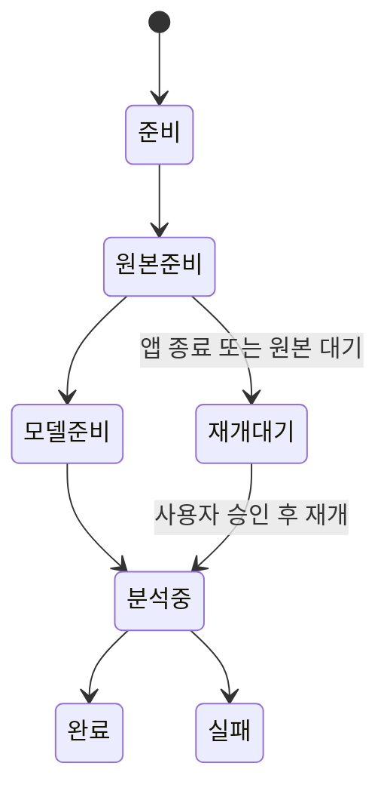

# 첫 실행

> 대상: 앱으로 처음 사진을 분류하는 사용자
>
> 근거: `main_window_appkit.py`, `direct_classification_appkit.py`, `local_file_selection_appkit.py`

## 1. 환경 확인

앱을 실행한 뒤 `환경 및 권한` 탭에서 다음을 확인한다.

- 사진 접근 권한
- 사진 보관함 읽기
- 선택 검사 상태
- 이미지 분석 모델 정책

기본 검사는 읽기 중심이며 사진이나 앨범을 변경하지 않는다.

## 2. 사진 소스 선택

`사진 분류` 탭에서 두 경로 중 하나를 선택한다.

### Apple 사진

- 앨범을 선택한다.
- 필요하면 시작일과 종료일을 지정한다.
- 분류 방식과 프로필, 최대 사진 수를 선택한다.
- 범위 확인 후 작업을 시작한다.

### 로컬 폴더

- `폴더 열기`로 앱 내부 3분할 브라우저를 연다.
- 왼쪽 폴더 트리에서 위치를 찾는다.
- 중앙 격자에서 사진을 확인하고 체크한다.
- 오른쪽 Inspector에서 현재 사진과 작업 설정을 확인한다.
- `선택한 N장 분류`를 실행한다.

## 3. 작업 상태 확인

작업은 창과 독립적으로 실행된다. `작업 기록` 탭에서 진행률, 완료 여부, 실패 원인과 결과 수를 확인한다.

## 4. 결과 검토

완료 작업의 `결과 보기`를 누르면 연속 스크롤 갤러리와 Inspector가 열린다.

- 필터로 전체·추천·검토 필요를 전환한다.
- 화면 폭에 따라 열 수가 자동 조정된다.
- 사진을 선택하면 오른쪽에서 설명과 점수를 확인한다.
- 사진을 열면 확대·축소 가능한 뷰어로 전환한다.
- 내보낼 사진을 다시 선택할 수 있다.

## 5. 내보내기

내보내기는 다음 대상을 개별 또는 동시에 선택할 수 있다.

- Apple 사진 앨범
- 로컬 분류 디렉토리

실제 쓰기 전에 변경 계획이 만들어지며, 승인된 경우에만 실행된다. 완료 후 영수증에서 성공, 기존 항목, 실패와 재개 가능 여부를 확인한다.

## 기본 키보드 조작

- 격자 및 한 장 보기 `←`/`→`: 이전·다음 사진
- 격자 및 한 장 보기 `Enter` 또는 `Space`: 현재 사진의 분류 대상 선택/해제
- 한 장 보기의 화면 버튼: 이전·다음 이동

전체 조작은 [키보드 단축키](../02-user-guide/05-keyboard-shortcuts.md)를 참고한다.
