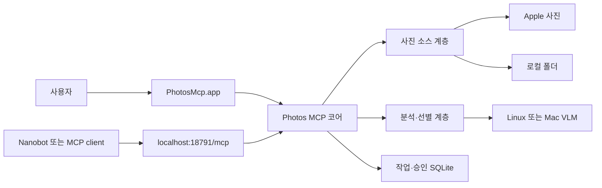

# 제품 개요

> 대상: 처음 프로젝트를 접하는 사용자와 개발자
>
> 근거: `main.py`, `server.py`, `main_window_appkit.py`, `vendor/`

Photos MCP는 Apple 사진 보관함과 로컬 이미지 폴더를 조회하고, 사진을 분석·선별·분류하며, 승인된 결과를 앨범 또는 디렉토리로 내보내는 macOS 앱이다.

## 핵심 기능

- Apple 사진 앨범과 기간을 지정한 분류
- 앱 내부 폴더 트리에서 로컬 사진 선택
- JPEG, PNG, HEIC와 SONY ARW 등 RAW 미리보기
- 사진 품질·장면·얼굴 신호를 이용한 추천
- 장면별 대표 사진 선택과 결과 검토
- Apple 사진 앨범 추가와 로컬 원본 내보내기
- MCP를 통한 동일 기능의 자동화
- Linux 또는 Mac 로컬 VLM의 온디맨드 사용

## 실행 구성

## 사용자 경험과 자동화의 관계

앱 UI와 MCP는 별도 제품이 아니다. 둘 다 같은 상태 저장소와 작업 서비스를 사용한다. 앱에서 시작한 작업은 작업 기록에 남고, MCP에서 만든 작업도 같은 저장소를 통해 결과를 조회할 수 있다.

다만 UI의 폴더 탐색과 키보드 조작은 데스크톱 전용이다. MCP는 파일 경로와 action options로 같은 코어 작업을 요청한다.

## 안전 원칙

- 조회와 분석은 원본 사진을 변경하지 않는다.
- Apple 사진 또는 파일 쓰기는 별도 승인 계획을 요구한다.
- 같은 승인 요청은 idempotency와 영수증으로 중복 실행을 방지한다.
- 미리보기와 캐시는 런타임 디렉토리에 저장하며 원본을 덮어쓰지 않는다.
- 원격 VLM 사용 여부는 정책으로 제어할 수 있다.

## 다음 문서

- 앱 설치: [설치와 실행](02-installation.md)
- 첫 사진 분류: [첫 실행](03-first-run.md)
- 구조 이해: [시스템 개요](../04-architecture/README.md)
