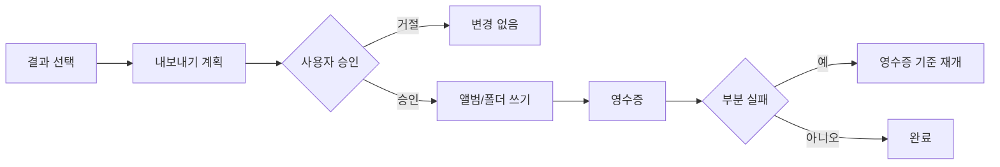

# 결과 검토와 내보내기

> 근거: `result_gallery_appkit.py`, `photo_viewer_appkit.py`, `desktop_export_service.py`, `selected_export_bundle`

## 결과 갤러리

완료 작업의 `결과 보기`를 누르면 갤러리가 열린다.

- 상단에는 전체 결과 수와 판정별 수를 표시한다.
- 필터는 전체·추천·검토 필요를 중심으로 제공한다.
- 갤러리는 위아래로 연속 스크롤된다.
- 화면 폭과 density에 따라 열 수가 자동 조정된다.
- 오른쪽 Inspector는 선택 사진의 큰 미리보기, 설명, 점수를 유지한다.

장면별 대표 선택에서는 같은 배경·인물의 연속 사진이 과도하게 추천되지 않도록 scene group과 대표 순위를 사용한다.

## 전체 화면 뷰어

사진을 열면 ImageKit 기반 뷰어에서 원본 비율로 표시한다.

- 창 크기와 전체 화면에 맞춘 aspect-fit
- scroll 또는 뷰어 control을 통한 확대·축소
- 이전·다음 사진 이동
- 파일명과 현재 순번 표시

## 결과 재선택

분석 결과는 최종 쓰기 대상이 아니다. 갤러리에서 내보낼 사진을 다시 선택할 수 있다.

- 전체 선택
- 전체 해제
- 개별 checkbox
- 필터 상태와 독립적인 전체 선택 집합

## 내보내기 대상

### Apple 사진 앨범

기존 앨범 또는 새 앨범 이름을 지정한다. 이미 앨범에 있는 항목은 영수증에서 별도로 구분한다.

### 로컬 디렉토리

선택 결과를 category/date 구조로 복사한다. 원본 파일은 이동하지 않으며, 파일명 충돌과 부분 실패를 영수증으로 추적한다.

### 동시 내보내기

앨범과 로컬 디렉토리를 동시에 지정할 수 있다. 한 대상이 실패해도 다른 대상 결과를 잃지 않도록 단계별 상태를 기록한다.

## 승인과 영수증

영수증에는 대상, 성공, 이미 존재함, 실패와 재개 식별자가 포함된다. token이나 private photo ID를 문서·공개 로그에 복사하지 않는다.
