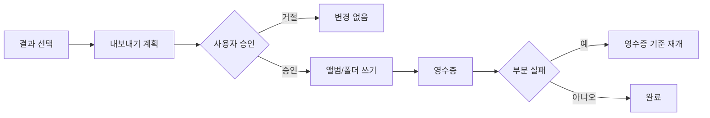

# 결과 검토와 내보내기

> 근거: `result_gallery_appkit.py`, `photo_viewer_appkit.py`, `desktop_export_service.py`, `selected_export_bundle`

## 결과 갤러리

완료 작업의 `결과 보기`를 누르면 갤러리가 열린다.

- 상단에는 전체 결과 수와 판정별 수를 표시한다.
- 필터는 전체·추천·검토 필요를 중심으로 제공한다.
- 갤러리는 위아래로 연속 스크롤된다.
- 화면 폭과 density에 따라 열 수가 자동 조정된다.
- 오른쪽 Inspector는 선택 사진의 큰 미리보기, 설명, 점수를 유지한다.

## 추천 기준

`사진 분류`와 `우수 사진 선별`은 추천의 기준이 다르다.

- `사진 분류`: 같은 인물·배경·시간대의 사진이 2장 이상 묶인 장면에서 상대 점수 1위와, 충분히 다른 구도의 2위까지 추천한다. 단일 사진은 점수가 높아도 자동 추천으로 표시하지 않고 검토 대상으로 남긴다.
- `우수 사진 선별`: 전체 작업의 품질 점수 백분위 기준을 통과한 사진만 선별한다. 이 모드는 전체적인 품질 기준을 적용하므로 장면별 상대 추천과 혼동하지 않는다.

따라서 일반 분류 결과의 `추천`은 “비슷한 사진 중 먼저 볼 후보”를 뜻하며, 절대적인 품질 합격선은 아니다. 장면별 대표 선택에서는 같은 배경·인물의 연속 사진이 과도하게 추천되지 않도록 최대 2장과 대표 순위를 사용한다.

## 전체 화면 뷰어

사진을 열면 ImageKit 기반 뷰어에서 원본 비율로 표시한다.

- 창 크기와 전체 화면에 맞춘 aspect-fit
- scroll 또는 뷰어 control을 통한 확대·축소
- 이전·다음 사진 이동
- 파일명과 현재 순번 표시
- SONY ARW 등 RAW는 처음 한 번 `4096px` 고해상도 미리보기를 로컬 캐시에 준비한 뒤 표시한다. 준비 중에는 저해상도 프리뷰를 확대하지 않으므로 계단 현상이 보이지 않으며, 이후에는 캐시를 즉시 재사용한다.
- JPEG, HEIC, RAW 캐시 미리보기는 파일 디코드 완료 시점에 화면 맞춤과 재그리기를 자동으로 다시 적용한다. 사진이 보일 때까지 창 크기를 바꿀 필요가 없다.

## 결과 재선택

분석 결과는 최종 쓰기 대상이 아니다. 갤러리에서 내보낼 사진을 다시 선택할 수 있다.

- 전체 선택
- 전체 해제
- 개별 checkbox
- 필터 상태와 독립적인 전체 선택 집합

## 내보내기 대상

### Apple 사진 앨범

기존 앨범 또는 새 앨범 이름을 지정한다. 이미 앨범에 있는 항목은 영수증에서 별도로 구분한다.

### 로컬 디렉토리

선택 결과를 category/date 구조로 복사한다. 원본 파일은 이동하지 않으며, 파일명 충돌과 부분 실패를 영수증으로 추적한다.

### 동시 내보내기

앨범과 로컬 디렉토리를 동시에 지정할 수 있다. 한 대상이 실패해도 다른 대상 결과를 잃지 않도록 단계별 상태를 기록한다.

## 승인과 영수증

영수증에는 대상, 성공, 이미 존재함, 실패와 재개 식별자가 포함된다. token이나 private photo ID를 문서·공개 로그에 복사하지 않는다.
