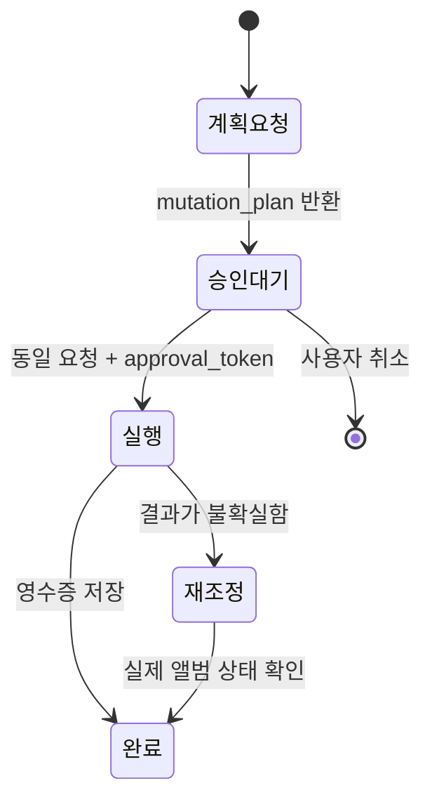

# MCP 도구 참조

> 코드 기준: `src/photos_mcp/facade/action_options.py`
>
> 계약 검증: `tests/test_action_contract_docs.py`

모든 도구는 `action` 문자열과 action별 `options` 객체를 받는다. 알 수 없는 action, 누락된 필수 옵션, 허용되지 않은 옵션은 실행 전에 거부된다.

## Action 계약

아래 표는 자동 테스트가 코드의 `ACTION_SPECS`와 일치하는지 확인하는 공식 목록이다.

<!-- action-contract:start -->
| 도구 | Action | 필수 옵션 | 용도 |
| --- | --- | --- | --- |
| `photos_query` | `artifacts` | 없음 | 실행 산출물 조회 |
| `photos_query` | `cancel` | 없음 | 실행 취소 |
| `photos_query` | `guide` | 없음 | 목표별 안전 호출 안내 |
| `photos_query` | `inspect` | `photo_id` | 사진 메타데이터와 미리보기 조회 |
| `photos_query` | `list` | 없음 | 사진 목록 조회 |
| `photos_query` | `prefetch` | 없음 | 원본의 로컬 준비 요청 |
| `photos_query` | `ready_only` | 없음 | 로컬 분석 준비가 끝난 사진만 조회 |
| `photos_query` | `result_detail` | 없음 | 실행 결과 상세 조회 |
| `photos_query` | `result_summary` | 없음 | 실행 결과 요약 조회 |
| `photos_query` | `resume_plan` | `run_id` | 재개 전에 저장된 요청 확인 |
| `photos_query` | `search` | `query` | 조건 및 텍스트 검색 |
| `photos_query` | `selected` | 없음 | 선택 결과 조회 |
| `photos_query` | `status` | 없음 | 앱과 작업 상태 조회 |
| `photos_select` | `analyze_photo` | `photo_id` | 사진 한 장 분석 |
| `photos_select` | `classify_range` | 없음 | 범위 분류 작업 시작 |
| `photos_select` | `select_best` | 없음 | 범위에서 우수 사진 선택 |
| `photos_select` | `select_best_person` | `person` | 특정 인물의 우수 사진 선택 |
| `photos_workflow` | `classify_then_organize_by_category` | 없음 | 분류 후 카테고리 앨범 정리 |
| `photos_workflow` | `curate_to_album` | `target_album_name` | 선별 후 단일 앨범에 추가 |
| `photos_workflow` | `curate_to_directory` | `output_dir` | 선별 후 디렉토리에 내보내기 |
| `photos_workflow` | `import_then_curate_to_album` | `photo_paths`, `target_album_name` | 로컬 사진 가져오기와 앨범 선별 |
| `photos_workflow` | `resume` | `run_id` | 저장된 workflow 재개 |
| `photos_write` | `add_photo_ids_to_album` | `photo_ids` | 지정 사진을 앨범에 추가 |
| `photos_write` | `add_selected_to_album` | `run_id` | 실행의 선택 결과를 앨범에 추가 |
| `photos_write` | `cleanup_album` | `target_album_name` | 대상 앨범 정리 |
| `photos_write` | `export_selected` | `output_dir`, `run_id` | 선택 결과를 로컬로 내보내기 |
| `photos_write` | `export_selected_bundle` | `run_id` | 로컬·앨범 복합 내보내기 |
| `photos_write` | `import_to_album` | `photo_paths`, `target_album_name` | 로컬 사진을 Apple 사진 앨범으로 가져오기 |
| `photos_write` | `organize_by_category` | `run_id` | 결과를 카테고리 앨범으로 정리 |
<!-- action-contract:end -->

## 공통 조회 옵션

조회와 선택 action에서 주로 사용하는 범위 옵션은 다음과 같다.

| 옵션 | 의미 |
| --- | --- |
| `source` | `apple`, `local` 등 사진 소스 |
| `source_path` | 로컬 소스의 루트 경로 |
| `album`, `person` | Apple 사진 범위 |
| `date_from`, `date_to` | 날짜 범위 |
| `limit` | 최대 처리 수 |
| `selected_photo_ids` | UI 또는 클라이언트가 명시적으로 선택한 사진 |
| `selection_profile` | `general`, `person` 등 선별 프로필 |
| `wait_for_local` | iCloud 원본의 로컬 준비를 기다릴지 여부 |

정확한 허용 옵션은 서버의 오류 응답 또는 `photos_query(action="guide")`를 우선한다. 코드에서 action별 허용 목록을 바꾸면 이 문서의 계약 테스트도 함께 갱신해야 한다.

## 조회 예시

```json
{
  "action": "list",
  "options": {
    "source": "apple",
    "album": "가족",
    "limit": 20,
    "include_thumbnail": true,
    "max_size": 512
  }
}
```

```json
{
  "action": "select_best",
  "options": {
    "source": "local",
    "source_path": "/Users/me/Pictures/trip",
    "limit": 100,
    "selection_profile": "general",
    "exclude_screenshots": true
  }
}
```

## 결과 조회

`run_id`를 생략할 수 있는 결과 action은 기본적으로 최신 실행을 대상으로 하지만, 자동화에서는 경합을 피하기 위해 시작 응답의 `run_id`를 명시한다.

```json
{
  "action": "result_summary",
  "options": {"run_id": "<시작 응답의 run_id>", "top_n": 20}
}
```

## 쓰기 승인

첫 번째 쓰기 호출은 변경을 수행하지 않고 `mutation_plan`과 `approval_token`을 반환한다. 사용자가 대상을 확인한 뒤 같은 action과 같은 업무 옵션에 토큰만 더해 재호출한다.



`export_selected_bundle`은 `run_id` 외에 `output_dir` 또는 `target_album_name`/`target_album_id` 중 하나 이상의 목적지가 필요하다. 둘을 함께 지정하면 로컬 원본 복사와 Apple 사진 앨범 추가를 한 계획으로 처리한다.
