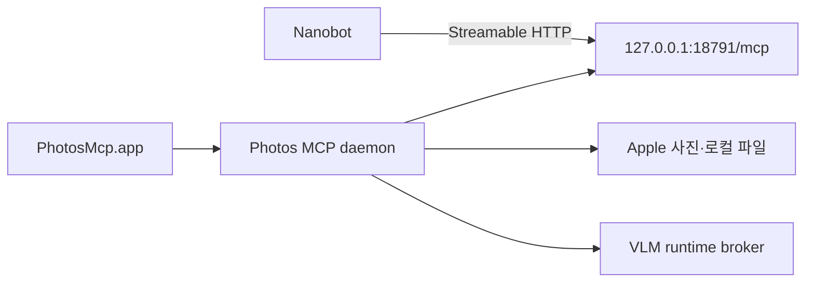

# Nanobot 연결

> 경계 원칙: Photos MCP는 서버 수명 주기를 소유하고 Nanobot은 MCP client 역할만 담당한다.

## 연결 구조



Nanobot이 Python 모듈을 직접 import하거나 vendor 서버를 별도로 실행하지 않는다. `PhotosMcp.app`을 먼저 실행하고 Nanobot의 MCP 서버 설정에는 다음 연결 정보만 사용한다.

| 항목 | 값 |
| --- | --- |
| 전송 방식 | Streamable HTTP |
| MCP URL | `http://127.0.0.1:18791/mcp` |
| 상태 URL | `http://127.0.0.1:18791/health` |
| capability URL | `http://127.0.0.1:18791/health/capabilities` |

Nanobot 버전별 설정 키 이름은 달라질 수 있으므로 임의의 설정 예제를 복사하기보다 해당 버전의 MCP 서버 등록 화면에서 위 전송 방식과 URL을 넣는다.

## 연결 확인 순서

1. `PhotosMcp.app`을 실행한다.
2. `/health`가 응답하는지 확인한다.
3. Nanobot에서 서버 도구 목록을 새로 고친다.
4. 공개 도구가 네 개만 보이는지 확인한다.
5. `photos_query(action="status")`를 호출한다.
6. `photos_query(action="guide", options={"goal":"browse"})`로 실제 흐름을 확인한다.

## 자동화 프롬프트 원칙

- 사진을 쓰기 전에 반드시 조회와 분석 결과를 사용자에게 요약한다.
- `mutation_plan`의 사진 수, 목적지, 경로를 표시하고 명시적 승인을 받는다.
- 장기 작업의 `run_id`를 같은 세션 상태에 저장한다.
- 재시도할 때 `latest`에 의존하지 않고 기존 `run_id`를 사용한다.
- 원격 Linux VLM 준비가 느릴 수 있으므로 즉시 실패로 해석하지 않는다.

## 서버가 꺼져 있을 때

Nanobot 호출이 앱 자체를 시작하는 구조는 기본 계약이 아니다. 먼저 앱을 로그인 시 실행하거나 필요할 때 `open -a PhotosMcp`로 시작한다. VLM Linux 워크스테이션의 깨우기와 준비는 Photos MCP의 runtime broker가 첫 분석 요청에서 처리할 수 있지만, Mac의 Photos MCP 앱은 실행 중이어야 한다.

## 최소 점검 명령

```bash
open -a PhotosMcp
curl -fsS http://127.0.0.1:18791/health
```

연결은 되지만 사진 기능이 실패하면 [상태와 모니터링](../05-operations/03-health-and-monitoring.md)에서 transport 상태와 capability 상태를 분리해 확인한다.
