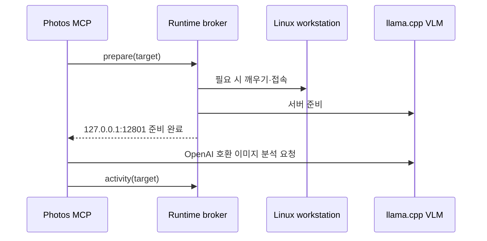

# 이미지 분석 런타임

> 기준: `src/photos_mcp/vision_runtime.py`, `src/photos_mcp/runtime_broker_client.py`

Photos MCP는 사진 분석 요청과 VLM 프로세스 수명 주기를 분리한다. 기본 정책은 Linux 워크스테이션의 OpenAI 호환 API를 준비해 사용하고, 정책 설정에 따라 Mac 로컬 MLX 모델만 사용할 수도 있다.

## 기본값

| 항목 | 기본값 |
| --- | --- |
| provider | `linux_qwen36` |
| backend | `openai_compat` |
| model | `Qwen3.8-27B-Q4_K_M.gguf` |
| API base | `http://127.0.0.1:12801/v1` |
| runtime target | `linux-qwen36-vlm` |
| 준비 제한 시간 | 330초 |
| Mac 로컬 model | `mlx-community/Qwen2.5-VL-7B-Instruct-4bit` |
| Mac 로컬 target | `qwen3-vl-4b` |

기본 Linux API가 loopback 주소인 이유는 SSH 터널이나 로컬 broker가 원격 llama.cpp endpoint를 Mac의 `127.0.0.1:12801`에 투영하기 때문이다.

`linux_qwen36` provider와 `linux-qwen36-vlm` target 이름은 이미 저장된 작업의
호환성을 위해 유지한다. 이는 현재 모델 버전이 아니라 기존 runtime 식별자다.

## 요청 흐름



broker 인터페이스는 Nanobot 구현에 의존하지 않는다. 실제 준비·활동 명령은 환경 변수로 주입되며, 이 경계 덕분에 앱 UI와 다른 MCP client가 같은 VLM 정책을 사용한다.

## 로컬 전용 정책

사진을 Linux로 전송하지 않으려면 앱을 다음 환경으로 실행한다.

```bash
PHOTOS_MCP_VLM_POLICY=local_only open -a PhotosMcp
```

이 정책에서는 `PHOTOS_MCP_LOCAL_VLM_MODEL`과 `PHOTOS_MCP_LOCAL_VLM_TARGET`을 사용할 수 있다. 이미 실행 중인 앱에는 새 환경 변수가 적용되지 않으므로 앱을 완전히 종료한 뒤 다시 시작한다.

## 주요 환경 변수

| 변수 | 용도 |
| --- | --- |
| `PHOTOS_MCP_VLM_POLICY` | `local_only` 등 런타임 정책 |
| `PHOTOS_MCP_VLM_PROVIDER` | provider 강제 지정 |
| `PHOTOS_MCP_LINUX_VLM_API_BASE` | Linux VLM API base |
| `PHOTOS_MCP_LINUX_VLM_MODEL` | Linux 모델명 |
| `PHOTOS_MCP_LINUX_VLM_PREPARE_COMMAND` | 첫 요청 전 준비 명령 |
| `PHOTOS_MCP_LINUX_VLM_ACTIVITY_COMMAND` | 요청 활동 기록 명령 |
| `PHOTOS_MCP_LINUX_VLM_PREPARE_TIMEOUT_SECONDS` | 준비 제한 시간 |
| `PHOTOS_MCP_LOCAL_VLM_MODEL` | Mac MLX 모델명 |
| `PHOTOS_MCP_LOCAL_VLM_TARGET` | 로컬 broker target |
| `PHOTO_RANKER_VLM_API_BASE` | photo-ranker API base override |
| `PHOTO_RANKER_VLM_MODEL` | photo-ranker 모델 override |

## 준비 상태 확인

```bash
curl -fsS http://127.0.0.1:18791/health/capabilities
curl -fsS http://127.0.0.1:12801/v1/models
```

첫 번째 응답의 `vision_runtime.ready`는 짧은 준비 상태 확인 결과다. Linux 깨우기나 모델 적재 중에는 아직 `false`일 수 있으므로 장기 분석 작업의 상태와 함께 판단한다.
