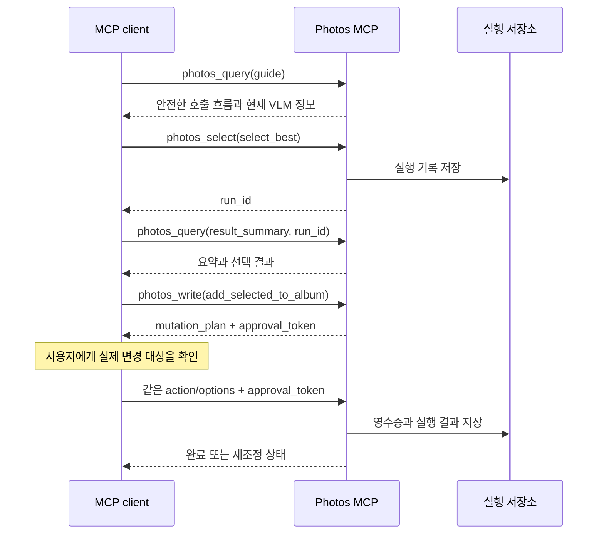

# MCP 통합 개요

> 기준: `src/photos_mcp/server.py`, `src/photos_mcp/facade/`

Photos MCP는 앱 프로세스가 소유하는 Streamable HTTP MCP server다. 기본 주소는 `http://127.0.0.1:18791/mcp`이며 외부 네트워크가 아니라 같은 Mac 안의 클라이언트만 연결하는 구성을 기본으로 한다.

## 공개 표면

| 도구 | 역할 | 원본 변경 |
| --- | --- | --- |
| `photos_query` | 상태, 탐색, 사진 조회, 결과 확인 | 없음 |
| `photos_select` | 분석, 분류, 우수 사진 선택 | 없음 |
| `photos_write` | 앨범 추가, 로컬 내보내기 | 승인 후 가능 |
| `photos_workflow` | 분석과 쓰기를 묶은 장기 작업 | 승인 후 가능 |

내부 vendor 도구는 공개 MCP 목록에 직접 노출하지 않는다. 클라이언트는 네 개의 facade 도구와 `action`, `options` 조합만 사용한다.

## 권장 호출 순서



도구 선택이 불명확하면 항상 다음 호출부터 시작한다.

```text
photos_query(action="guide", options={"goal": "overview"})
```

## 상태 확인

MCP 연결 전에 HTTP 상태를 먼저 분리해서 확인한다.

```bash
curl -fsS http://127.0.0.1:18791/health
curl -fsS http://127.0.0.1:18791/health/capabilities
```

- `status`: 전송 계층 상태
- `daemon_status`: `ready`, `busy`, `stopped` 등 앱 daemon 상태
- `preflight_status`: 사진 접근과 런타임 사전 점검 상태
- `capabilities.vision_runtime`: 선택된 VLM과 준비 여부

`ready`와 `busy`는 MCP 전송 계층이 요청을 받을 수 있다는 뜻이다. Apple 사진 권한이나 VLM 준비 상태는 capability 값을 별도로 확인해야 한다.

## 오류 처리 원칙

- 입력 오류는 임의로 고치지 말고 응답의 `error_code`, 허용 옵션, 사용 힌트를 따른다.
- 비동기 작업은 `run_id`를 보관하고 `result_summary` 또는 `result_detail`로 조회한다.
- iCloud 원본이 아직 로컬에 없으면 `wait_for_local`을 사용하거나 먼저 `prefetch`한다.
- 쓰기 재시도는 새 요청으로 반복하지 않고 기존 영수증과 재조정 결과를 확인한다.

전체 action 목록은 [MCP 도구 참조](02-tool-reference.md)를 따른다.
