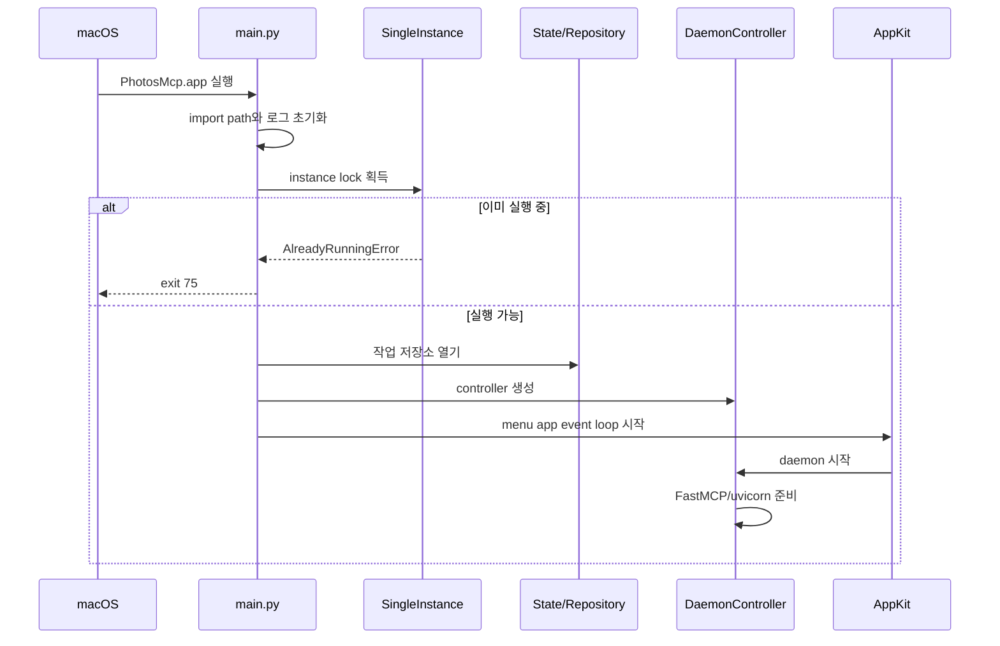

# 런타임 생명주기

> 근거: `main.py`, `single_instance.py`, `daemon.py`, `runtime_bootstrap.py`, `menu_app.py`

## 시작 순서



## 앱과 daemon

AppKit event loop가 프로세스의 주 실행 루프다. MCP server는 `PhotosMcpDaemonController`가 별도 thread에서 uvicorn으로 운영한다. UI는 daemon의 ready/busy/stopped 상태를 `PhotosMcpStateStore` snapshot으로 표시한다.

기본 설정은 앱 실행과 함께 daemon을 시작한다. `PHOTOS_MCP_START_DAEMON_ON_LAUNCH=0`으로 자동 시작을 끌 수 있으며 status menu에서 수동 시작·중지·재시작할 수 있다.

## 종료

정상 종료는 다음 순서를 지킨다.

1. 새 작업 수락 중지
2. daemon 종료 요청
3. background worker와 polling 정리
4. 저장소와 event loop 종료
5. single-instance lock 해제

작업 중 앱이 종료되더라도 영속 작업 기록이 남는다. 다음 실행에서 무단 재개하지 않도록 interrupted 또는 `awaiting_resume_approval` 상태를 사용한다.

## 런타임 경로

```text
~/.photos-mcp/
├── runtime/
│   └── photo-ranker/
│       └── jobs.db
├── cache/
│   ├── photo-source/
│   ├── vlm/
│   └── models/photo-ranker/
└── logs/
```

경로는 [설정 참조](../05-operations/README.md)의 환경변수로 변경할 수 있다.

## 상태 의미

| 상태 | 의미 |
| --- | --- |
| `ready` | MCP 요청을 받을 수 있음 |
| `busy` | daemon은 정상이며 작업 처리 중 |
| `stopped` | daemon이 정지됨 |
| `warning` | transport는 동작하지만 선택 capability가 미확인 또는 제한됨 |
| `failed` | 시작 또는 필수 검사 실패 |

health의 top-level 상태와 사진 권한 capability는 별도다. transport가 `ok`여도 특정 Apple 사진 작업은 권한 부족으로 제한될 수 있다.
