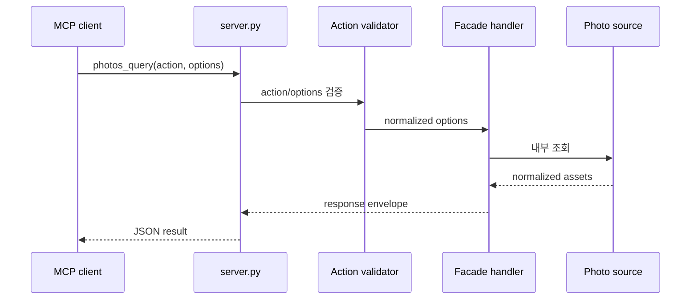
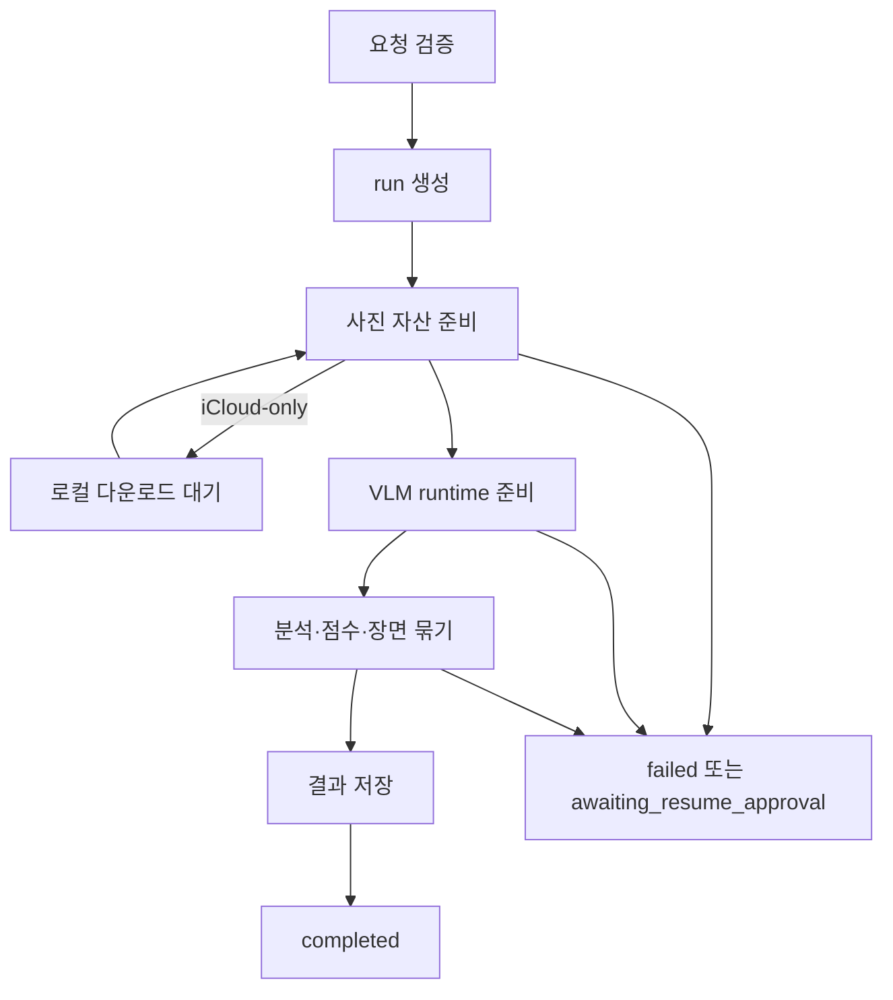
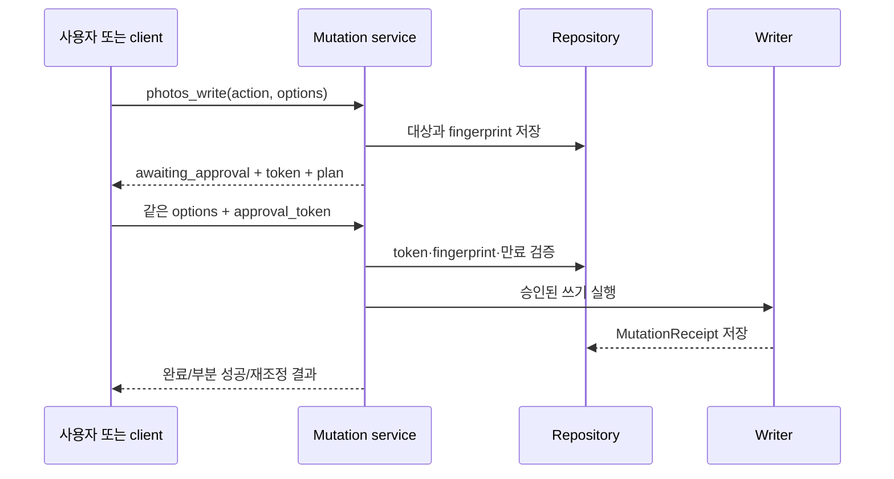

# 요청과 작업 흐름

> 근거: `server.py`, `facade/public_tools.py`, `facade/run_service.py`, `state.py`, `job_state.py`

## 동기 요청

상태 조회, 가이드, 제한된 목록 조회처럼 빠른 작업은 한 요청 안에서 결과를 반환한다.

## background 작업

사진 범위 분석, 원본 다운로드 대기, VLM 준비처럼 오래 걸리는 작업은 `run_id`를 가진다.

client는 다음 action으로 작업을 추적한다.

- `photos_query(action="result_summary")`
- `photos_query(action="result_detail")`
- `photos_query(action="selected")`
- `photos_query(action="artifacts")`
- `photos_query(action="cancel")`

`run_id="latest"`는 편의 기능이지만, 자동화에서는 명시적 run ID를 보존하는 것이 안전하다.

## 재개

재시작 또는 준비 실패 뒤 재개 가능한 작업은 다음 두 단계로 처리한다.

1. `photos_query(action="resume_plan", options={"run_id": ...})`로 저장 요청을 확인한다.
2. 사용자가 확인한 뒤 `photos_workflow(action="resume", ...)` 승인 절차를 수행한다.

## 쓰기 작업

options 또는 대상이 바뀌면 기존 token은 사용할 수 없다. 완료·부분 실패 후 같은 요청은 영수증과 실제 대상 상태를 이용해 중복 쓰기를 방지한다.
