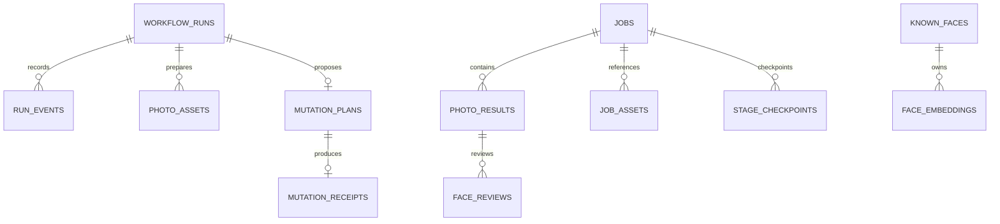

# 저장소와 데이터 모델

> 근거: `run_repository.py`, `vendor/photo-ranker/db.py`, `state.py`, `photo_assets.py`

## 저장 원칙

- 원본 사진은 저장소에 복제하지 않는다.
- 작업과 분석 결과는 SQLite에 영속화한다.
- 미리보기와 모델 파일은 cache 영역에 둔다.
- UI는 데이터베이스 레코드를 사용자용 snapshot으로 투영한다.

## SQLite 구성

기본 경로는 `~/.photos-mcp/runtime/photo-ranker/jobs.db`다. facade coordinator와 vendored ranker가 같은 파일 안에서 서로 다른 테이블을 사용한다.

## Coordinator 테이블

| 테이블 | 역할 |
| --- | --- |
| `workflow_runs` | facade 장기 실행과 요청 원본 |
| `run_events` | 진행 단계와 상태 변경 이력 |
| `mutation_plans` | 승인 전 쓰기 계획과 fingerprint |
| `mutation_receipts` | 실제 변경 결과와 재조정 정보 |
| `photo_assets` | 사진 ID, 준비 상태, 로컬 경로 가용성 |

## Ranker 테이블

| 테이블 | 역할 |
| --- | --- |
| `jobs` | 분석 작업 상태 |
| `photo_results` | 사진별 점수·분류·설명 |
| `job_assets` | 작업 입력 자산 |
| `stage_checkpoints` | 단계별 재개 지점 |
| `known_faces`, `face_embeddings`, `face_reviews` | 얼굴 관련 데이터와 사용자 검토 |

## 캐시

- source thumbnail과 조회 캐시
- VLM 입력용 이미지
- 다운로드된 모델 파일
- AppKit 메모리 thumbnail cache

캐시는 삭제 후 재생성할 수 있어야 한다. 작업 DB와 내보내기 영수증은 캐시와 동일하게 취급하지 않는다.

## 백업 시 주의

복구 가능성이 필요한 경우 `runtime`의 SQLite 파일과 내보내기 영수증을 먼저 보존한다. 사진 원본 자체는 Apple 사진 보관함 또는 사용자가 선택한 원본 폴더가 기준이다.
