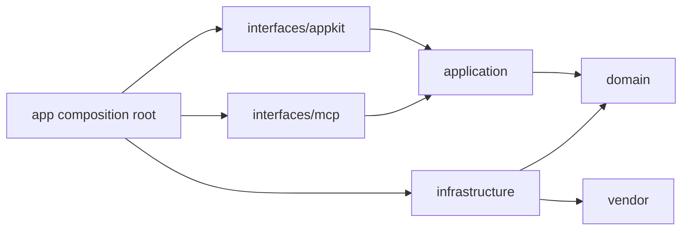

# 시스템 아키텍처

> 상태: 2026-08-09 리팩터링 반영
>
> 근거: `src/photos_mcp/app`, `domain`, `application`, `infrastructure`, `interfaces`, `operations`

## 계층과 책임

| 계층 | 책임 | 대표 코드 |
| --- | --- | --- |
| `app` | 설정, single-instance, 로그, UI·MCP composition root | `app/main.py`, `app/config.py` |
| `domain` | 사진·source·grant 모델, capability 정책, port | `domain/models`, `domain/policies`, `domain/ports` |
| `application` | 분류, 조회, 선택, 내보내기, 승인, cloud session use case | `application/*_service.py` |
| `infrastructure` | Apple·local·GCS·Google adapter, SQLite, Keychain, RAW, VLM, vendor gateway | `infrastructure/` |
| `interfaces/appkit` | 메인 창, 메뉴, 로컬 브라우저, 결과·뷰어 | `interfaces/appkit/` |
| `interfaces/mcp` | 4개 public tool, health route, MCP facade | `interfaces/mcp/` |
| `operations` | standalone 패키징과 실환경 검증 CLI | `operations/packaging`, `operations/validation` |
| `vendor` | 포함된 photo-source와 photo-ranker 구현 | `vendor/` |

최상위의 `main.py`, `server.py`, `*_appkit.py`, `state.py`, `vendor_loader.py` 등은 이전 import와 console entry point를 유지하는 compatibility module이다. 새 기능은 해당 wrapper에 추가하지 않는다.

## 의존 방향

`domain`은 AppKit, filesystem, network, SQLite와 vendor를 import하지 않는다. vendor는 host 기능이 필요할 때 `infrastructure/vendor_adapter/compat.py`를 통해서만 접근한다. 이 규칙은 `tests/architecture/test_dependency_rules.py`가 강제한다.

일부 application service는 기존 함수형 API와 생성자 기본값을 유지하기 위해 concrete repository 또는 vendor adapter를 기본 구현으로 참조한다. composition root에서 주입 가능한 port를 우선 사용하며, 이 연결을 UI에 다시 노출하지 않는다.

## Source 계약

사진 공급자는 하나의 범용 문자열 분기로 다루지 않는다.

- `PhotoCatalogPort`: 영속적으로 탐색 가능한 항목 목록
- `PhotoPickerPort`: 사용자 상호작용이 필요한 선택 session
- `PhotoContentPort`: 영구 경로 또는 만료형 grant를 실제 분석 입력으로 materialize
- `PhotoDestinationPort`: 내보내기나 앱 생성 콘텐츠 쓰기
- `CredentialStorePort`: 계정별 secret 저장

`SourceDescriptor`, `SourceCapabilities`, `AccessGrant`, `PhotoAssetRef`가 공급자 ID, 권한 수명, 정책과 준비 상태를 명시한다. Apple 사진, 로컬 파일, GCS와 Google Photos는 서로 다른 adapter와 capability를 사용한다.

Google Photos는 Picker session을 통해 사용자가 선택한 항목만 읽는 구조다. 얼굴 군집과 인물 식별은 source policy가 실행 전에 거부한다. 실제 OAuth 계정 연동 전까지 fake Picker lifecycle로 create, poll, pagination, consume, timeout, cancel과 cleanup을 검증한다.

## UI 구조

AppKit은 feature package로 구분한다.

- `main`: navigation shell과 홈·작업·환경 화면
- `menu`: status item, popover, 환경 검사와 presentation model
- `classification`: Apple 사진 직접 분류 입력
- `local_browser`: controller, folder tree, photo grid, single-photo view, 순수 pane layout
- `results`: gallery controller, reusable collection item, 확대·이동 viewer
- `shared`: theme과 main-thread 전달 helper

PyObjC selector와 delegate 수명주기가 있는 window controller는 concrete class에 유지한다. 재사용 가능한 collection item, folder model, keyboard view와 레이아웃 계산은 별도 모듈로 분리해 AppKit 회귀 범위를 줄였다.

## 실행과 저장

UI와 MCP는 같은 application service와 SQLite 상태를 사용한다. 읽기·분석은 사진과 앨범을 변경하지 않으며 쓰기는 mutation plan, fingerprint, 승인 token과 receipt를 거친다. 앱 재시작 뒤에는 영속 상태를 기준으로 작업과 내보내기 결과를 복구한다.

## 외부 endpoint

- MCP: `http://127.0.0.1:18791/mcp`
- Health: `http://127.0.0.1:18791/health`
- Capabilities: `http://127.0.0.1:18791/health/capabilities`

host, port와 path는 환경변수로 변경할 수 있지만 기본값은 loopback 전용이다.
