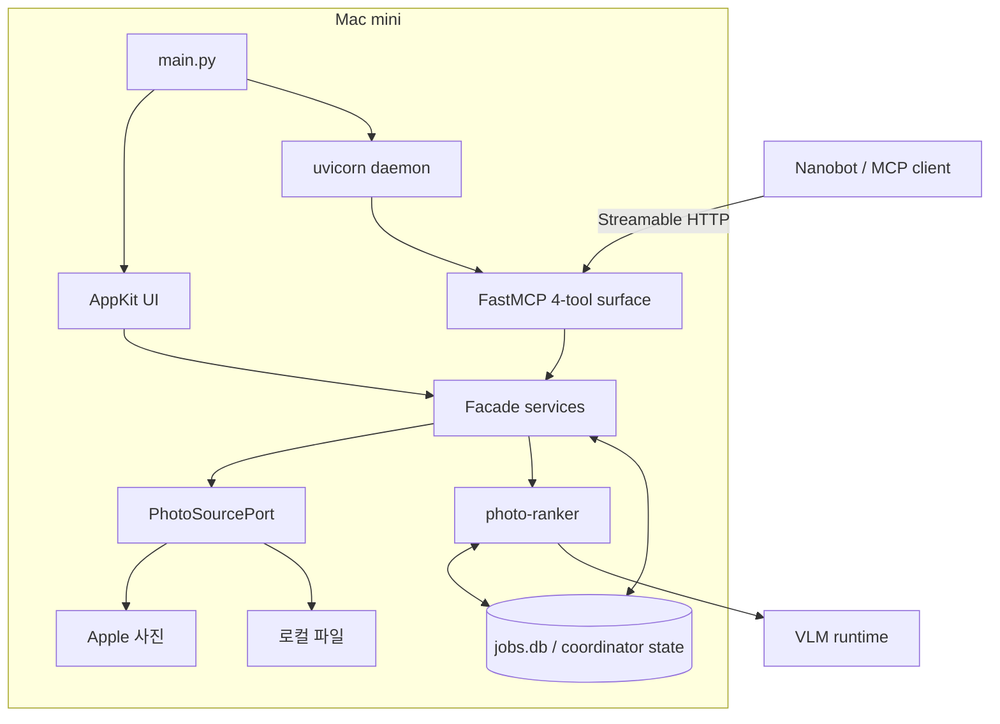

# 시스템 아키텍처

> 상태: 현행
>
> 근거: `main.py`, `server.py`, `daemon.py`, `state.py`, `facade/`, `vendor/`

## 구성 요소

| 계층 | 책임 | 주요 코드 |
| --- | --- | --- |
| 앱 진입점 | single-instance, 로그, 상태 저장소, UI 시작 | `main.py` |
| AppKit UI | 홈, 분류, 작업, 환경, 결과, 로컬 브라우저 | `*_appkit.py`, `menu_app.py` |
| HTTP/MCP | 4개 public tool과 health route | `server.py`, `daemon.py` |
| Facade | action 검증, orchestration, 응답 정규화 | `facade/` |
| Photo source port | Apple·local·Google·GCS 입력 정규화 | `photo_source_port.py`, `vendor/photo-source/` |
| Ranker | 품질·장면·얼굴·중복·선별·내보내기 | `vendor/photo-ranker/` |
| Runtime services | VLM 선택, Apple Photos runtime, preflight | `vision_runtime.py`, `apple_photos_runtime.py`, `preflight.py` |
| Persistence | 작업, 이벤트, 승인, 영수증, 자산 상태 | `run_repository.py`, `vendor/photo-ranker/db.py` |

## 전체 구조

## 중요한 설계 경계

### UI와 MCP는 같은 서비스 사용

UI가 별도 분석 엔진을 갖지 않는다. 직접 분류 화면은 `ClassificationCommand`를 만들고 facade/run service에 전달한다. MCP도 검증된 action을 같은 서비스에 전달한다. 따라서 작업 결과와 영속 상태가 한 곳에 모인다.

### Vendor 코드는 내부 구현

`photo-source`와 `photo-ranker`는 `src/photos_mcp/vendor` 아래에 포함되지만 외부 MCP tool로 직접 노출하지 않는다. `vendor_loader.py`와 명시적 port를 통해 접근한다.

### 읽기와 쓰기 분리

조회·분석 도구는 사진을 변경하지 않는다. 앨범 추가와 파일 내보내기는 `mutation_plan`과 승인 token을 거친다. 결과는 mutation receipt로 남는다.

### 실행 상태 영속화

장기 작업은 메모리 UI 상태가 아니라 SQLite 저장소가 기준이다. 앱 재시작 시 진행 중이던 작업은 자동으로 무조건 재개하지 않고 중단 또는 승인 대기 상태로 정리한다.

## 외부 endpoint

- MCP: `http://127.0.0.1:18791/mcp`
- Health: `http://127.0.0.1:18791/health`
- Capabilities: `http://127.0.0.1:18791/health/capabilities`

host, port와 path는 환경변수로 변경할 수 있지만 기본값은 loopback 전용이다.
