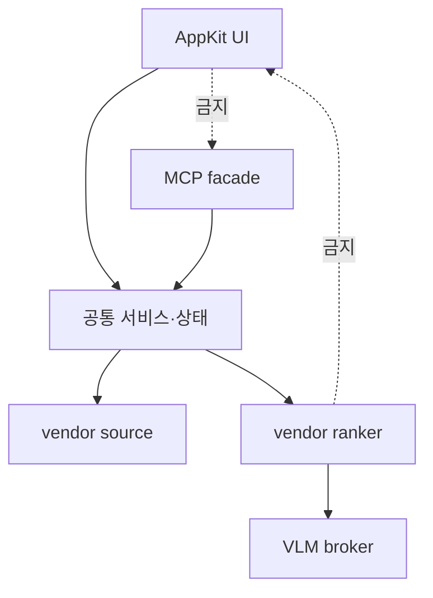

# 저장소 구조

```text
photos-mcp/
├── src/photos_mcp/          앱, MCP facade, 런타임, AppKit UI
│   ├── facade/              공개 action 검증과 orchestration
│   └── vendor/              photo-source, photo-ranker 구현
├── src/apple_terminal_helper/
├── scripts/                 빌드, smoke, VLM 검증 도구
├── tests/                   단위·통합·AppKit 구조 테스트
├── docs/                    현행 문서
├── pyproject.toml           패키지와 의존성
└── setup.py                 py2app 진입점
```

## 변경 위치 선택

| 변경 목적 | 우선 확인 위치 |
| --- | --- |
| MCP 공개 action | `facade/action_options.py`, `facade/public_tools.py`, `server.py` |
| 작업 실행·결과 | `facade/run_service.py`, `facade/result_service.py` |
| 쓰기 승인 | `mutation_approval.py`, `mutation_plan_service.py` |
| 앱 상태·작업 기록 | `state.py`, `run_repository.py`, `job_state.py` |
| 메인 AppKit UI | `main_window_appkit.py` |
| 로컬 폴더 브라우저 | `local_file_selection_appkit.py` |
| 결과 갤러리·뷰어 | `result_gallery_appkit.py`, `photo_viewer_appkit.py` |
| Apple 사진 접근 | `apple_photos_runtime.py`, vendor photo-source |
| 분석 알고리즘 | vendor photo-ranker |
| Linux/Mac VLM 선택 | `vision_runtime.py`, `runtime_broker_client.py` |
| 앱 번들 | `packaging.py`, `setup.py`, build script |

## 의존 방향

UI와 MCP는 facade와 공통 서비스를 호출한다. facade가 AppKit을 import하거나 vendor가 UI 상태를 직접 수정하지 않도록 유지한다.


