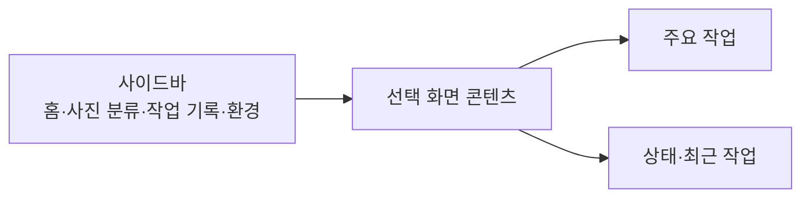
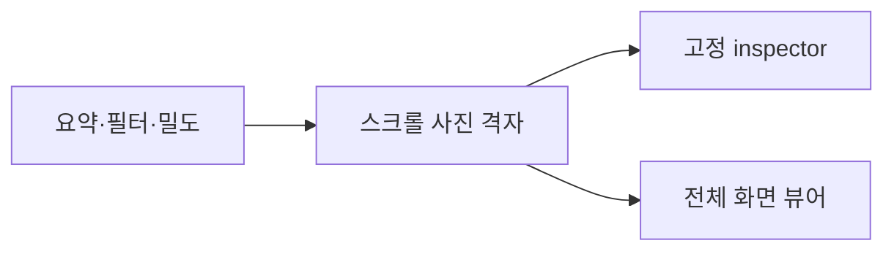

# 화면 패턴

## 메인 창

메인 창은 기능 탐색과 상태 요약에 집중한다. 메뉴 막대 popover는 서버 정지·재시작·종료 같은 운영 명령만 제공하고, 사진 분류와 결과 검토는 메인 창에서 수행한다.

## 로컬 폴더 브라우저

세 개의 pane을 사용한다.

1. 왼쪽: 내장 폴더 트리와 즐겨찾기
2. 중앙: 격자 또는 한 장 보기, 검색, 정렬, 밀도
3. 오른쪽: 현재 사진 정보와 작업 설정

왼쪽 pane은 깊은 경로를 읽을 수 있도록 창 폭의 최대 약 40%까지 확장 가능해야 한다. 중앙 이미지는 pane 안에서 비율을 유지해 resize하며, 데이터 로드 전후에 inspector가 겹치지 않아야 한다.

중앙 격자는 화면 폭과 밀도 설정을 함께 사용해 3~6열 범위에서 결정한다. 한 장 보기와 격자 모두 좌우 키로 포커스를 이동하고 Enter·Space로 분류 대상을 토글한다.

## 결과 갤러리

- 격자는 페이지 단위가 아니라 위아래 scroll을 기본으로 한다.
- 열 수는 실제 gallery 폭에 따라 3~6열로 자동 계산한다.
- `−`, `+`는 선호 카드 폭을 조절하며 현재 열 수를 표시한다.
- 오른쪽 inspector는 현재 사진의 큰 미리보기, 분석 요약, 점수, 분류를 유지한다.
- 전체 선택과 전체 해제를 제공하되 현재 필터 범위인지 전체 결과인지 라벨로 분명히 한다.

## 전체 화면 사진 뷰어

- 창 확대 시 이미지가 사용 가능 영역에 맞춰 커진다.
- trackpad magnification과 scroll 기반 확대·축소를 지원한다.
- 확대 범위는 제한하고 “화면에 맞춤”과 “실제 크기” 복귀를 제공한다.
- 좌우 이동과 현재 위치를 표시한다.
- 검은 이미지 배경과 별도 정보 panel을 사용해 사진과 분석 텍스트를 분리한다.

## Resize 검증 행렬

| 상태 | 확인 항목 |
| --- | --- |
| 최소 창 | 버튼·텍스트 겹침, inspector 최소 폭, scroll 가능 여부 |
| 기본 창 | 정보 밀도, 3-pane 비율, 초기 데이터 로드 위치 |
| 넓은 창 | 과도한 빈 공간, 자동 열 수, 사이드바 최대 폭 |
| 전체 화면 | 이미지 확대, inspector 유지, toolbar 정렬 |
| 데이터 0건 | 빈 상태와 작업 설정의 겹침 여부 |
| 데이터 로드 후 | resize 없이 즉시 올바른 frame인지 여부 |
