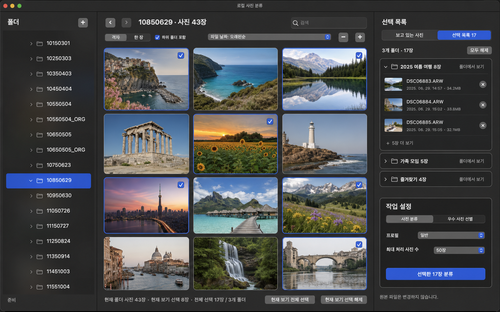

# 로컬 다중 폴더 누적 선택

## 상태

- 단계: 구현 및 설치본 실화면 검증 완료
- 작성일: 2026-08-09
- 대상 화면: `로컬 사진 분류`
- 목표: 여러 폴더에서 고른 사진을 하나의 분류 작업으로 실행

## UX 목업



목업은 실제 구현 방향을 정하기 위한 고해상도 시안이다. 현재 세 pane 구조를 유지하며, 선택 목록을 모달로 가리지 않고 오른쪽 inspector 안에서 전환해 표시한다.

## 문제

현재 로컬 사진 브라우저는 사진 선택 집합인 `_selected_paths`를 가지고 있지만 폴더를 이동할 때 `_load_current_folder(clear_selection=True)`를 호출한다. 새 스캔이 끝난 뒤에도 현재 폴더의 경로만 남기도록 `intersection_update`를 실행한다.

따라서 다음 작업을 완료할 수 없다.

1. 폴더 A에서 사진을 선택한다.
2. 폴더 B로 이동한다.
3. 폴더 B의 사진을 추가한다.
4. A와 B의 사진을 한 번에 비교·분류한다.

이 동작은 선택이 취소됐다는 피드백 없이 이전 선택을 제거하므로 사용자의 통제와 시스템 상태 가시성을 해치는 주요 UX 문제다.

휴리스틱 평가는 현재 `7/10`, 심각도 `3(주요 문제)`이다. 폴더 간 누적 선택, 숨은 선택의 가시성, 범위가 명확한 해제 기능, 실행 전 오류 복구를 모두 제공해야 `10/10` 완료 상태로 본다.

## 검토한 방안

| 방안 | 장점 | 문제 | 결정 |
| --- | --- | --- | --- |
| 폴더 이동 전 선택 초기화 확인 | 구현이 단순함 | 다중 폴더 작업을 해결하지 못함 | 제외 |
| 폴더별로 별도 작업 생성 | 기존 단일 폴더 계약 유지 | 폴더 간 유사 장면 비교와 대표 사진 선별이 분리됨 | 제외 |
| 사진을 임시 폴더로 복사·링크 | 단일 폴더 입력으로 만들 수 있음 | 저장 공간, 정리, 원본 추적, 링크 권한 문제가 생김 | 제외 |
| 현재 폴더와 독립된 선택 목록 유지 | 원본을 복사하지 않고 한 작업으로 처리 가능 | 숨은 선택을 관리하는 UI와 실행 전 검증이 필요함 | 채택 |

외부 라이브러리는 필요하지 않다. 현재 AppKit collection view, outline view와 기존 `selected_photo_ids` 계약을 유지하면서 구현할 수 있다.

## 확정 UX

### 선택 모델

- 사진의 파란 focus와 분류 대상 checkbox는 계속 독립적으로 동작한다.
- 폴더 이동, 뒤로·앞으로 이동, 검색, 정렬, 격자·한 장 보기 전환은 누적 선택을 변경하지 않는다.
- `하위 폴더 포함` 변경도 이미 선택한 사진을 제거하지 않는다.
- 선택은 로컬 사진 분류 창이 열려 있는 동안 유지한다.
- 사용자가 명시적으로 해제하거나 작업을 시작할 때 만든 실행 snapshot만 선택 상태를 바꿀 수 있다.

### 화면 표시

중앙 하단 요약을 다음처럼 변경한다.

```text
현재 폴더 사진 43장 · 현재 보기 선택 8장 · 전체 선택 17장 / 3개 폴더
```

오른쪽 inspector 상단에는 다음 segmented control을 둔다.

```text
[ 보고 있는 사진 | 선택 목록 17 ]
```

`보고 있는 사진`은 현재 focus 사진의 미리보기와 metadata를 표시한다. `선택 목록 N`은 누적 선택을 관리하는 inspector로 전환하며 다음 정보를 표시한다.

- 폴더별 그룹과 선택 수
- 작은 thumbnail, 파일명, 파일 날짜
- 항목별 선택 해제
- `폴더에서 보기`
- `모두 해제`
- 접근 불가 또는 이동된 파일 경고

선택 목록 inspector 하단에는 기존 작업 설정과 `선택한 N장 분류` 버튼을 고정한다. 목록만 세로로 스크롤되며 작업 설정은 화면에서 사라지지 않는다. 선택 목록은 사진 원본을 변경하지 않고 현재 선택 세션만 편집한다.

이 방식은 별도 sheet보다 다음 이점이 있다.

- 중앙 사진 격자를 가리지 않아 다른 폴더 사진을 계속 추가할 수 있다.
- `보고 있는 사진`과 `선택 목록`의 역할을 같은 inspector 위치에서 명확히 전환한다.
- 선택 수와 실행 설정을 동시에 확인할 수 있다.
- 창 크기가 달라져도 기존 세 pane resize 규칙을 그대로 사용할 수 있다.

### 보고 있는 사진 상세 정보

현재 구현은 파일명, 파일 수정 시각, 용량, 해상도만 표시한다. 개선 후 `보고 있는 사진` mode는 focus 사진의 metadata를 다음 구조로 제공한다.

```text
┌ 보고 있는 사진 | 선택 목록 17 ┐
│ 큰 미리보기                    │
│ DSC06883.ARW                   │
│ 2025. 06. 29. 14:57           │
│                                │
│ 35mm · f/2.8 · 1/250초 · ISO 100│
│                                │
│ ▾ 파일 및 이미지               │
│ ▾ 카메라와 렌즈                │
│ ▾ 촬영 설정                    │
│ ▸ 위치 정보 포함               │
│ ▸ 색상 및 고급 정보            │
│                                │
│ [정보 복사]                    │
├────────────────────────────────┤
│ 작업 설정                      │
│ [선택한 17장 분류]             │
└────────────────────────────────┘
```

미리보기 아래에는 자주 비교하는 `초점 거리 · 조리개 · 셔터 속도 · ISO` 요약을 한 줄로 우선 표시한다. 전체 정보는 disclosure section으로 펼친다.

| 섹션 | 표시할 정보 |
| --- | --- |
| 파일 및 이미지 | 파일명, 형식·UTI, 원본 경로, 파일 크기, 생성·수정 시각, 촬영 시각, 해상도, 방향, DPI, bit depth |
| 카메라와 렌즈 | 제조사, 카메라 모델, 렌즈 제조사·모델, 렌즈 사양, 실제 초점 거리, 35mm 환산 초점 거리, 최대 조리개, 초점 거리 범위, focus distance |
| 촬영 설정 | 조리개, 셔터 속도·노출 시간, ISO, 노출 보정, 노출 프로그램, 측광 방식, flash, white balance, light source, 촬영 모드, digital zoom |
| 위치 | GPS 위도·경도, 고도, 촬영 방향, GPS 시각. 값이 있을 때만 섹션 표시 |
| 기기 식별 정보 | ImageIO가 제공하는 카메라·렌즈 일련번호. 값이 있을 때만 별도 접힌 섹션으로 표시 |
| 색상 및 고급 정보 | color space·profile, pixel dimensions, orientation, software, artist·copyright, 사람이 읽을 수 있는 ImageIO 원본 key/value |

`모든 정보`의 범위는 ImageIO가 해당 JPG, HEIC, TIFF 또는 RAW 파일에서 반환한 표준 EXIF·TIFF·GPS·ExifAux metadata와 사람이 읽을 수 있는 추가 key/value다. 대용량 binary MakerNote와 thumbnail binary, 화면과 clipboard에 안전하게 표현할 수 없는 binary 값은 UI에 출력하지 않는다. 정상적인 사진에서는 이 제외 조건을 빼고 ImageIO가 반환한 사람이 읽을 수 있는 필드를 고급 정보까지 모두 제공한다. 비정상적으로 큰 metadata가 UI를 멈추지 않도록 최대 120개 필드와 필드당 256자 안전 상한을 둔다. SONY ARW의 비공개 maker field까지 ImageIO가 해석하지 못하면 실제 샘플 계측 후에만 ExifTool 같은 추가 parser 도입을 검토한다.

#### 개인정보 표시 원칙

- GPS와 카메라·렌즈 일련번호는 값의 존재만 먼저 알리고 기본 접힘 상태로 둔다.
- 사용자가 섹션을 펼쳤을 때만 정확한 좌표와 식별 값을 표시한다.
- `정보 복사`는 기본적으로 GPS, 원본 절대 경로, 일련번호를 제외한다.
- 민감 정보를 펼친 상태에서는 `표시된 정보 복사`로 명칭을 바꿔 복사 범위를 명확히 한다.
- reverse geocoding이나 지도 서버 전송은 자동 실행하지 않는다. 향후 위치명을 조회한다면 별도 동의와 network 정책이 필요하다.

#### 로딩과 화면 배치

- 폴더 스캔에서는 기존처럼 파일과 해상도만 빠르게 읽는다.
- 상세 metadata는 사진에 focus가 생길 때 background worker에서 지연 로드한다.
- 새 사진으로 빠르게 이동하면 이전 요청 결과가 현재 inspector를 덮어쓰지 않도록 generation token을 사용한다.
- cache key는 `canonical path + modified time + size`로 구성하고 bounded LRU cache를 사용한다.
- metadata 영역만 스크롤하고 하단 작업 설정과 실행 버튼은 고정한다.
- 값을 읽는 동안 skeleton 또는 `촬영 정보 불러오는 중`을 표시하고, 값이 없으면 해당 행을 숨긴다.
- 오류가 나도 미리보기·사진 선택·분류 실행은 계속 사용할 수 있어야 한다.

### 전체 선택과 해제

기존 `전체 선택`, `전체 해제`는 범위가 모호하므로 다음처럼 구분한다.

- `현재 보기 전체 선택`: 현재 검색·폴더 범위에 표시된 사진만 추가한다.
- `현재 보기 선택 해제`: 현재 표시 범위의 사진만 누적 목록에서 제거한다.
- `모두 해제`: 선택 목록 inspector에서 모든 폴더의 선택을 제거한다.

검색 중에는 버튼 문구를 `검색 결과 전체 선택`, `검색 결과 선택 해제`로 바꾼다.

### 폴더 이동

폴더를 이동하면 중앙 사진과 focus만 새 폴더 기준으로 갱신한다. 누적 선택은 유지하며, 이전 폴더로 돌아왔을 때 해당 사진의 checkbox를 다시 켠 상태로 표시한다.

폴더 트리의 선택 수 badge는 2차 개선으로 둔다. 1차 구현에서는 중앙 하단 전체 수와 오른쪽 `선택 목록` 버튼만으로도 숨은 선택을 확인하고 관리할 수 있어야 한다.

## 상태 구조

현재의 단순 `set[str]` 대신 화면 표시와 오류 복구에 필요한 metadata를 가진 세션을 둔다.

```text
LocalSelectionSession
  entries: canonical path -> LocalSelectionEntry

LocalSelectionEntry
  canonical_path
  display_name
  parent_folder
  modified_at
  size_bytes
  pixel_width / pixel_height
  availability: available | missing | unreadable

LocalPhotoMetadata
  file_and_image
  camera_and_lens
  exposure
  location
  color_and_advanced
  raw_human_readable_properties
  sensitive_fields
```

항목 키는 `expanduser().resolve()`로 정규화한 절대 경로를 사용한다. 같은 파일의 중복 추가를 방지하고, 표시 순서는 최초 선택 순서를 유지한다.

현재 폴더의 `_photos`와 `_focused_path`는 탐색 상태로 남긴다. 누적 선택 세션과 수명 및 책임을 분리한다.

## 실행 계약

### 하나의 작업으로 실행

여러 폴더의 사진은 별도 작업으로 나누지 않는다. 하나의 `ClassificationCommand`에 정확한 `selected_photo_ids` snapshot을 전달해 전체 사진에서 중복 장면과 대표 사진을 함께 비교한다.

`source_path`는 현재 보고 있는 폴더가 아니라 선택 파일 부모들의 공통 상위 디렉토리로 계산한다.

```text
/Photos/Trip/day-1/a.jpg
/Photos/Trip/day-2/b.jpg
              ↓
source_path = /Photos/Trip
selected_photo_ids = [두 절대 경로]
```

선택 경로가 명시된 경우 로더는 공통 상위 디렉토리를 재귀 스캔하지 않고 `selected_photo_ids`에 포함된 파일만 읽어야 한다. 이 규칙은 넓은 공통 경로에서 불필요한 사진을 읽거나 성능이 저하되는 것을 막는다.

서로 다른 volume의 사진도 절대 경로의 공통 상위 경로와 정확한 선택 목록으로 처리할 수 있다. 다만 sandbox를 도입할 경우 각 접근 위치의 security-scoped bookmark를 선택 세션에 보존하는 후속 작업이 필요하다.

### 실행 전 검증

실행 버튼을 누를 때 immutable snapshot을 만들고 다음을 다시 확인한다.

1. 중복 canonical path 제거
2. 파일 존재 및 regular file 여부
3. 지원 확장자와 실제 이미지 decode 가능 여부
4. 읽기 권한
5. 전체 선택 수와 최대 처리 수
6. 모든 경로가 계산된 공통 상위 경로 안에 있는지 확인

누락되거나 이동된 항목을 조용히 제거하지 않는다. 실행을 멈추고 `사용할 수 없는 사진 N장`을 표시한 뒤 `선택 목록 확인`과 `해당 항목 제외 후 계속`을 제공한다.

## 코드 변경 범위

### AppKit 화면

`local_file_selection_appkit.py`

- 폴더 이동 시 `clear_selection=True` 제거
- 사진 스캔 완료 시 전역 선택에 대한 `intersection_update` 제거
- 현재 보기 선택 수와 전체 누적 선택 수 분리
- 현재 보기 해제와 전체 해제 action 분리
- 선택 목록 inspector mode 및 폴더별 grouping 추가
- `보고 있는 사진` metadata scroll view와 disclosure section 추가
- focus 변경 시 상세 정보 비동기 로딩·취소·cache 연결
- 실행 시 현재 폴더 대신 선택 경로의 공통 상위 경로 계산
- 작업 실행 중 selection snapshot 고정

### metadata service

새 `local_photo_metadata.py`에 UI와 분리된 read-only parser를 둔다.

- `CGImageSourceCopyPropertiesAtIndex` 결과의 EXIF, TIFF, GPS, ExifAux dictionary 정규화
- rational·날짜·GPS·노출 값의 표시용 변환
- JPG, HEIC, TIFF, SONY ARW에 같은 반환 모델 제공
- 알려진 key의 한글 label과 단위 제공
- 알 수 있는 값은 고급 정보에 원본 key로 보존
- binary·지나치게 큰 값·재귀 깊이가 큰 metadata 제외
- 민감 field 표시와 clipboard redaction을 UI가 판단할 수 있도록 flag 제공

### 애플리케이션 서비스

`direct_classification.py`

- 공통 상위 경로 계산 helper 추가
- 다중 폴더 명시 선택 검증 추가
- 선택 목록이 있을 때 exact-path 로딩 계약 명시
- 사용자 오류 메시지에 누락·권한·지원 형식을 구분

### vendor 경계

`vendor/photo-ranker/sources.py`, `vendor/photo-ranker/server.py`

- 명시 선택은 공통 상위 경로 아래의 exact path만 읽는 기존 동작 유지
- 선택 목록이 있을 때 `rglob`을 실행하지 않는 회귀 테스트 추가
- job status에는 현재처럼 절대 선택 경로를 노출하지 않고 `selected_photo_count`만 노출

## 예외 처리

| 상황 | 처리 |
| --- | --- |
| 같은 사진을 두 번 선택 | 하나의 항목으로 유지 |
| 선택 후 파일 삭제·이동 | 선택 목록에 오류 표시, 실행 전 사용자 선택 요구 |
| 폴더 접근 권한 상실 | 해당 폴더 그룹에 접근 불가 표시 |
| 최대 처리 수 초과 | 전체 선택 수 기준으로 실행 비활성화 |
| 검색 결과 전체 선택 | 현재 검색 결과만 추가 |
| 현재 보기 선택 해제 | 다른 폴더 선택은 유지 |
| 폴더에 사진이 없음 | 누적 선택은 유지하고 현재 폴더 빈 상태만 표시 |
| 스캔이 늦게 완료됨 | generation이 일치하는 현재 탐색 결과만 반영, 누적 선택은 변경하지 않음 |
| 심볼릭 링크 | canonical path로 중복 제거하고 공통 상위 경로를 검증 |

## 테스트 계획

### 자동 테스트

- 폴더 A 선택 후 폴더 B 이동 시 A 선택 유지
- B 사진 추가 후 전체 수가 A+B와 일치
- A로 복귀할 때 checkbox 복원
- 뒤로·앞으로, 검색, 정렬, 보기 전환에서 선택 유지
- 하위 폴더 포함 변경에서 선택 유지
- 현재 보기 선택 해제가 다른 폴더 선택을 보존
- 모두 해제가 전체 세션을 비움
- 선택 목록 inspector의 폴더 grouping과 항목 제거
- 표준 EXIF fixture의 카메라·렌즈·노출·촬영 시각 정규화
- GPS DMS 좌표, 고도와 촬영 방향 변환
- metadata가 없는 PNG와 손상 파일의 안전한 빈 상태
- ARW ImageIO metadata dictionary 정규화
- binary MakerNote와 과도한 metadata 값 제외
- focus를 빠르게 바꿀 때 오래된 worker 결과 무시
- cache hit와 파일 수정 후 cache invalidation
- GPS·절대 경로·일련번호의 기본 clipboard 제외
- 최소 창 높이와 전체 화면에서 metadata scroll·작업 설정이 겹치지 않음
- 여러 폴더 선택의 공통 상위 `source_path` 계산
- exact selection에서 공통 상위 디렉토리를 재귀 스캔하지 않음
- 누락·권한 없음·지원하지 않는 파일 오류
- 1,000장 선택 시 UI 응답성과 limit 검증
- job status에 절대 경로가 노출되지 않음

### 실제 앱 검증

1. 폴더 A에서 3장을 선택한다.
2. 폴더 B에서 4장을 추가한다.
3. 폴더 A로 돌아가 3개 checkbox가 유지되는지 확인한다.
4. 선택 목록에 2개 폴더·7장이 표시되는지 확인한다.
5. 폴더 B 항목 1개를 해제해 6장이 되는지 확인한다.
6. 한 작업을 시작해 작업 기록의 입력·결과가 6장을 기준으로 생성되는지 확인한다.
7. JPG, HEIC, SONY ARW 혼합 입력으로 반복한다.
8. 각 형식의 `보고 있는 사진`에서 렌즈·노출·촬영 시각을 원본 EXIF와 비교한다.
9. GPS 포함 사진은 기본 접힘, 펼침, 복사 제외 동작을 확인한다.

개인 사진의 경로, 파일명, 인물 정보는 검증 문서에 기록하지 않고 폴더 수·선택 수·상태만 남긴다.

## 완료 조건

- 폴더를 이동해도 이전 선택이 사라지지 않는다.
- 사용자가 현재 폴더 밖의 선택을 항상 확인하고 해제할 수 있다.
- 여러 폴더의 사진이 하나의 분석 작업에서 함께 비교된다.
- 선택되지 않은 파일은 로더가 읽지 않는다.
- 누락 파일과 권한 오류가 조용히 무시되지 않는다.
- `보고 있는 사진`에서 ImageIO가 제공하는 촬영·렌즈·위치 정보를 섹션별로 확인할 수 있다.
- metadata가 없거나 읽기 실패한 사진도 탐색과 분류를 막지 않는다.
- 자동 테스트와 실제 앱 혼합 형식 검증이 모두 통과한다.

## 구현 순서

1. 누적 선택 세션과 공통 상위 경로 helper
2. 폴더 이동·스캔 시 선택 보존
3. 현재 보기/전체 선택 action 분리와 상태 문구
4. 선택 목록 inspector mode
5. ImageIO metadata service와 정규화 테스트
6. `보고 있는 사진` 상세 inspector와 개인정보 표시 정책
7. 실행 전 snapshot·재검증
8. 자동 회귀 테스트
9. standalone 재빌드와 실제 앱 E2E 검증

## 2026-08-09 구현 결과

- 폴더 이동, 검색, 정렬, 보기 방식과 `하위 폴더 포함` 변경 뒤에도 선택 세션을 유지한다.
- 중앙 하단은 현재 보기 선택과 전체 누적 선택 및 폴더 수를 함께 표시한다.
- 현재 보기 선택·해제와 전체 누적 해제를 서로 다른 action으로 분리했다.
- 오른쪽 inspector에서 `보고 있는 사진`과 `선택 목록 N`을 전환한다.
- 선택 목록은 폴더별 접기·펼치기, thumbnail, 파일명·수정 시각, 항목 해제, 폴더 이동을 제공한다.
- 한 폴더 그룹은 처음 60장만 렌더링해 1,000장 선택에서도 불필요한 view 생성을 제한한다.
- 작업 설정은 inspector 하단에 고정하고 사진 상세 정보와 선택 목록만 스크롤한다.
- 상세 정보는 ImageIO 기반으로 파일, 카메라·렌즈, 촬영 설정, GPS, 식별 정보, 색상·고급 속성을 지연 로딩한다.
- metadata cache는 경로·수정 시각·크기를 key로 하는 64개 제한 LRU이며 generation token으로 이전 사진의 늦은 결과를 버린다.
- `정보 복사`는 원본 절대 경로, GPS, 카메라·렌즈 일련번호를 제외한다.
- 실행 시 선택 파일 부모의 가장 좁은 공통 상위 경로와 exact `selected_photo_ids` snapshot을 사용한다.

자동 검증은 `./.venv/bin/pytest -q` 기준 434개가 통과했고, `./.venv/bin/python scripts/validate_docs.py`로 Markdown 40개의 링크와 문서 구조를 확인했다.

설치본은 standalone으로 다시 빌드하고 `~/Applications/PhotosMcp.app`과 `/Volumes/ExtData/system/Applications/PhotosMcp.app`에 반영했다. 실제 앱 검증 결과는 다음과 같다.

- 서로 다른 두 폴더에서 사진을 1장씩 선택한 뒤 폴더를 이동해도 `전체 선택 2장 / 2개 폴더`가 유지됐다.
- `선택 목록 2`에는 두 폴더가 별도 그룹으로 표시되고 thumbnail, 파일명, 수정 시각, 개별 해제와 `폴더 보기`가 정상 동작했다.
- 실제 SONY ARW에서 카메라 제조사·모델, 렌즈 모델·사양, 실제 및 35mm 환산 초점 거리, 조리개, 셔터 속도, ISO, 해상도와 고급 필드를 읽어 표시했다.
- 기본 창과 확대 창에서 중앙 격자, 우측 scroll 영역, 하단 고정 작업 설정 사이의 겹침이나 잘림이 없었다. 확대 창에서는 사진 밀도에 따라 중앙 격자 열 수가 늘어났다.
- metadata는 focus 사진이 바뀔 때 지연 로드됐고, 선택 목록으로 전환한 뒤에도 누적 선택과 작업 설정이 유지됐다.
- 최근 앱 로그에는 이 검증 과정에서 발생한 Python 예외나 AppKit 오류가 없었다.

실제 Linux LLM을 호출하는 장시간 분류 실행은 이번 UI 검증에서 수행하지 않았다. 실행 경로는 기존 exact `selected_photo_ids` 계약과 공통 상위 `source_path`를 사용하며 자동 회귀 테스트로 검증했다.
