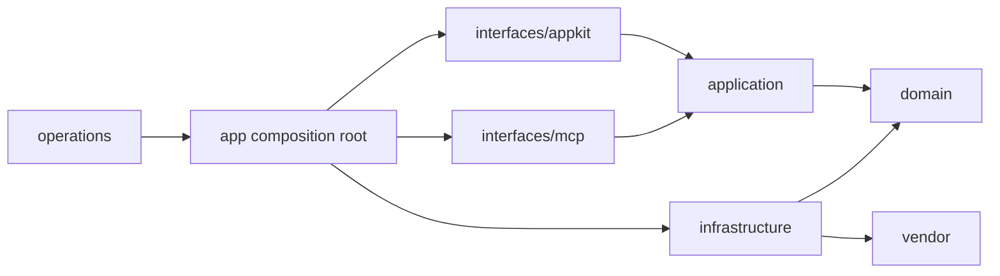
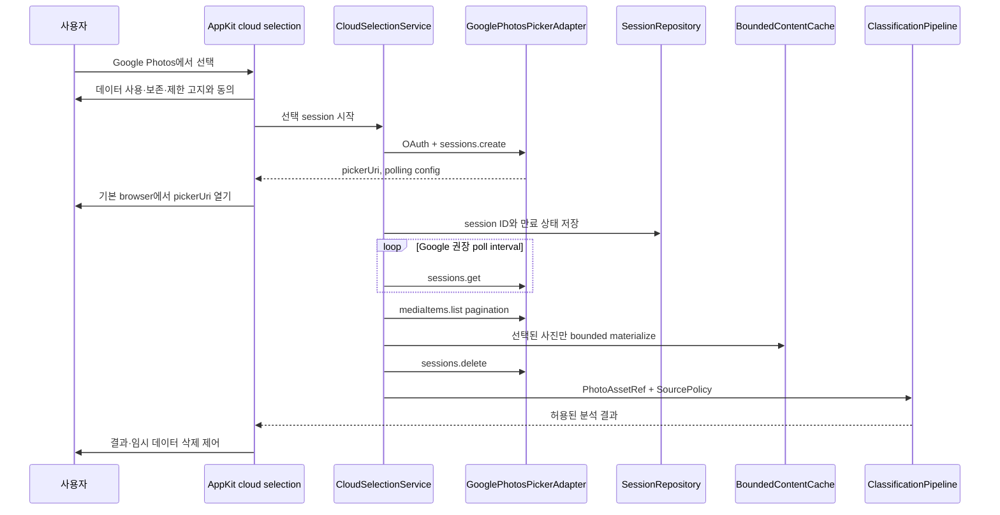

# Photos MCP 코드베이스 리팩터링

## 상태

- 단계: 0~7단계 구현 및 standalone 회귀 검증 완료
- 작성일: 2026-08-09
- 재검토: 2026-08-09, Google Photos Picker·Library API와 GCS 확장 경계 반영
- 대상: `src/photos_mcp`, `tests`, `scripts`, 앱 패키징과 관련 문서
- 목표: 사용자 기능과 MCP 계약을 유지하면서 책임별 모듈 경계, 디렉터리, 테스트 구조를 단계적으로 재정리하고 Google Photos 같은 대화형 cloud source를 추가할 수 있는 기반 확립

## 구현 결과

2026-08-09에 이 문서의 0~7단계를 독립 커밋으로 구현했다.

| 영역 | 반영 결과 |
| --- | --- |
| 공개 계약 | 4개 MCP tool, endpoint, console entry point와 기존 AppKit class import 유지 |
| domain | typed source, capability, access grant, asset reference와 source policy 추가 |
| application | 분류·결과·선택·내보내기·승인·preflight·cloud selection use case 이동 |
| infrastructure | Apple·local·GCS·Google, persistence, Keychain, RAW, VLM, vendor adapter 분리 |
| AppKit | main, menu, classification, local browser, results, shared feature package 구성 |
| 로컬 브라우저 | folder tree, photo grid, single-photo keyboard/zoom view와 pane layout 분리 |
| 결과 화면 | 공통 result presenter와 reusable collection item 분리, 기존 viewer 유지 |
| MCP·실행 | MCP interface와 app composition root 분리, 최상위 경로는 얇은 wrapper로 유지 |
| vendor | host import를 `infrastructure/vendor_adapter/compat.py` 한 경계로 제한 |
| Google Photos | 제거된 legacy Library 조회 구현 삭제, Picker fake lifecycle과 정책 gate 추가 |
| GCS | catalog, content, destination adapter와 별도 capability 추가 |
| 운영 | packaging·validation을 `operations`로 이동하고 이전 CLI 경로 유지 |

최종 자동 검증은 `466 passed`로 기준선 446건보다 20건 늘었다. 문서 검사, standalone py2app 빌드, 코드 서명, health, `osxphotos`, photo-source와 photo-ranker runtime import smoke가 모두 통과했다. 상세 결과는 [코드베이스 리팩터링 검증 보고서](../../08-reports/01-validation/06-codebase-refactoring-2026-08-09.md)에 기록한다.

PyObjC selector와 delegate 수명주기를 보호하기 위해 window controller 자체는 무리한 mixin 다중 상속으로 분해하지 않았다. 대신 독립 view, collection item, 순수 모델·레이아웃·service를 실제 package로 이동했다. controller 줄 수 상한은 완료 조건이 아닌 경보 기준으로 사용했으며, 이후 UX 변경 시 해당 feature package 안에서 추가 분리한다.

최상위 compatibility module도 즉시 제거하지 않았다. 기존 사용자 설치본, console entry point와 외부 import를 깨뜨리지 않는 것이 이 문서의 최우선 조건이므로 새 구현을 re-export하는 무상태 wrapper로 유지하고 architecture test로 동일 객체 연결을 고정했다.

## 결론

현재 코드는 기능과 테스트가 충분히 쌓여 있어 전면 재작성보다 **호환 계층을 둔 점진적 리팩터링**이 적절하다. 특히 AppKit 대형 controller를 먼저 기능별 component와 순수 상태 모델로 분리하고, 그 뒤 application service와 infrastructure adapter를 이동해야 한다.

한 번에 전체 파일을 이동하는 방식은 채택하지 않는다. PyObjC selector, py2app 모듈 수집, background callback, MCP import 경로와 SQLite 상태 복구를 동시에 깨뜨릴 위험이 크기 때문이다. 각 단계는 독립 커밋으로 끝내고 전체 테스트와 설치 앱 smoke를 통과한 뒤 다음 단계로 진행한다.

Google Photos는 Apple 사진처럼 전체 보관함을 자유롭게 탐색하는 source가 아니다. 2025년 3월 이후 사용자가 기존 보관함에서 사진을 제공하는 흐름은 Picker API의 대화형·만료형 session을 사용해야 한다. 따라서 `source="google"` 분기만 추가하는 구조가 아니라 **카탈로그형 source, 사용자 선택형 source, 콘텐츠 접근, 쓰기 destination과 권한 수명**을 서로 분리한다.

## 기준선

2026-08-09에 현재 저장소를 직접 계측한 결과다.

| 항목 | 현재 값 |
| --- | ---: |
| 비 vendor Python module | 54개 |
| vendor Python module | 41개 |
| 비 vendor 코드 | 20,099줄 |
| vendor 코드 | 12,664줄 |
| 테스트 module | 54개 |
| 테스트 코드 | 12,114줄 |
| 자동 테스트 | 446개 통과 |
| 현행 Markdown 검증 | 44개 통과 |

검증 명령은 다음과 같다.

```bash
./.venv/bin/pytest -q
./.venv/bin/python scripts/validate_docs.py
```

리팩터링 단계마다 최소한 이 두 명령이 계속 통과해야 한다. 테스트 수가 줄어들면 삭제 이유와 대체 검증을 같은 커밋에 기록한다.

## 현재 구조에서 유지할 장점

현재 구조 전체가 잘못된 것은 아니다. 아래 경계는 유지하거나 강화한다.

- `facade/`는 MCP action 검증, 실행 orchestration, 응답 정규화를 이미 분리하고 있다.
- UI와 MCP는 같은 분석·작업 상태를 사용하며 별도 분석 엔진을 중복 구현하지 않는다.
- `PhotoSourcePort`가 Apple 사진과 로컬 파일 입력을 하나의 계약으로 정규화한다.
- 읽기 작업과 승인 기반 쓰기 작업이 분리되어 있다.
- 장기 작업과 내보내기 결과는 UI 메모리가 아닌 영속 저장소를 기준으로 복구한다.
- `vendor_loader.py`와 패키징 검증이 포함 vendor의 import 오염을 통제한다.
- AppKit 구조, MCP 계약, 패키징을 포함한 자동 회귀 테스트가 이미 충분한 안전망을 제공한다.

## 확인된 구조 문제

### 1. 최상위 패키지가 평면적임

`src/photos_mcp` 최상위에 UI, 설정, 저장소, 사진 decode, VLM 연결, MCP server, 패키징, 검증 코드가 함께 있다. 파일명만으로는 의존 방향과 변경 영향을 판단하기 어렵다.

### 2. AppKit controller의 책임이 너무 큼

| 파일 | 줄 수 | 현재 함께 가진 책임 |
| --- | ---: | --- |
| `local_file_selection_appkit.py` | 2,369 | 폴더 트리, 파일 스캔, RAW thumbnail, 선택 세션, 격자·한 장 보기, metadata, keyboard, layout, 작업 실행 |
| `menu_app.py` | 1,989 | status item, popover, 환경 검사, legacy 결과 창, 앱 lifecycle |
| `result_gallery_appkit.py` | 1,392 | 결과 정규화, filter, collection item, inspector, 비동기 asset 준비, 내보내기 |
| `main_window_appkit.py` | 936 | 창 shell, navigation, 홈, 작업 기록, 환경 화면, async refresh |
| `photo_viewer_appkit.py` | 705 | 확대 canvas, scroll 계산, toolbar, RAW 비동기 준비, window lifecycle |

UI class가 filesystem과 vendor 호출까지 직접 수행하므로 작은 UX 변경도 controller 전체를 건드리게 된다. `test_menu_appkit_layout.py`도 1,603줄까지 커져 화면별 실패 원인을 빠르게 찾기 어렵다.

### 3. 화면 표현용 순수 함수가 중복됨

`result_item_failure`, `sanitized_result_export_payload`, `sorted_result_items`가 `menu_app.py`와 `result_gallery_appkit.py`에 중복되어 있다. 한 화면만 수정하면 최근 작업과 결과 화면의 의미가 달라질 수 있다.

### 4. UI와 infrastructure가 직접 결합됨

AppKit controller가 파일 스캔, RAW decode, metadata 추출, runtime 상태, vendor 호출과 내보내기를 직접 안다. 따라서 화면을 테스트하려면 많은 framework mock과 실제 경로 형태가 필요하다.

### 5. vendor가 host runtime을 역참조함

`vendor/photo-ranker`와 `vendor/photo-source` 일부가 `photos_mcp.runtime_paths`, `vision_runtime`, `apple_photos_runtime`, `raw_image`를 직접 import한다. 지금은 동작하지만 vendor 내부 코드를 독립 검증하거나 교체하기 어렵다.

### 6. PyObjC와 py2app 제약이 명시적인 경계로 관리되지 않음

문자열 selector, `performSelectorOnMainThread...`, AppKit delegate/data source와 background callback이 대형 UI 파일 안에 흩어져 있다. 일반 Python 파일 이동처럼 처리하면 source 실행은 통과해도 설치 앱에서 selector 또는 module 수집이 실패할 수 있다.

### 7. 문서와 실제 경로가 일부 어긋남

현행 개발 문서에는 존재하지 않는 `local_photo_browser_appkit.py`가 로컬 브라우저 경로로 적혀 있었다. 코드 이동은 문서, 테스트 명령과 패키징 경로를 같은 단계에서 갱신해야 한다.

### 8. 현재 Google Photos 구현은 최신 API 계약과 맞지 않음

`vendor/photo-source/sources/google_photos.py`는 제거된 `photoslibrary.readonly` scope와 전체 보관함의 `list`, `search`, album 탐색을 전제로 한다. Google은 2025년 3월 31일부터 해당 scope를 제거했고 Library API 조회를 앱이 생성한 데이터로 제한했다. 사용자가 기존 Google Photos 보관함에서 사진을 고르는 기능은 Picker API로 전환해야 한다.

현재 구현에는 다음 구조적 문제가 함께 있다.

- OAuth token을 공용 `~/.config/photo-source/token.json`에 저장하며 macOS Keychain과 계정별 격리가 없다.
- process 전역 Google source instance 하나만 사용해 계정 전환과 credentials 변경을 구분하지 못한다.
- Picker session 생성, browser 전환, polling, timeout, cancel과 session 삭제 상태가 없다.
- Google Photos `baseUrl`의 짧은 유효 기간과 재요청을 모델링하지 않는다.
- `PhotoAsset`은 Apple 이외 source에 ID만 있으면 분석 준비로 판단해 만료형 cloud asset을 잘못 ready로 표시할 수 있다.
- `PhotoSourcePort`의 `source`, `path_or_bucket` 문자열이 로컬 경로, GCS bucket과 Google 권한 session을 한 필드에 섞는다.
- Google Photos 전용 자동 테스트가 없고 `Photo` model의 source 설명에도 Google이 누락되어 있다.

### 9. Google Photos와 GCS가 같은 cloud source로 취급됨

Google Photos는 개인 사진에 대한 OAuth·사용자 선택·정책 기반 API이고, GCS는 bucket object에 대한 cloud storage API다. 인증, 탐색, 접근 수명, 쓰기, 개인정보 정책이 완전히 다르므로 같은 adapter나 `path_or_bucket` 계약을 공유하면 안 된다.

### 10. 공급자별 허용 기능을 pipeline이 알 수 없음

Google Photos API 정책은 API로 받은 사진을 이용한 얼굴 군집 생성을 금지한다. 현재 pipeline은 source의 정책 capability를 받지 않으므로 Google Photos 입력에서도 얼굴 clustering이나 인물 식별 단계가 실행될 수 있다. source별 허용 기능을 application 계층에서 강제하는 정책 모델이 필요하다.

## 리팩터링 원칙

1. 사용자 동작, 공개 MCP tool 이름, action, 응답 envelope와 저장 데이터 계약을 먼저 고정한다.
2. 파일 이동과 기능 변경을 가능한 한 같은 커밋에 섞지 않는다.
3. UI는 application service와 presentation model만 호출하고 vendor 구현을 직접 알지 않는다.
4. domain은 AppKit, filesystem, network, SQLite와 vendor package를 import하지 않는다.
5. infrastructure가 domain port를 구현하며 Apple 사진, 로컬 파일, VLM, DB와 RAW decode를 담당한다.
6. AppKit selector를 가진 class는 한 단계에서 하나씩 이동하고 기존 class 이름과 selector 문자열을 유지한다.
7. 이전 import 경로는 과도기 compatibility module에서 re-export하고 설치 앱 검증 뒤 제거한다.
8. `vendor/` 내부 재구성은 host 경계를 안정화한 뒤 마지막 별도 단계로 진행한다.
9. 리팩터링 중 사진 원본 읽기·쓰기 정책과 승인 절차를 변경하지 않는다.
10. 각 단계는 되돌릴 수 있는 크기로 커밋한다.
11. source를 문자열 `if/elif`로 판별하지 않고 registry와 capability로 선택한다.
12. 사진을 읽는 source와 결과를 쓰는 destination을 별도 port로 취급한다.
13. 영구 경로, 만료형 URL과 사용자 선택 session을 하나의 asset ID로 혼동하지 않는다.
14. OAuth scope와 공급자 정책은 UI 표시만이 아니라 application service에서 실행 전에 강제한다.
15. cloud 원본은 큰 base64 문자열로 계층 사이를 전달하지 않고 bounded stream 또는 관리되는 임시 파일로 처리한다.

## 이름과 정렬 원칙

문서는 기존 정책대로 `01-`, `02-`, `03-` 번호를 사용하고 각 디렉터리의 진입점은 `README.md`로 둔다.

Python source와 test package에는 숫자 접두사를 사용하지 않는다. `01-core` 같은 이름은 정상적인 Python import 식별자가 아니며 도구 호환성도 떨어진다. 코드 디렉터리는 `domain`, `application`, `infrastructure`처럼 책임이 드러나는 `snake_case` 이름을 사용하고, 읽는 순서는 각 package의 `README.md`와 architecture 문서에서 안내한다.

## 목표 디렉터리

```text
src/photos_mcp/
├── app/
│   ├── main.py
│   ├── config.py
│   ├── lifecycle.py
│   ├── logging.py
│   └── single_instance.py
├── domain/
│   ├── models/
│   │   ├── photo.py
│   │   ├── job.py
│   │   ├── run.py
│   │   ├── mutation.py
│   │   ├── source.py
│   │   ├── source_capability.py
│   │   └── access_grant.py
│   ├── policies/
│   │   ├── result_category.py
│   │   ├── selection.py
│   │   └── source_policy.py
│   └── ports/
│       ├── photo_catalog.py
│       ├── photo_picker.py
│       ├── photo_content.py
│       ├── photo_destination.py
│       ├── credential_store.py
│       ├── run_repository.py
│       └── vision_runtime.py
├── application/
│   ├── classification_service.py
│   ├── result_service.py
│   ├── export_service.py
│   ├── mutation_service.py
│   ├── preflight_service.py
│   ├── viewer_asset_service.py
│   ├── source_registry.py
│   └── cloud_selection_service.py
├── infrastructure/
│   ├── sources/
│   │   ├── apple_photos/
│   │   │   ├── catalog.py
│   │   │   ├── content.py
│   │   │   └── runtime.py
│   │   ├── local_files/
│   │   │   ├── catalog.py
│   │   │   ├── content.py
│   │   │   ├── metadata.py
│   │   │   └── raw_image.py
│   │   ├── google_photos/
│   │   │   ├── oauth.py
│   │   │   ├── picker.py
│   │   │   ├── content.py
│   │   │   ├── session_repository.py
│   │   │   └── library_destination.py
│   │   └── gcs/
│   │       ├── catalog.py
│   │       ├── content.py
│   │       └── destination.py
│   ├── persistence/
│   │   ├── run_repository.py
│   │   └── state_store.py
│   ├── credentials/
│   │   └── keychain.py
│   ├── vision/
│   │   ├── broker_client.py
│   │   └── runtime.py
│   └── vendor_adapter/
│       ├── loader.py
│       ├── photo_source.py
│       └── photo_ranker.py
├── interfaces/
│   ├── mcp/
│   │   ├── server.py
│   │   ├── health.py
│   │   └── facade/
│   └── appkit/
│       ├── shared/
│       │   ├── theme.py
│       │   ├── controls.py
│       │   ├── async_delivery.py
│       │   └── zoom_canvas.py
│       ├── main/
│       ├── menu/
│       ├── classification/
│       ├── cloud_selection/
│       ├── local_browser/
│       │   ├── controller.py
│       │   ├── folder_tree.py
│       │   ├── photo_grid.py
│       │   ├── single_photo.py
│       │   ├── selection_session.py
│       │   └── inspector.py
│       └── results/
│           ├── controller.py
│           ├── collection_item.py
│           ├── presenter.py
│           └── photo_viewer.py
├── operations/
│   ├── packaging/
│   └── validation/
└── vendor/
    ├── photo-source/
    └── photo-ranker/
```

최종 tree는 책임을 나타내는 목표다. 기존 최상위 compatibility module은 전환 기간 동안 남아 있을 수 있으며, 모든 경로를 한 번에 만들지는 않는다.

## 의존 방향



허용 규칙은 다음과 같다.

- `domain`은 다른 Photos MCP package에 의존하지 않는다.
- `application`은 `domain`에만 의존한다.
- `interfaces`는 `application`과 presentation 전용 model에 의존한다.
- `infrastructure`는 domain port를 구현하고 외부 framework와 vendor를 감싼다.
- concrete 구현을 연결하는 일은 `app` composition root만 담당한다.
- `vendor`에서 host module을 직접 import하는 현재 예외는 마지막 단계까지 inventory로 고정하고 adapter 주입으로 줄인다.
- source provider의 OAuth client, bucket client, temporary URL과 SDK response는 `infrastructure` 밖으로 노출하지 않는다.
- pipeline은 provider 이름을 해석하지 않고 `SourceCapabilities`와 `SourcePolicy`만 전달받는다.

## 주요 파일 이동안

| 현재 경로 | 목표 책임 | 비고 |
| --- | --- | --- |
| `main.py`, `config.py`, `single_instance.py`, `logging_setup.py` | `app/` | entry point wrapper 유지 |
| `daemon.py`, `server.py`, `facade/` | `interfaces/mcp/` | public tool/action 계약 불변 |
| `photo_assets.py`, `job_state.py`의 순수 모델 | `domain/models/` | persistence와 분리 |
| `photo_source_port.py` | `domain/ports/`의 catalog·picker·content 분리 | 기존 문자열 계약은 compatibility adapter로 한시 유지 |
| `direct_classification.py` | `application/classification_service.py` | AppKit import 금지 |
| `desktop_export_service.py`, mutation 관련 module | `application/` | 승인 계약 유지 |
| `apple_photo_asset.py`, `apple_photos_runtime.py` | `infrastructure/sources/apple_photos/` | 실제 보관함 접근 격리 |
| `raw_image.py`, `local_photo_metadata.py` | `infrastructure/sources/local_files/` | ImageIO/Pillow 경계 |
| legacy `google_photos.py` | 폐기 대상 compatibility 구현 | Picker client와 앱 생성 콘텐츠 destination으로 대체 |
| `gcs.py`와 GCS ranker loader | `infrastructure/sources/gcs/` | Google Photos와 분리, catalog/content 계약 유지 |
| `runtime_broker_client.py`, `vision_runtime.py` | `infrastructure/vision/` | Linux wake/idle 계약 유지 |
| `state.py`, `run_repository.py`의 concrete 저장 | `infrastructure/persistence/` | domain snapshot과 분리 |
| `*_appkit.py`, `menu_app.py`, `menu_presentation.py` | `interfaces/appkit/` | 화면 feature별 분리 |
| `packaging*.py`, `live_validation.py`, `llm_sample_validation.py` | `operations/` | console script wrapper 유지 |
| `vendor/` | 현재 위치 유지 | host 경계 완료 후 별도 분리 |

## Cloud 확장을 위한 핵심 계약

### 공급자 문자열 대신 명시적 모델 사용

```text
SourceDescriptor
  source_id              # 설치 내 고유 ID
  provider               # apple_photos | local_files | google_photos | gcs
  account_id             # 계정 식별용 내부 key, 화면 표시명과 분리
  locator                # local root 또는 GCS bucket/prefix처럼 provider가 해석할 값

SourceCapabilities
  catalog_browse
  interactive_picker
  list_albums
  date_filter
  persistent_asset_access
  thumbnail_access
  original_content_access
  write_destination
  face_quality_allowed
  face_clustering_allowed

AccessGrant
  grant_id
  source_id
  grant_type             # local_permission | oauth | picker_session | workload_identity
  created_at
  expires_at
  status                 # active | expired | revoked | consumed

PhotoAssetRef
  source_id
  provider_asset_id
  access_grant_id
  media_type
  content_state          # metadata_only | thumbnail_ready | materialized | expired
  content_expires_at
```

`PhotoAssetRef`에는 Google의 `baseUrl`이나 OAuth access token을 저장하지 않는다. infrastructure adapter가 유효한 grant를 사용해 필요한 순간에 콘텐츠 주소를 해석한다.

### 하나의 범용 source port를 네 역할로 분리

| Port | 책임 | 구현 예시 |
| --- | --- | --- |
| `PhotoCatalogPort` | 반복 가능한 목록·앨범·날짜 탐색 | Apple 사진, 로컬 폴더, GCS, Google 앱 생성 콘텐츠 |
| `PhotoPickerPort` | 사용자 대화형 선택 session | Google Photos Picker |
| `PhotoContentPort` | thumbnail·원본 stream·metadata 해석 | Apple, local, Google, GCS provider별 구현 |
| `PhotoDestinationPort` | 승인 후 업로드·앨범·파일 쓰기 | Apple 앨범, 로컬 디렉터리, 향후 Google 앱 생성 앨범, GCS |

OAuth token 저장과 갱신은 `CredentialStorePort`와 provider auth adapter가 담당한다. macOS 설치 앱에서는 refresh token과 계정 식별 정보를 평문 JSON이 아니라 Keychain에 저장한다.

### 공급자 capability 기준

| 기능 | Apple 사진 | 로컬 폴더 | Google Photos | GCS |
| --- | --- | --- | --- | --- |
| 전체 범위 탐색 | 권한 범위 내 가능 | 선택 root 아래 가능 | 불가, 사용자 Picker 선택만 | 허용된 bucket/prefix 가능 |
| 대화형 선택 | 앱 자체 album/기간 UI | 앱 자체 folder UI | Google Picker session | 필요 없음 |
| 접근 수명 | 보관함 권한·iCloud 상태 | 파일 권한 수명 | session과 content URL 만료 | credential·object 수명 |
| 원본 준비 | iCloud local readiness | 로컬 decode | 유효 grant로 임시 materialize | object stream/download |
| 앨범/파일 쓰기 | 승인 후 Apple 앨범 | 승인 후 디렉터리 | 앱 생성 콘텐츠에 한해 별도 destination | 별도 GCS destination 승인 필요 |
| 얼굴 군집·인물 식별 | 로컬 정책에 따라 가능 | 로컬 정책에 따라 가능 | 정책상 금지 | 데이터 소유·동의 정책에 따라 판단 |

Google Photos의 얼굴 **품질 점수**처럼 군집을 만들지 않는 처리도 구현 전에 최신 정책과 OAuth 검증 범위를 별도로 확인한다. 명시적 승인이 끝나기 전에는 Google Photos source에서 얼굴 관련 단계 전체를 기본 비활성화한다.

## Google Photos 예정 흐름



구현 규칙:

1. `pickerUri`는 embedded web view나 iframe이 아니라 기본 browser로 연다.
2. polling 간격과 timeout은 Google 응답의 `pollingConfig`를 따른다.
3. 목록은 pagination하며 2,000장 같은 큰 선택도 메모리에 한 번에 펼치지 않는다.
4. `baseUrl`은 최대 60분의 단기 접근 정보로 취급하고 DB의 영구 사진 경로로 저장하지 않는다.
5. 분석에 필요한 크기만 bounded cache로 materialize하고 종료·취소·보존 기간 만료 시 삭제한다.
6. session을 완료, 취소 또는 timeout 처리한 뒤 정리하며 orphan session을 복구할 수 있게 ID를 임시 저장한다.
7. Google Photos에서 받은 사진은 얼굴 clustering과 인물 식별 pipeline에 전달하지 않는다.
8. Library API는 사용자의 전체 보관함 source가 아니라 향후 **앱이 업로드한 콘텐츠**를 관리하는 destination/read-back adapter로만 사용한다.

## 공식 API 근거

- [Google Photos API 변경 안내](https://developers.google.com/photos/support/updates): 2025년 3월 31일부터 `photoslibrary.readonly`, `photoslibrary.sharing`, `photoslibrary` scope 제거와 Library API의 앱 생성 콘텐츠 제한
- [Picker session 관리](https://developers.google.com/photos/picker/guides/sessions): session 생성, 권장 polling, timeout과 삭제 lifecycle
- [Picker media item 조회](https://developers.google.com/photos/picker/guides/media-items): pagination, 인증된 content 요청과 단기 `baseUrl`
- [Library API 시작 안내](https://developers.google.com/photos/library/guides/get-started-library): 앱이 생성한 media와 album 중심의 Library API 역할
- [Photos API 데이터 정책](https://developers.google.com/photos/support/api-policy): 최소 권한, 명시적 고지·동의·삭제와 얼굴 군집 금지

이 문서의 Google Photos 설계는 2026-08-09에 위 공식 문서를 기준으로 재검토했다. 구현 직전 release note와 정책을 다시 확인하는 검증 gate를 둔다.

## AppKit 전용 구조 제약

일반 Python service 분리 원칙만 적용하면 source 테스트는 통과해도 설치 앱에서 window와 action이 사라질 수 있다. AppKit 계층은 다음 규칙을 별도로 지킨다.

- `NSStatusItem`, `NSPopover`, `NSMenu` 생성과 수명은 `interfaces/appkit/menu`가 소유한다. 일반 app lifecycle service가 AppKit 객체를 직접 보관하지 않는다.
- 표시 중인 `NSWindowController`, child controller, delegate와 data source는 필요한 기간 동안 강한 참조를 유지한다. 임시 지역 변수로 이동하지 않는다.
- `setAction_`에 전달하는 selector와 `performSelector...` callback을 구현하는 class는 ObjC에 노출되는 기존 class 이름과 method signature를 유지한다.
- background worker는 path, bytes, dataclass와 dictionary만 반환한다. `NSImage`, `NSView`, `NSWindow` 갱신은 main thread delivery helper를 통과한다.
- 화면 controller 간 통신은 서로의 내부 view property에 직접 접근하지 않고 command, callback protocol 또는 presentation state를 사용한다.
- 앱 sandbox를 도입하는 단계에서는 로컬 파일 접근을 security-scoped bookmark adapter로 집중한다. 현재 리팩터링에서 권한 정책을 묵시적으로 바꾸지 않는다.
- status item, main window와 결과 window는 각각 독립적으로 닫고 다시 열 수 있어야 하며 server lifecycle과 window lifecycle을 동일 객체로 합치지 않는다.

## 테스트 목표 구조

```text
tests/
├── architecture/
│   ├── test_dependency_rules.py
│   └── test_public_import_compatibility.py
├── unit/
│   ├── domain/
│   ├── application/
│   ├── infrastructure/
│   └── interfaces/
│       └── appkit/
├── integration/
│   ├── mcp/
│   ├── apple_photos/
│   ├── local_files/
│   ├── google_photos/
│   ├── gcs/
│   └── vision/
├── packaging/
└── system/
```

테스트도 한 번에 이동하지 않는다. source module을 옮기는 단계에서 해당 테스트를 `git mv`로 함께 옮겨 변경 이력을 보존한다. AppKit 구조 assertion만으로 끝내지 않고 순수 presenter와 state transition 테스트 비중을 늘린다.

## 단계별 실행 계획

### 0단계: 기준선과 금지 의존성 고정

목표는 현재 동작을 리팩터링 안전망으로 만드는 것이다.

- 446개 테스트 기준선을 CI와 개발 문서에 고정한다.
- 공개 MCP tool, action 목록과 response envelope snapshot test를 보강한다.
- `domain -> AppKit/vendor/filesystem`, `application -> AppKit` 역방향 import를 막는 architecture test를 추가한다.
- py2app가 모든 새 subpackage를 수집하는 package inventory test를 추가한다.
- 주요 UI scenario와 설치 앱 smoke checklist를 확정한다.
- 현재 시작 시간, 1,000장 폴더 scan, 100장 결과 gallery load, 메모리 기준을 계측한다.
- 현재 source별 실제 지원 기능과 legacy Google Photos 호출을 inventory test로 고정한다.
- Google Photos legacy `photoslibrary.readonly` 흐름을 새 기능의 기반으로 사용하지 않는다는 deprecation test와 안내를 추가한다.

완료 기준:

- 기능 변경 없이 전체 자동 테스트와 standalone smoke가 통과한다.
- 이후 단계의 성능 저하를 판정할 기준값이 남는다.

### 1단계: source 계약과 공통 순수 로직 분리

- `SourceDescriptor`, `SourceCapabilities`, `AccessGrant`, `PhotoAssetRef`를 framework 독립 model로 추가한다.
- `PhotoSourcePort`를 catalog, picker, content, destination, credential 역할로 나눈다.
- source registry가 provider 문자열 분기 대신 capability에 맞는 adapter를 반환하게 한다.
- 기존 `source`, `path_or_bucket` 요청은 compatibility mapper에서 typed descriptor로 변환한다.
- Apple, local, GCS와 가상 Google Picker adapter에 같은 contract test를 적용한다.
- 중복된 결과 정렬, 오류 표시, export payload 정제를 하나의 result presenter로 이동한다.
- `ui_theme.py`와 공통 button/label 생성기를 `interfaces/appkit/shared`로 이동한다.
- main thread delivery와 generation token 처리를 `async_delivery.py`로 통일한다.
- 확대 canvas의 좌표·배율 계산을 AppKit view lifecycle과 분리해 순수 테스트가 가능하게 한다.
- 기존 module은 새 구현을 re-export해 import 호환성을 유지한다.

완료 기준:

- 중복 presenter 함수가 한 구현만 가진다.
- 화면 문구와 결과 정렬이 최근 작업, gallery, export에서 동일하다.
- 만료된 grant와 content URL을 가진 asset이 `ready`로 판정되지 않는다.
- Google Photos capability에서는 전체 보관함 list와 얼굴 clustering이 실행 전에 거부된다.
- 기존 `photos_mcp.*_appkit` import 테스트가 계속 통과한다.

### 2단계: 로컬 사진 브라우저 분리

가장 크고 변경이 잦은 `local_file_selection_appkit.py`를 먼저 줄인다.

- `FolderNode`, `LocalPhoto`, 선택 세션을 UI 독립 model로 분리한다.
- 폴더 scan, 지원 형식 판정, 정렬과 검색을 local file service로 이동한다.
- thumbnail decode/cache와 상세 metadata cache를 infrastructure로 이동한다.
- folder tree, grid, single-photo canvas, inspector, 작업 설정을 개별 AppKit component로 분리한다.
- top-level controller는 child component 연결, window lifecycle과 command 전달만 담당한다.
- 누적 선택, 키보드, zoom/pan, RAW/HEIC 표시 계약은 그대로 유지한다.

권장 상한:

- controller 한 파일 700줄 이하
- child view/component 한 파일 500줄 이하
- 순수 service 한 파일 400줄 이하

줄 수는 절대 규칙이 아니라 책임이 다시 섞이는지 확인하는 경보다.

완료 기준:

- 폴더 변경, 누적 선택, 격자·한 장 전환, metadata, 분류 실행 E2E가 동일하다.
- AppKit 없이 파일 scan, 선택 상태와 정렬을 테스트할 수 있다.
- 1,000장 폴더 scan 성능과 메모리가 기준선보다 10% 넘게 악화되지 않는다.

### 3단계: 결과·뷰어·메뉴·메인 화면 분리

- gallery collection item, filter/presenter, inspector, export coordinator를 분리한다.
- photo viewer의 canvas, toolbar, asset loading과 window controller를 분리한다.
- `menu_app.py`의 status item, popover, 환경 검사와 legacy result code를 별도 package로 나눈다.
- `main_window_appkit.py`는 navigation shell만 유지하고 홈, 작업 기록, 환경 화면을 child controller로 이동한다.
- 화면 간 공유 상태는 직접 property 접근 대신 명시적 presentation state 또는 callback protocol을 사용한다.

완료 기준:

- 각 화면을 독립 생성하고 상태를 주입해 테스트할 수 있다.
- 창 크기 변경, 비동기 RAW 준비, 이전·다음 이동과 결과 내보내기에 회귀가 없다.
- `test_menu_appkit_layout.py`를 화면별 테스트로 나눠 실패 범위를 좁힌다.

### 4단계: domain과 application service 확립

- 사진, 작업, 실행, 결과, mutation model에서 framework와 DB 표현을 제거한다.
- 직접 분류, 결과 조회, 내보내기, 승인, preflight를 명시적 use case service로 만든다.
- UI와 MCP가 같은 service interface를 호출하게 한다.
- UI용 문구와 AppKit object는 application result에 포함하지 않는다.
- `PhotosMcpStateStore`의 coordinator 책임과 저장 책임을 분리한다.
- cloud selection service가 session 생성·poll·consume·cancel을 상태 전이로 다루게 한다.
- pipeline command에는 provider 이름 대신 검증된 source policy와 materialized asset snapshot을 전달한다.

완료 기준:

- application 테스트가 AppKit, uvicorn, 실제 vendor import 없이 실행된다.
- UI와 MCP가 동일 입력에 대해 동일한 run/result 상태를 얻는다.
- mutation approval token, fingerprint와 receipt 계약이 바뀌지 않는다.
- cloud session timeout, revoke와 임시 콘텐츠 삭제가 분석 작업 상태와 분리되어 복구 가능하다.

### 5단계: infrastructure와 cloud adapter 경계 재배치

- Apple 사진, 로컬 파일, GCS, RAW/ImageIO, persistence, credential store와 VLM broker를 각각 adapter package로 이동한다.
- runtime path와 cache path 생성을 한 설정 객체에서 주입한다.
- filesystem과 network side effect를 protocol 뒤로 숨긴다.
- Linux workstation wake, 작업 중 종료 방지와 idle release 계약을 vision adapter에 집중한다.
- vendor 직접 호출은 `vendor_adapter`에서만 허용한다.
- Google Photos Picker용 fake adapter와 session repository를 먼저 구현해 실제 OAuth 없이 lifecycle을 검증한다.
- token persistence는 Keychain adapter로 한정하고 로그, SQLite와 진단 복사에서 secret을 제거한다.
- large cloud content는 bounded stream 또는 관리되는 임시 파일로 전달하며 base64 원본 전달을 금지한다.

완료 기준:

- source와 ranker vendor 호출 지점이 inventory에 명시된 adapter로 제한된다.
- Apple 사진 권한, iCloud-only, RAW preview와 Linux VLM fallback 실환경 검증이 통과한다.
- 앱 재시작 뒤 작업 상태와 내보내기 영수증을 정상 복구한다.
- fake Picker에서 create, poll, pagination, consume, timeout, cancel, cleanup 회귀가 통과한다.
- GCS와 Google Photos가 서로 다른 credential, locator와 capability를 사용한다.

### 6단계: MCP와 app composition 정리

- `server.py`, health route와 facade를 `interfaces/mcp`로 이동한다.
- `main.py`는 설정 로드, concrete adapter 생성, UI/MCP wiring만 수행한다.
- console script와 과거 import 경로는 얇은 wrapper로 유지한다.
- py2app package discovery와 include 목록을 새 package tree 기준으로 검증한다.
- health capability 응답은 provider별 `configured`, `authenticated`, `interactive_selection_required`, `write_supported`를 구분한다.

완료 기준:

- `photos-mcp` console script와 `PhotosMcp.app`이 같은 composition root를 사용한다.
- 4개 public MCP tool과 endpoint가 변경되지 않는다.
- source 실행, standalone build, 설치본 health 및 AppKit smoke가 모두 통과한다.

### 7단계: vendor 격리와 compatibility 제거

- host module을 직접 import하는 vendor 예외를 adapter 또는 주입 가능한 callback으로 바꾼다.
- `vendor/photo-ranker/server.py`의 API, pipeline, review, export 책임을 분리한다.
- 제거된 scope를 사용하는 legacy `google_photos.py`를 삭제하고 Picker·Library destination adapter가 별도 구현을 갖게 한다.
- 모든 외부·내부 호출 경로가 새 package로 전환된 것을 확인한 뒤 기존 compatibility module을 제거한다.
- 최종 architecture와 저장소 구조 문서를 실제 tree 기준으로 갱신한다.

완료 기준:

- vendor import inventory가 의도한 예외 외에는 비어 있다.
- 제거된 이전 import 경로를 사용하는 production code와 test가 없다.
- wheel, py2app, MCP, AppKit, Apple 사진과 로컬 폴더 E2E가 모두 통과한다.
- Google Photos 실제 연동 전 architecture가 대화형 picker, 만료형 content와 정책 capability contract test를 통과한다.

## 단계별 검증 게이트

| 게이트 | 매 단계 | UI 단계 | runtime 단계 | 최종 단계 |
| --- | --- | --- | --- | --- |
| 전체 pytest | 필수 | 필수 | 필수 | 필수 |
| 문서 검사 | 필수 | 필수 | 필수 | 필수 |
| import/architecture test | 필수 | 필수 | 필수 | 필수 |
| standalone build | checkpoint | 필수 | 필수 | 필수 |
| bundle smoke | checkpoint | 필수 | 필수 | 필수 |
| Apple 사진 소규모 읽기 | 선택 | 필수 | 필수 | 필수 |
| 로컬 JPG·HEIC·ARW | 선택 | 필수 | 필수 | 필수 |
| Google Picker fake lifecycle | 필수 | 필수 | 필수 | 필수 |
| Google OAuth 실제 계정 smoke | 해당 없음 | 해당 없음 | 별도 승인 | 후속 연동 시 필수 |
| GCS read-only fixture | 선택 | 선택 | 필수 | 필수 |
| Linux VLM 작업 | 선택 | 선택 | 필수 | 필수 |
| 승인 기반 test export | 선택 | 필수 | 필수 | 필수 |

`checkpoint`는 1개 이상의 source 이동이 있거나 package 경로가 바뀐 커밋을 의미한다.

## 성능과 메모리 기준

리팩터링은 기능 동일성뿐 아니라 체감 성능도 유지해야 한다. 0단계에서 다음 값을 동일한 fixture와 설치 앱으로 기록한다.

- cold/warm 앱 시작 후 홈 표시 시간
- 1,000장 로컬 폴더 최초 scan과 warm cache scan 시간
- 100장 결과 gallery 최초 표시 시간
- JPEG, HEIC, ARW 한 장 보기 준비 시간
- idle 메모리, 1,000장 scan peak, 100장 gallery peak
- Linux VLM 연결 준비와 첫 결과 시간
- 2,000개 cloud asset metadata pagination 시 peak memory와 취소 응답 시간
- cloud thumbnail 100개 bounded cache의 크기, 적중률과 정리 시간

각 단계에서 동일한 입력의 시간 또는 peak memory가 10%를 넘게 악화되면 원인을 기록하고 승인 없이 다음 단계로 넘어가지 않는다. 측정 오차가 큰 항목은 3회 중앙값으로 비교한다.

## 호환성과 rollback

### 유지할 계약

- `photos_query`, `photos_select`, `photos_write`, `photos_workflow`
- action 이름과 options validation
- run ID, job 상태와 결과 envelope
- mutation approval token, fingerprint와 receipt
- 기본 runtime/cache/log 경로
- `http://127.0.0.1:18791/mcp`와 health endpoint
- AppKit 창 title, 주요 keyboard shortcut와 읽기 전용 기본 동작

제거된 Google Photos scope와 전체 보관함 list/search 동작은 유지 대상 계약이 아니다. 새 Google 연동은 Picker 기반 사용자 선택과 Library API의 앱 생성 콘텐츠 범위로만 제공한다.

### compatibility module 예시

```python
# photos_mcp/photo_viewer_appkit.py
from photos_mcp.interfaces.appkit.results.photo_viewer import (
    PhotosMcpPhotoViewerController,
    PhotosMcpZoomImageView,
)

__all__ = ["PhotosMcpPhotoViewerController", "PhotosMcpZoomImageView"]
```

compatibility module에는 새 로직을 추가하지 않는다. 마지막 단계에서 호출처가 모두 새 경로를 사용하고 설치 앱 검증이 끝난 뒤 삭제한다.

### rollback 단위

- 한 단계 안에서도 `순수 로직 추출`, `UI class 이동`, `호출처 전환`을 별도 커밋으로 나눈다.
- 실패하면 해당 커밋만 되돌릴 수 있어야 한다.
- DB migration과 파일 이동을 같은 커밋에 넣지 않는다.
- 사용자 사진 또는 실제 앨범을 수정하는 검증은 승인된 test destination에서만 수행한다.

## 첫 구현 묶음 권장안

첫 작업은 위험이 낮고 중복 제거 효과가 큰 다음 범위로 제한한다.

1. architecture/import compatibility test 추가
2. typed source descriptor, capability, grant와 asset reference 추가
3. catalog/picker/content/destination port와 compatibility mapper 추가
4. Apple·local·GCS·fake Google Picker contract test 추가
5. 중복 result presenter 함수 통합
6. 공통 AppKit main-thread delivery helper 추출
7. 로컬 브라우저의 `FolderNode`, `LocalPhoto`, scan/sort/search를 UI 독립 module로 분리
8. 기존 import wrapper 유지
9. 전체 pytest, 문서 검사, standalone build와 로컬 JPG·HEIC·ARW smoke

이 묶음에서 화면 배치나 사용자 기능을 동시에 바꾸지 않는다. 안전성이 확인된 뒤 selection session과 child AppKit component 분리로 넘어간다.

## 완료 정의

- 목표 dependency 방향을 architecture test가 자동으로 강제한다.
- 최상위 package는 entry compatibility module을 제외하고 책임별 디렉터리로 정리된다.
- UI controller가 filesystem, vendor와 persistence concrete 구현을 직접 호출하지 않는다.
- UI와 MCP가 같은 application service를 사용한다.
- Apple, local, Google Photos와 GCS가 typed source contract와 provider별 capability를 사용한다.
- 대화형 picker, 만료형 grant와 영구 catalog가 서로 다른 port와 상태로 관리된다.
- 대형 AppKit controller와 test가 화면·상태·service별로 분리된다.
- vendor 접근은 adapter 한 곳으로 제한된다.
- Google Photos 입력에서 정책상 금지된 얼굴 clustering과 인물 식별이 실행되지 않는다.
- 공개 MCP, 저장 데이터, AppKit UX와 승인 기반 쓰기 계약이 유지된다.
- 성능과 peak memory가 기준선에서 허용 범위를 벗어나지 않는다.
- 전체 자동 테스트, 문서 검사, standalone 설치 앱과 실환경 smoke가 통과한다.

## 완료 후 운영 원칙

- 새 기능은 최상위 compatibility wrapper가 아니라 새 책임 package에 추가한다.
- package 이동 시 architecture, 공개 import, 전체 pytest와 standalone smoke를 함께 실행한다.
- 실제 Google 계정 OAuth와 Picker browser 연동은 별도 사용자 승인과 개인정보 검토 후 진행한다.
- 실제 사진 또는 앨범을 변경하는 E2E는 승인된 test destination에서만 수행한다.
- compatibility wrapper 제거는 외부 호출자 inventory와 설치 앱 전환이 확인된 별도 작업으로 처리한다.
