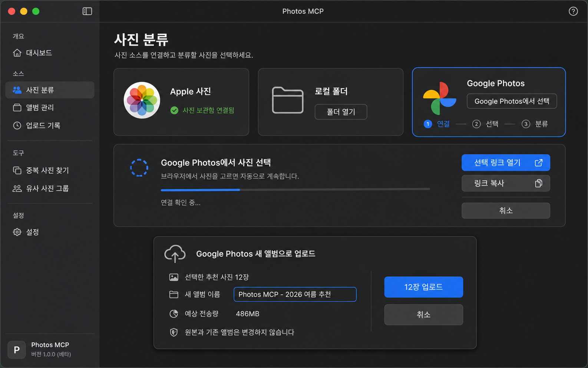

# Google Photos 입력과 결과 앨범 AppKit UX 계획

## 상태

- UX 검토·시안과 AppKit 1차 구현 완료
- Google Photos 전용 연결 창, 단계 표시, browser 링크 열기·복사, 자동 polling, 취소와 분류 연결 구현 완료
- 결과 화면의 Google 입력 전용 새 앨범 업로드 확인 흐름과 incremental 권한 연결 구현 완료
- source gate, 선택 수 gate, 오류 상태와 AppKit controller 자동 테스트 완료
- 실제 Google 계정 OAuth 동의·Picker 선택·앨범 표시의 사용자 E2E는 대기
- 적용 대상: `사진 분류` 탭, Google Picker 선택 상태, `사진 분류 결과`의 새 Google Photos 앨범 업로드 확인 흐름

## 목표

Google Photos 기능을 기존 Apple 사진·로컬 폴더와 같은 단순 source 카드로만 추가하면, OAuth 연결, browser에서의 Picker 선택 대기, 선택 완료 뒤 분류, 결과 사본 업로드의 상태가 한 화면에 섞인다. 사용자가 다음을 혼동하지 않도록 단계와 책임을 분리한다.

1. 어떤 source에서 사진을 가져오는가
2. Google browser에서 사용자가 직접 선택해야 하는 시점은 언제인가
3. 현재 앱이 자동으로 처리하는 단계는 무엇인가
4. 기존 Google Photos 원본을 바꾸지 않는다는 보장은 무엇인가
5. 분류 뒤 새 사본을 새 앨범에 올리는 것이 선택 사항이라는 점

## UX 원칙

| 원칙 | 적용 |
| --- | --- |
| source-first | 시작 화면의 첫 행동은 Apple 사진, 로컬 폴더, Google Photos 중 하나를 선택하는 일이다. source를 섞어 한 작업에서 동시에 선택하지 않는다. |
| progressive disclosure | Apple·로컬 설정은 선택한 source에만 보이고, Google 선택 중에는 album·기간 폼 대신 Picker 진행 panel을 보인다. |
| user action boundary | OAuth 허용과 Picker 안의 사진 선택은 `사용자 필요`, polling·다운로드·분류는 `자동 진행`으로 텍스트와 아이콘을 함께 표시한다. |
| write-last | Google 업로드는 분류 시작 화면에 두지 않는다. 결과에서 사용자가 사진을 체크하고 `Google Photos 새 앨범으로 업로드`를 눌러야만 확인 sheet가 열린다. |
| original-safe | Google 입력과 업로드 UI 모두 `원본과 기존 앨범은 변경하지 않습니다`를 지속 표시한다. 새 업로드는 사본임을 명확히 한다. |
| recovery visible | 선택 취소, session 만료, token 재연결, 다운로드 실패, 업로드 부분 실패는 기존 작업 기록에서 재시도 가능한 구체적 상태로 보인다. |
| native AppKit | 표준 `NSButton`, `NSSegmentedControl`, `NSSheet`, `NSProgressIndicator`, SF Symbols를 우선 사용하고, 아이콘만으로 상태를 전달하지 않는다. |

## 시안



시안은 계획 설명용이며 실제 Google·Apple 상표 아이콘 asset으로 사용하지 않는다. 구현에서는 AppKit SF Symbol 기반의 `photo.on.rectangle`, `folder`, `icloud.and.arrow.up`, `checkmark.circle.fill`, `arrow.triangle.2.circlepath`를 사용하고, Google Photos source는 텍스트 label과 접근성 설명으로 식별한다.

## 정보 구조

### 사이드바

현재 4개 탭을 유지한다.

| 탭 | Google Photos 추가 후 역할 |
| --- | --- |
| 홈 | 최근 Google 선택·분류·업로드 작업의 상태와 `사진 분류 시작` 진입점 |
| 사진 분류 | source 선택, Apple/로컬 설정 또는 Google Picker 진행 panel |
| 작업 기록 | Picker 대기·다운로드·분류·업로드를 하나의 parent job 아래 단계별 상태로 표시 |
| 환경 및 권한 | Apple 사진 권한, Google 연결 상태, scope별 권한, 재연결·연결 해제 |

Google Albums를 일반 탐색 탭으로 추가하지 않는다. API는 기존 개인 album 목록을 조회·관리하지 않으며, Photos MCP가 만든 결과 album만 업로드 영수증에서 열 수 있다.

### 사진 분류 탭: source 선택

제목 아래에 높이 92pt의 동등한 source card 3개를 배치한다.

| 카드 | 기본 문구 | 주 행동 | 보조 상태 |
| --- | --- | --- | --- |
| Apple 사진 | `사진 보관함에서 범위를 선택합니다.` | 카드 선택 | 연결됨·권한 필요·오류 |
| 로컬 폴더 | `폴더를 탐색해 사진을 직접 선택합니다.` | `폴더 열기` | 현재 선택 수 |
| Google Photos | `Google Photos에서 직접 고른 사진만 가져옵니다.` | `Google Photos에서 선택` | 연결 안 됨·연결됨·선택 대기·재연결 필요 |

- 선택 카드에는 system blue 1pt outline과 `선택됨` 보조 label을 보인다. 색만으로 선택 상태를 전달하지 않는다.
- Apple과 로컬 source가 선택되면 현행 범위·작업 설정 form을 재사용한다.
- Google source가 선택되면 Apple album popup, 기간, 최대 분석 수 form을 숨기고 `Google Photos에서 사진 선택` panel로 교체한다.
- source를 바꾸려 할 때 진행 중인 Picker session 또는 분석 job이 있으면 source를 즉시 바꾸지 않고 `선택 취소 후 변경` confirmation을 제공한다.

### Google Picker 진행 panel

Google card를 선택하면 아래 영역은 고정 크기 panel 하나로 전환한다. 임시 link를 status line 또는 영구 작업 기록에 그대로 출력하지 않는다.

| 상태 | 제목 | 보이는 행동 | 자동/사용자 구분 |
| --- | --- | --- | --- |
| `not_connected` | `Google Photos 연결이 필요합니다` | `Google 계정 연결` | 사용자: OAuth 허용 |
| `connecting` | `Google 계정 연결 중` | `취소` | system browser callback 대기 |
| `ready_to_select` | `Google Photos에서 사진 선택` | `선택 링크 열기`, `링크 복사`, `선택 취소` | 사용자: browser에서 사진 선택·완료 |
| `waiting_for_selection` | `사진 선택 완료를 기다리는 중` | `링크 다시 열기`, `선택 취소` | 자동: Google polling |
| `selected` | `사진 24장을 가져왔습니다` | `분류 설정 확인`, `분류 시작` | 자동: type·size 사전 검사 |
| `downloading` | `사진을 안전하게 준비하는 중` | `작업 취소` | 자동: bounded download와 temporary cache |
| `expired_or_error` | `사진 선택을 완료하지 못했습니다` | `새 선택 시작`, `진단 정보 복사` | 오류 원인·재시도 방법 |

진행 panel의 상단에는 `1 연결 - 2 사진 선택 - 3 분류` step indicator를 둔다. 현재 단계는 파란 outline과 텍스트로 나타내고, 완료는 checkmark, 실패는 설명이 있는 warning icon을 사용한다. 대기 중에는 indefinite progress indicator와 `브라우저에서 선택하면 이 화면은 자동으로 계속됩니다.`를 함께 표시한다.

`링크 복사`는 원격 LLM/nanobot에게 전달하기 위한 보조 수단이며, `pickerUri`가 포함된 clipboard action임을 tooltip과 accessibility label에 명시한다. 화면·공개 로그에는 원문 URI를 노출하지 않는다.

### Google 선택 뒤의 분류 설정

Picker가 선택한 항목은 이미 사용자가 범위를 확정했으므로 album·기간 control을 다시 노출하지 않는다. 대신 다음만 표시한다.

- 사진/동영상 수와 지원되지 않는 항목 수
- 사진 수, 예상 temporary cache 사용량, 분석 해상도
- 작업 방식 `사진 분류` / `우수 사진 선별`
- 프로필 `일반` / `풍경`만 기본 허용. Google source에는 얼굴 군집·인물 확인·선호 학습을 표시하거나 실행하지 않는다.
- `선택한 N장 분류` primary button과 `다시 선택` secondary button

실제 파일 bytes가 아직 없는 상태와 temporary cache 준비 완료 상태를 구분해 표시한다. 사용자가 URL만 열린 상태를 다운로드 완료로 오해하지 않게 한다.

## 결과 화면: 새 Google Photos 앨범 업로드

### 진입 조건

`Google Photos 새 앨범으로 업로드`는 다음 조건을 모두 만족할 때만 활성화한다.

1. 작업 source가 `google_photos`다.
2. 결과 화면에서 사용자가 최소 한 장을 export 대상으로 체크했다.
3. 선택 사진의 original-quality temporary bytes가 아직 유효하거나, 정책상 다시 materialize할 수 있다.
4. 해당 Google 계정의 결과 업로드가 연결 해제·만료 상태가 아니다.

버튼 label은 `선택한 12장 새 앨범으로 업로드`처럼 count를 포함한다. 추천 결과라고 해도 자동 선택·자동 업로드하지 않는다. `검토 필요` 결과는 사용자가 직접 체크한 경우에만 포함된다.

### 확인 sheet

AppKit `NSSheet`로 열고 parent 결과 창을 유지한다. destructive action은 아니지만 새 사본 생성·저장공간 사용을 수반하므로 default action은 명시적 확인이다.

| 영역 | 내용 |
| --- | --- |
| 제목 | `Google Photos 새 앨범으로 업로드` |
| 선택 요약 | thumbnail 3장, `선택한 추천 사진 12장`, 사진·동영상 별도 count |
| 앨범 이름 | 편집 가능한 text field. 기본값 `Photos MCP - YYYY-MM-DD 추천` |
| 전송량 | 합계 bytes, 50MB 이상 파일 수, 예상 시간은 네트워크 속도를 확정하지 않고 `네트워크에 따라 달라짐`으로 표기 |
| 원본 보장 | `기존 Google Photos 원본과 기존 앨범은 변경하지 않습니다.` |
| 사본 고지 | `새 파일 사본이 Photos MCP가 만든 새 앨범에 추가됩니다.` |
| 위치 고지 | `선택 API에서 내려받은 사본에는 원본 위치 정보가 포함되지 않을 수 있습니다.` |
| scope 고지 | 아직 write scope가 없으면 `업로드를 계속하면 Google에 사진 추가 권한을 요청합니다.` |
| 행동 | `취소`와 `12장 업로드`. primary는 선택·album 이름·고지 확인이 완료될 때만 활성화 |

자동 점수, file path, 내부 tag, 인물 정보, 분석 JSON은 description에 업로드하지 않는다. 성공 후에는 sheet가 닫히고 결과 창 하단에 `새 앨범 열기`와 `업로드 영수증 보기`가 나타난다. product URL은 사용자 action으로만 browser에 연다.

### 업로드 진행과 복구

`작업 기록`의 Google parent job 안에 다음 child stage를 표시한다.

```text
사진 선택 완료 -> 다운로드 준비 -> 분류 완료 -> 업로드 승인 대기
-> 새 앨범 생성 -> 4 / 12장 업로드 -> 업로드 확인 -> 완료
```

- 50개 단위 `batchCreate`와 resumable upload의 진행률을 별도로 합산한다.
- 일부 실패 시 성공 사진·실패 사진 수, error code, `실패한 N장 다시 시도`를 표시한다. 이미 성공한 항목은 다시 업로드하지 않는다.
- cancel은 아직 전송하지 않은 항목만 중지하며, 이미 만들어진 새 album과 업로드된 사본을 자동 삭제하지 않는다. 영수증에 남기고 사용자가 Google Photos에서 직접 정리할 수 있는 link를 제공한다.
- job 창을 닫아도 background upload 상태는 작업 기록에서 계속 보인다.

## 환경 및 권한 탭

Google row를 추가한다. token 값이나 account email을 표시하지 않고, scope·상태·마지막 성공 시각만 노출한다.

| 상태 | headline | 행동 |
| --- | --- | --- |
| 미연결 | `Google Photos가 연결되지 않았습니다` | `Google 계정 연결` |
| Picker만 연결 | `사진 선택 준비됨` | `연결 테스트`, `연결 해제` |
| 업로드 권한 추가 | `결과 앨범 업로드 준비됨` | `업로드 권한 갱신`, `연결 해제` |
| refresh 실패 | `Google Photos 다시 연결이 필요합니다` | `다시 연결` |

사용자가 `연결 해제`를 누르면 Keychain refresh token, 위임 profile, 아직 열려 있는 Picker session을 제거한다. 이미 Google Photos에 생성된 결과 album과 미디어 사본은 삭제하지 않음을 sheet에 설명한다.

## AppKit 구현 방안

| 영역 | 변경 대상 | 구현 방향 |
| --- | --- | --- |
| source 선택 | `interfaces/appkit/classification/controller.py` | Apple/로컬 card와 동일한 reusable `SourceCard` state를 만들고 `google_photos` card와 상태별 content container를 추가 |
| Google 작업 상태 | `application/cloud_selection_service.py` 및 picker adapter | `not_connected`부터 `selected`까지 typed state를 UI view model로 변환. URI는 model의 display field에 넣지 않음 |
| 결과 업로드 | `interfaces/appkit/results/controller.py` | Google source 전용 export action·NSSheet·progress UI·receipt link를 추가 |
| Library 쓰기 | `infrastructure/sources/google_photos/library_destination.py` | existing explicit-approval gate 뒤에 album create, resumable bytes upload, batchCreate, receipt persistence adapter를 연결 |
| 권한 | Keychain OAuth repository | Picker readonly와 `photoslibrary.appendonly`을 incremental auth로 분리하고 write scope는 upload 승인 직전에만 요청 |
| 접근성·키보드 | 모든 신규 control | `accessibilityLabel`, 명시적 tab order, `Escape` 취소, `Return`은 유효한 confirmation의 primary action만 실행, 오류 설명을 접근성 알림으로 전달 |

### 화면 크기와 레이아웃

- 기본 콘텐츠 폭 860pt, sidebar 포함 최소 창 폭 1,180pt를 유지한다.
- source card는 최소 폭 240pt를 보장한다. content가 충분하지 않으면 3열을 강제 축소하지 않고 2열 + 1열 또는 vertical scroll로 전환한다.
- Google progress panel과 upload sheet는 고정 pixel text 배치가 아니라 auto layout equivalent constraints를 사용한다. 긴 album 이름, 접근성 글자 크기, 오류 message는 줄바꿈·창 확장을 허용한다.
- 아이콘-only button은 32pt 이상 hit area와 tooltip·accessibility label을 제공한다. primary text button은 최소 36pt 높이를 유지한다.

## 검증 계획

1. AppKit snapshot: source 3종, Google 상태 7종, 좁은 창·기본 창·전체 화면, 글자 크기 증가 상태를 캡처 비교한다.
2. keyboard: source 선택, 링크 복사, 취소, `Return` confirmation, focus ring, sheet focus trap과 복귀를 검증한다.
3. fake lifecycle: 연결 없음, 연결, 사용자 선택 대기, 취소, timeout, pagination, download error, app 재시작 recovery를 자동 테스트한다.
4. fake upload: 0장 차단, album 이름 validation, write scope denied, 1장 성공, 12장 성공, partial failure, resume, cancel, receipt 상태를 검증한다.
5. 실제 계정 E2E: 1장·10장 Picker 선택, 결과 미선택 상태의 upload 비활성, 업로드 전 scope 고지, 새 app-created album 포함, 기존 원본·기존 album 비변경, 위치 metadata 고지, 재시도와 연결 해제를 검증한다.

## 비범위

- Google Photos 전체 보관함 또는 기존 album 탐색 UI
- 기존 Google Photos 항목의 앨범 추가·이동·삭제·태그·설명 수정
- Picker 사진의 인물 확인·얼굴 군집·개인 선호 학습
- 업로드 성공 후 Google Photos UI에서 새 사본을 자동 정리·삭제하는 기능
- 웹 browser를 AppKit 안에 embed하거나 OAuth·Picker의 사용자 동작을 자동 클릭하는 기능

## 참고 자료

- [Google Photos Picker 시작](https://developers.google.com/photos/picker/guides/get-started-picker)
- [Google Photos 업로드와 batchCreate](https://developers.google.com/photos/library/guides/upload-media)
- [Google Photos 권한 scope와 incremental auth](https://developers.google.com/photos/overview/authorization)
- [Google Photos API 데이터 정책](https://developers.google.com/photos/support/api-policy)
- [macOS Human Interface Guidelines](https://developer.apple.com/design/human-interface-guidelines/)
