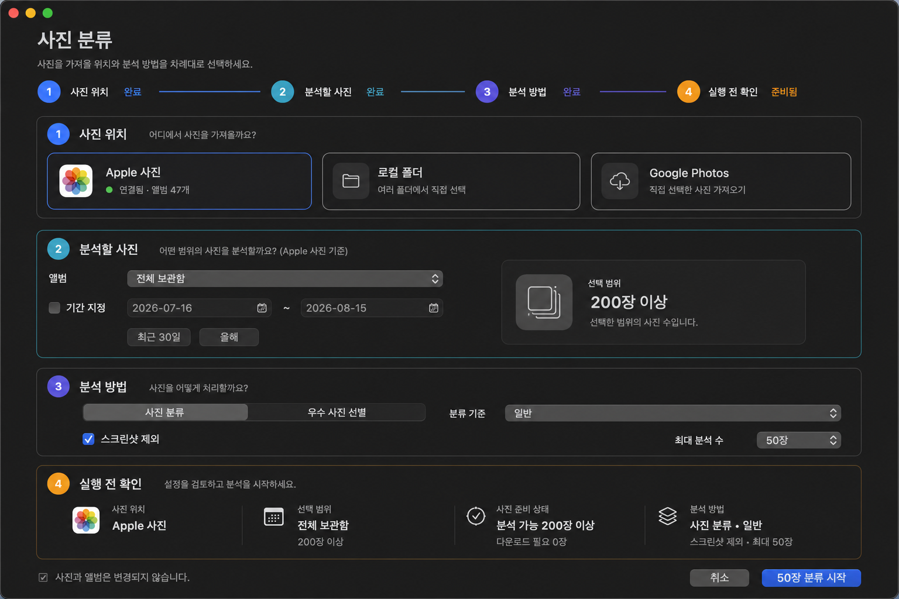
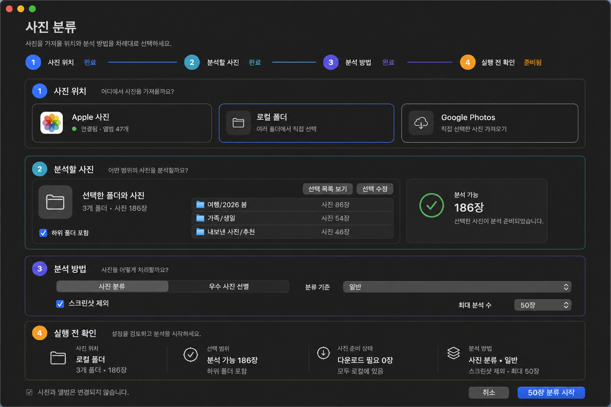
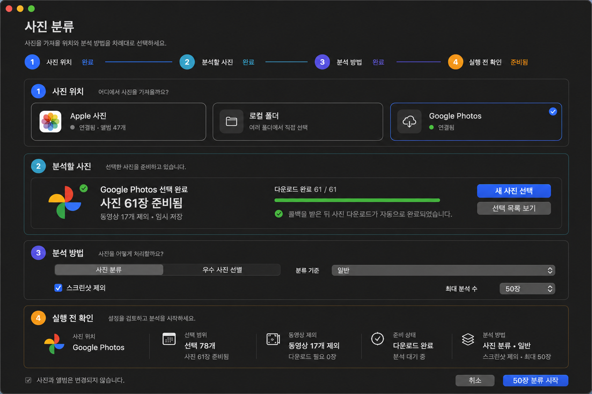
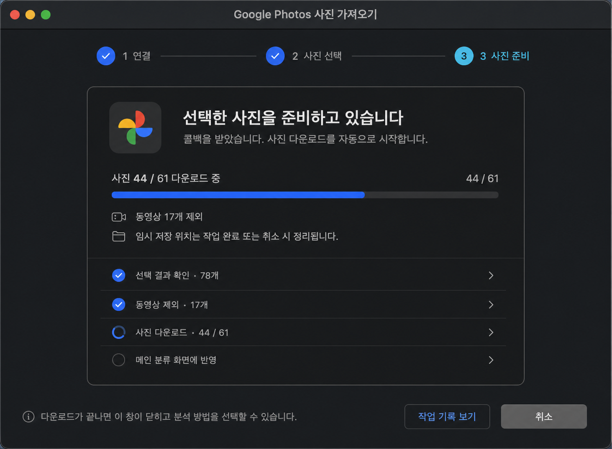

# 소스 인식형 사진 분류와 Google Photos 자동 준비

## 목적

사진 위치를 먼저 고른 뒤 소스에 맞는 범위만 선택하고, 모든 소스가 같은 분석 방법과 실행 전 확인 단계로 합류하게 한다. Google Photos는 Picker 콜백을 받으면 사진만 자동으로 임시 다운로드하지만, 사용자가 분석 방법을 확인하기 전에는 분류 작업을 시작하지 않는다.

## 확인된 현재 문제

- 1단계에서 Apple 사진, 로컬 폴더, Google Photos를 보여주지만 2단계는 Apple 사진의 앨범과 기간 입력으로 고정되어 있다.
- 로컬 폴더와 Google Photos는 별도 창에서 곧바로 분류를 시작해 메인 화면의 분석 방법을 공유하지 못한다.
- Google Photos의 `classify_ready_selection()`이 다운로드와 분류 제출을 한 번에 수행한다.
- Picker가 준비 완료되어도 화면은 `ready`에서 멈추며 사용자가 다음 버튼을 눌러야 다운로드가 시작된다.
- Google 전용 창의 3단계가 `분류`로 표시되어 메인 분류 화면과 역할이 겹친다.

## 권장 사용자 흐름

| 단계 | 공통 역할 | Apple 사진 | 로컬 폴더 | Google Photos |
|---|---|---|---|---|
| 1. 사진 위치 | 단일 소스 선택 | 보관함 연결 상태 | 로컬 선택 상태 | OAuth 연결 상태 |
| 2. 분석할 사진 | 분석 대상 준비 | 앨범·선택 기간 | 여러 폴더·파일 누적 선택 | Picker 선택·사진 자동 다운로드 |
| 3. 분석 방법 | 공통 분석 설정 | 분류/선별·프로필·제외·최대 수 | 동일 | 동일 |
| 4. 실행 전 확인 | 최종 요약과 명시적 실행 | 후보·다운로드 필요 수 | 선택·분석 가능 수 | 선택·사진·제외 동영상·준비 수 |

### Google Photos 상태 전이

```text
연결 확인
  -> 브라우저 Picker 열기
  -> 사용자가 선택 완료
  -> READY 콜백 감지
  -> 동영상 제외
  -> 사진 자동 다운로드 및 임시 저장
  -> 메인 화면 2단계에 준비 결과 반영
  -> 사용자가 분석 방법과 실행 범위를 확인
  -> 분류 시작
```

Google 콜백 이후 자동화 범위는 사진 다운로드까지다. 분류 방법, 최대 분석 수와 실행 여부는 사용자가 결정한다. 이 경계는 예기치 않은 비용과 장시간 작업을 막고 Apple·로컬과 같은 확인 절차를 유지한다.

## 화면 설계

### Apple 사진



2단계에는 앨범과 선택적 기간만 노출한다. 오른쪽 범위 요약은 후보 수와 원본 다운로드 필요 수를 즉시 보여준다.

### 로컬 폴더



2단계에는 누적 선택한 폴더와 사진, 하위 폴더 정책, 선택 수정과 목록 보기를 노출한다. 폴더를 바꾸어도 선택은 유지한다.

### Google Photos



2단계에는 선택 수, 사진 준비 수, 제외한 동영상 수, 임시 저장 상태를 노출한다. Apple 앨범과 기간 입력은 숨긴다.

### Google Photos 자동 다운로드 전환 창



별도 창은 연결, 브라우저 선택, 사진 준비만 담당한다. 다운로드 완료 후 메인 분류 화면의 Google Photos 상태를 갱신하고 창을 닫거나 완료 상태로 전환한다. 수동 다운로드 또는 수동 분류 버튼은 제공하지 않는다.

## 애플리케이션 상태 모델

메인 분류 컨트롤러는 다음 상태를 소유한다.

- `selected_source`: `apple`, `local`, `google_photos` 중 하나
- `apple_scope`: 앨범, 기간, 원본 준비 상태
- `local_scope`: 선택한 절대 경로, 공통 루트, 하위 폴더 정책
- `google_scope`: Picker 세션, 선택 수, 제외 동영상 수, 임시 파일 경로, 준비 상태
- `analysis_options`: 작업 방식, 프로필, 스크린샷 제외, 최대 분석 수

2단계는 소스별 adapter가 미리보기 값을 만들고, 3단계와 4단계는 공통 모델만 읽는다. 소스를 바꾸어도 이미 준비된 범위는 세션 동안 보존하되 실행 대상은 현재 선택한 소스 하나로 제한한다.

## 서비스 분리

현재 `classify_ready_selection()`은 다음 두 작업으로 분리한다.

1. `prepare_ready_selection()`
   - READY 세션을 소비한다.
   - 동영상을 제외한다.
   - 사진을 제한된 동시성으로 다운로드한다.
   - lease와 임시 파일을 세션에 연결한다.
   - `PreparedGoogleSelection`을 반환한다.
2. `classify_prepared_selection()`
   - 공통 분석 설정과 준비된 경로를 받아 작업을 생성한다.
   - 성공한 작업 ID에 lease를 결합한다.
   - 실패하면 세션 임시 파일을 정리한다.

기존 `classify_ready_selection()`은 호환 wrapper로 유지해 기존 API와 테스트 호출을 깨뜨리지 않는다.

## 오류와 취소

- 다운로드 일부 실패: 성공한 파일 수와 실패 수를 표시하고 재시도 또는 새 선택을 제공한다.
- 사용자가 취소: polling과 다운로드를 중단하고 해당 세션 lease와 임시 파일만 삭제한다.
- 창 닫기: 다운로드 중이면 확인 후 취소하고, 준비 완료 상태면 메인 화면에 상태를 보존한다.
- 앱 재시작: 완료되지 않은 세션 lease를 복구 정책에 따라 정리하며 분류 작업을 자동 시작하지 않는다.
- 사진이 0장이고 동영상만 선택: 2단계를 완료 처리하지 않고 새 선택을 안내한다.

## 접근성과 반응형 원칙

- 소스 카드 전체를 클릭 대상으로 사용하고 버튼과 상태 문구를 수직 중앙 정렬한다.
- 860pt 최소 폭에서는 소스 카드를 유지하되 보조 문구를 한 줄 말줄임 처리한다.
- 넓은 화면에서는 본문 최대 폭을 제한하고 상단 또는 중앙 상단에 배치한다.
- 색상만으로 상태를 구분하지 않고 단계 번호와 `완료`, `준비 중`, `확인 필요` 문구를 함께 사용한다.
- 진행 중에는 수치형 진행률과 취소 동작을 제공한다.

## 구현 순서

1. Google 가져오기 서비스의 준비와 분류 제출을 분리한다.
2. Google controller가 READY를 감지하면 자동으로 `prepare_ready_selection()`을 실행한다.
3. 준비 완료 payload를 메인 분류 controller에 전달한다.
4. 메인 controller에 소스별 상태와 2단계 container를 추가한다.
5. 공통 3단계 설정으로 Apple, 로컬, Google 명령을 생성한다.
6. 4단계 요약과 실행 버튼을 현재 소스 기준으로 갱신한다.
7. 기존 별도 로컬 브라우저는 선택 편집기로 유지하고 직접 작업 시작은 메인 화면에 위임한다.

## 검증 기준

- Apple 기존 앨범·기간 분류가 회귀하지 않는다.
- 로컬 여러 폴더 선택이 메인 화면에 누적 수량으로 반영된다.
- Google Picker READY 뒤 추가 버튼 없이 다운로드가 시작된다.
- Google 동영상은 다운로드하지 않고 제외 수량에만 포함한다.
- Google 다운로드 완료만으로 분류 작업이 생성되지 않는다.
- 세 소스 모두 3단계 설정과 4단계 확인 이후에만 작업을 생성한다.
- 취소·실패·재선택 시 해당 세션 임시 파일이 정리된다.
- 최소·중간·최대 창 크기에서 텍스트 겹침과 잘림이 없다.

## 구현 결과

2026-08-15 기준으로 다음 범위를 반영했다.

- Google Picker 세션이 `READY`가 되면 별도 다운로드 버튼 없이 사진 준비를 시작한다.
- 선택 항목 중 동영상은 다운로드하지 않고 제외 수량으로 기록한다.
- 다운로드 완료 결과를 메인 사진 분류 화면으로 전달하며, 분류 작업은 자동으로 시작하지 않는다.
- 메인 화면의 2단계는 Apple 사진의 앨범·기간, 로컬 폴더의 선택 경로, Google Photos의 준비 수량을 각각 표시한다.
- 분석 방법과 최대 분석 수는 세 소스가 공통으로 사용하고, 4단계 확인 이후에만 작업을 생성한다.
- 로컬 사진 브라우저는 선택 편집기로 동작하며 선택 결과를 메인 화면에 반환한다.
- 소스를 변경할 때 이전 소스의 미리보기와 실행 요약을 초기화해 잘못된 완료 상태가 남지 않게 했다.
- 세 소스 카드 전체를 클릭해 선택할 수 있으며, 로컬과 Google의 보조 버튼은 선택 편집 창을 여는 역할로 분리했다.
- Google 사진 다운로드는 완료 수와 전체 사진 수를 기반으로 선택 창과 메인 화면에 동일한 실시간 진행률을 표시한다.
- Google 사진 준비가 끝나면 기존 로컬 격자와 확대 뷰어를 읽기 전용으로 재사용하는 `다운로드 사진 보기` 동작을 제공한다.

자동 검증은 전체 테스트 `595 passed`, Markdown 문서 `64개` 검증 통과로 완료했다. 설치 번들의 코드 서명과 패키징 스모크 검사를 통과했다. 실제 설치 앱에서는 보조 버튼을 누르지 않은 카드 클릭만으로 Apple, 로컬, Google 소스가 전환되고 2단계 안내와 실행 가능 상태가 함께 갱신되는 것을 확인했다. 일반 창과 확대 창에서도 카드, 단계 패널, 하단 실행 영역의 겹침이나 잘림이 없음을 확인했다.

## 확정 후속 개선안

### 소스 카드와 편집 동작 분리

`Apple 사진`, `로컬 폴더`, `Google Photos` 카드 전체를 소스 선택 영역으로 사용한다. 카드 클릭은 현재 소스만 전환하며 별도 창을 열지 않는다. 카드 안의 보조 버튼은 다음처럼 선택 범위를 편집하는 동작만 담당한다.

| 소스 | 카드 클릭 | 보조 버튼 |
| --- | --- | --- |
| Apple 사진 | Apple 범위로 즉시 전환 | 별도 버튼 없음 |
| 로컬 폴더 | 기존 로컬 선택을 유지한 채 전환 | `폴더 열기` 또는 `선택 수정` |
| Google Photos | 준비된 Google 선택을 유지한 채 전환 | `사진 선택` 또는 `다시 선택` |

카드와 보조 버튼은 서로 다른 접근성 동작으로 노출한다. 보조 버튼을 눌러도 카드 선택과 창 열기가 중복 실행되지 않아야 한다.

### Google Photos 다운로드 진행 상태

Picker 세션이 준비되면 사진 수와 제외할 동영상 수를 계산하고 사진 다운로드를 자동 시작한다. 최대 3개의 병렬 다운로드를 유지하되 완료한 사진마다 다음 상태를 메인 스레드에 전달한다.

- 전체 선택 수
- 다운로드 대상 사진 수
- 다운로드 완료 수
- 제외한 동영상 수
- 진행률

Google 선택 창과 메인 분류 화면은 동일한 진행 상태를 사용한다. 다운로드 중에는 `18 / 61`과 백분율을 표시하고, 완료되면 `61 / 61` 완료 상태를 유지한다. 사진 다운로드 완료만으로 분석 작업을 시작하지 않는다.

### 다운로드 사진 미리보기

Google Photos 준비가 완료되면 `다운로드한 사진 보기` 버튼을 노출한다. 분석 전 사진이므로 추천·점수·분류 결과는 만들지 않는다. 기존 로컬 사진 격자와 단일 사진 확대·축소·드래그 뷰어를 읽기 전용 모드로 재사용한다.

- 임시 다운로드 경로만 표시한다.
- 격자, 한 장 보기, 키보드 이동, 전체 미리보기를 사용할 수 있다.
- 분류 선택과 작업 시작 컨트롤은 숨기거나 비활성화한다.
- 임시 파일이 정리되었으면 미리보기 버튼을 비활성화하고 새 선택을 안내한다.

### 추가 검증 기준

- 카드의 빈 영역, 아이콘, 제목을 클릭해도 소스가 전환된다.
- 카드 보조 버튼은 소스 전환 후 선택 편집 창을 한 번만 연다.
- 병렬 다운로드에서도 완료 수와 진행률이 단조 증가하며 최종 값이 정확하다.
- 동영상은 다운로드 진행률 분모에 포함하지 않는다.
- Google 선택 창과 메인 2단계의 다운로드 상태가 일치한다.
- 준비 완료 전에는 미리보기 버튼이 비활성화되고 완료 후에만 활성화된다.
- 미리보기에서 분석 작업을 직접 시작할 수 없다.
