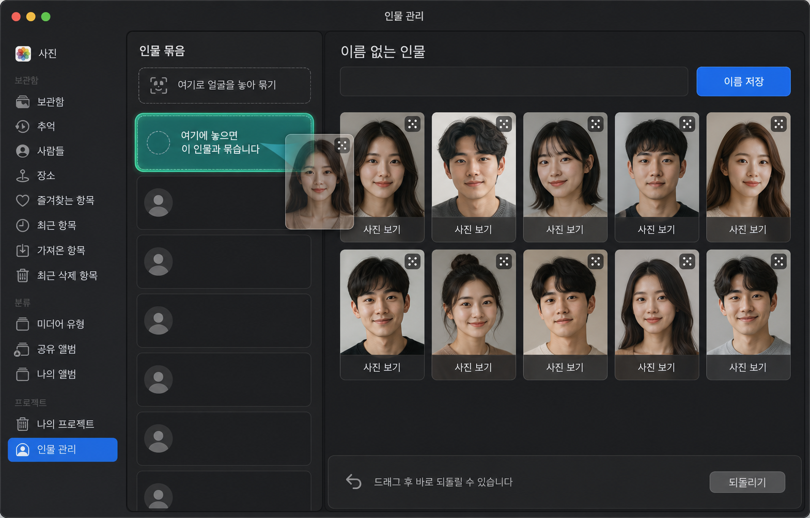

# 개인 얼굴 묶음 드래그 앤 드롭 UX 개선

## 목적

`인물 관리`에서 자동 얼굴 묶음을 빠르게 검토하고 수정한다. 현재 체크박스로 얼굴을 고르고 popup에서 병합 대상을 정하는 흐름은 다음 문제가 있다.

- 왼쪽 묶음 행의 텍스트가 클릭 영역보다 위에 있어, 어떤 행은 빈 여백에서만 선택되는 것처럼 보일 수 있다.
- 얼굴 격자의 document 높이가 viewport보다 작으면 첫 줄이 상단이 아닌 하단에 배치된다.
- 한 얼굴을 다른 인물에 넣는 목적에 비해 `선택 → 병합 대상 선택 → 병합` 절차가 길다.

이 계획은 선택과 병합을 AppKit의 기본 drag-and-drop 상호작용으로 바꾸고, 원본 보관함을 수정하지 않는 현재 개인정보 원칙을 유지한다.

## 디자인 시안

시안에서 보여주는 핵심은 왼쪽의 명확한 drop target, 상단에 정렬된 얼굴 격자, 드래그 중인 얼굴의 반투명 preview, 되돌릴 수 있는 하단 안내다. 시안의 인물 이미지는 실제 사용자 사진이 아닌 디자인용 가상 예시다.

## 확정 UX

### 묶음 선택과 배치

- 왼쪽의 각 묶음 행 전체를 최상위 버튼으로 둔다. 텍스트와 숫자는 클릭을 가로채지 않으며 행의 어느 위치를 눌러도 선택한다.
- 오른쪽 얼굴 격자는 scroll viewport 높이와 콘텐츠 높이 중 큰 값을 document 높이로 사용한다. 얼굴 수가 한 장이어도 첫 카드가 상단부터 시작한다.
- 선택된 묶음은 파란 테두리와 약한 배경색으로 표시한다. 현재 선택 상태를 별도 체크박스로 중복 표기하지 않는다.

### 얼굴 이동과 묶기

- 얼굴 카드의 사진 보기와 별개로, 카드 전체 또는 우측 상단 drag handle을 끌어 다른 묶음 행에 놓는다.
- 한 얼굴을 놓으면 해당 얼굴만 대상 묶음으로 이동한다. 원래 묶음에 얼굴이 남지 않으면 해당 자동 묶음은 목록에서 사라진다.
- 왼쪽 상단의 `여기로 얼굴을 놓아 묶기` 영역은 아직 대상 묶음이 없을 때 새 수동 묶음을 만드는 drop target이다.
- 묶음 행을 다른 묶음 행에 끌면 현재 묶음의 모든 얼굴을 병합한다. 실수 방지를 위해 drag preview에 `얼굴 N개 이동`을 표시하고, drop 대상은 청록색으로만 강조한다.
- 자신이 속한 묶음 또는 같은 대상에 drop하면 아무 변경도 하지 않는다.

### 되돌리기와 이름

- 각 drop은 현재 세션의 한 단계 `되돌리기`로 취소할 수 있다. 되돌리기는 마지막 수동 얼굴 이동 또는 묶음 병합만 복원한다.
- 이름 저장은 유지한다. 이름만 지정한 뒤에도 drag-and-drop으로 얼굴을 추가하거나 빼낼 수 있다.
- 기존의 얼굴 체크박스, `선택 얼굴 새 묶음`, 병합 popup, `선택 묶음 병합` 버튼은 제거한다. 사진 보기와 이름 저장은 유지한다.

## 구현 방안

### AppKit 상호작용

- `FaceCardView`는 `NSDraggingSource`로 얼굴 ID 목록만 가진 private pasteboard payload를 만든다. preview image는 메모리에서만 사용하고 원본 경로·embedding은 payload에 넣지 않는다.
- `IdentityDropRowView`와 `NewIdentityDropZoneView`는 `NSDraggingDestination`으로 등록한다. `draggingEntered:`에서 유효 대상만 강조하고, `performDragOperation:`에서 controller callback을 호출한다.
- 묶음 전체 drag는 왼쪽 행의 drag handle에서 시작한다. 얼굴 drag와 구분되는 payload type을 사용한다.
- drag 종료 뒤 catalog를 재구성해 자동·수동 묶음 상태를 다시 계산한다. 선택은 drop 대상 묶음으로 이동한다.

### 레지스트리와 undo

- `PersonIdentityRegistry`에 `move_faces(source, target, face_ids)`와 `create_identity_from_faces(source, face_ids)`를 추가한다.
- controller는 drop 직전의 `face_overrides`와 영향을 받는 identity 레코드를 메모리에 한 단계 보관한다. `되돌리기`는 이 메모리 snapshot만 복원한다.
- registry JSON에는 이름, 수동 identity ID, `face_id → identity_id` 관계만 저장한다. crop, 원본 경로, EXIF, embedding은 저장하지 않는다.
- 앱 종료 뒤에는 undo가 사라진다. 영구 이력은 만들지 않는다.

### 즉시 수정할 레이아웃 결함

- 왼쪽 묶음 행의 투명 button을 title·count label 뒤에 추가해 가장 위에서 mouse event를 받게 한다.
- `_face_gallery`의 document 높이를 `max(viewport_height, rows * row_height + gap)`으로 계산한다. 첫 row의 `y`는 document의 상단 기준으로 배치한다.
- 작은 창에서는 왼쪽 목록을 최소 250pt, 오른쪽 얼굴 카드는 132pt 이상 유지하고, detail 영역은 세로 scroll로 전환한다.

## 검증 조건

- 왼쪽 모든 묶음 행에서 제목·숫자·빈 영역 클릭이 동일하게 선택된다.
- 얼굴 1장, 2장, 다수 장 묶음 모두 격자 첫 줄이 상단에 정렬된다.
- 한 얼굴 drag, 묶음 전체 drag, 새 묶음 drop, 같은 대상 drop 무시를 AppKit 자동 테스트와 실제 UI로 검증한다.
- drag 후 되돌리기는 원래 묶음·이름·얼굴 수를 복원하며, 원본 Apple Photos/Google Photos/로컬 파일은 변경되지 않는다.
- 새 registry JSON을 검사해 원본 경로, crop 경로, 이미지 bytes, embedding이 저장되지 않았음을 확인한다.

## 범위 밖

- 자동 얼굴 재학습과 인물 이름 자동 추정
- iCloud, Google Photos, Apple Photos의 원본·앨범 수정
- 영구적인 다단계 undo/redo 기록

## 4회 독립 UX 재검토 결과

초보 사용자 흐름, AppKit 드래그 앤 드롭, 접근성·오류 복구, 리사이즈·테스트 관점으로 네 차례 독립 검토했다. 초기 구현은 4~6/10으로 평가됐고 다음 문제가 공통으로 확인됐다.

- 대표 이미지와 텍스트가 행의 클릭을 가로채 묶음 선택 성공 여부가 위치마다 달랐다.
- 드래그만으로 얼굴 이동·분리·병합을 제공해 키보드와 VoiceOver 대체 경로가 없었다.
- 자기 그룹이나 오래된 payload도 드롭 가능한 것처럼 강조되고, 실패한 드롭이 기존 실행 취소 지점을 덮을 수 있었다.
- 드래그 취소 뒤 기본·선택 테두리가 사라질 수 있었다.
- 이름 입력, 제외 복원, 하단 버튼이 최소 창에서 겹치며 리사이즈 때 이름 초안과 스크롤이 초기화됐다.
- 그룹 전체를 새 그룹 영역에 놓으면 이름을 잃을 수 있어 동작 자체를 허용하면 안 됐다.

### 최종 UX 계약

- 행의 대표 얼굴, 이름, 얼굴 수, 빈 공간 어디를 클릭해도 같은 그룹이 선택된다.
- 이름 없는 그룹은 이름 없는 인물 1, 이름 없는 인물 2처럼 구분한다.
- 얼굴 드래그는 빠른 주 경로로 유지하고 손잡이는 얼굴 이동과 그룹 병합을 구분해 최소 32×32pt로 제공한다.
- 얼굴 카드의 선택 체크박스와 하단의 새 그룹 만들기, 이동할 그룹 선택, 이동, 얼굴 아님으로 표시 버튼을 동등한 대체 경로로 제공한다.
- 같은 그룹, 빈·오래된 payload, 그룹 전체를 새 그룹 영역에 놓는 동작은 강조하지 않고 거부한다.
- 성공한 변경만 실행 취소 지점으로 등록한다. 실패와 취소는 데이터, 선택, 테두리, 기존 실행 취소를 바꾸지 않는다.
- 제외한 얼굴 모두 복원 문구로 전체 복원임을 명확히 하고, 마지막 얼굴을 제외해 그룹이 비어도 복원과 실행 취소를 계속 표시한다.
- 그룹 목록과 얼굴 갤러리 스크롤, 저장하지 않은 이름 초안은 리사이즈와 전체 화면 재구성 뒤에도 보존한다.
- 얼굴 격자 열 수는 scrollbar를 제외한 실제 document 폭으로 계산해 경계 폭에서도 마지막 카드가 잘리지 않게 한다.

### 추가 검증 조건

- 썸네일·제목·숫자·빈 공간 클릭, Return·Space 선택이 동일하게 동작한다.
- 얼굴 한 개 이동, 그룹 전체 병합, 새 그룹 생성과 각각의 실행 취소를 검증한다.
- 자기 그룹·빈 payload·오래된 그룹·잘못된 얼굴 ID는 드롭 전에 거부한다.
- 최소 1180×760, 기본, 1920×1080에서 컨트롤 겹침과 카드 클리핑이 없다.
- 드래그 없이 체크박스와 버튼만으로 새 그룹, 다른 그룹 이동, 잘못 감지 제외가 가능하다.
- 제외 후 복원한 얼굴은 가능하면 기존 수동 그룹과 이름으로 돌아간다.

## 구현 완료 결과

초기 설계의 드래그 전용 흐름은 사용성·접근성·오류 복구에 취약하므로 그대로 적용하지 않았다. 네 차례 UX 검토와 구현 후 세 차례 교차 검증을 거쳐 다음 하이브리드 구조로 완료했다.

- 묶음 행 전체를 클릭하거나 Return·Space로 선택할 수 있으며, 얼굴 이동과 묶음 병합용 32pt 드래그 손잡이를 구분했다.
- 얼굴 카드 체크박스와 `선택 얼굴 새 묶음`, `선택 이동`, `그룹 전체 병합`, `얼굴 아님으로 표시`, `되돌리기`를 제공해 드래그 없이도 모든 편집을 수행할 수 있다.
- payload 버전·유형·출발 묶음·대상 묶음·얼굴 ID를 drop 전에 엄격히 검증한다. 자기 묶음, 오래된 payload, 빈 선택, 그룹 전체의 새 묶음 이동은 강조하지 않고 거부한다.
- 성공한 변경만 한 단계 되돌리기로 저장하고, 저장 실패 시 메모리와 JSON 상태를 함께 원복한다.
- 이름 있는 묶음을 이름 없는 묶음에 합쳐도 이름을 보존하며, 잘못 감지된 얼굴을 복원하면 가능한 경우 원래 수동 묶음과 이름으로 돌아간다.
- 리사이즈와 전체 화면 전환 뒤에도 목록·갤러리 스크롤, 이름 초안과 커서 선택, 이동 대상 popup을 보존한다.
- 원본 Apple Photos, Google Photos, 로컬 파일은 변경하지 않고 로컬 identity registry만 갱신한다.

## 최종 검증

- 애플리케이션·AppKit 집중 테스트: 111개 통과
- 전체 자동 테스트: 651개 통과
- Python compileall 및 `git diff --check`: 통과
- 배포 앱 재빌드 및 `/health`: `status=ok`, `daemon_status=ready`
- 실제 앱 기본 창과 전체 화면에서 얼굴 카드 상단 정렬, 버튼 겹침, 선택 상태, 체크박스 대체 경로를 확인했다.
- 실제 배포 앱에서 서로 다른 인물 묶음을 연속 클릭해 선택 테두리·상세 얼굴·first responder가 같은 행으로 이동하고, 이전 인물의 저장하지 않은 이름 초안이 새 인물로 넘어가지 않는 것을 확인했다.
- 구현 후 독립 검증에서는 데이터 보존, 엄격한 drop 검증, 최소 창 레이아웃과 키보드·버튼 대체 경로를 다시 점검했다.

## 얼굴 카드 동작 개선

텍스트가 잘리던 얼굴 카드의 `사진 보기`, `잘못 감지` 버튼은 32×32pt SF Symbol 아이콘으로 교체한다. 카드 안의 일상 동작만 아이콘화하고, 여러 얼굴 또는 그룹 전체에 영향을 주는 새 그룹·이동·병합 동작은 작업 범위를 오해하지 않도록 텍스트 버튼을 유지한다.

- 사진 아이콘은 `원본 사진 보기`이며, 해당 얼굴이 포함된 원본 사진 미리보기를 연다.
- 인물+X 아이콘은 `얼굴 아님으로 표시`이며, 사진을 삭제하지 않고 해당 얼굴만 Photos MCP 인물 관리에서 숨긴다.
- 두 아이콘은 각각 툴팁, 얼굴 순번을 포함한 VoiceOver 이름, 결과와 복구 방법을 설명하는 접근성 도움말을 제공한다.
- `잘못 감지`라는 모호한 표현은 카드와 선택 작업 모두 `얼굴 아님으로 표시`로 통일한다.
- 제외 작업 뒤에는 원본이 변경되지 않으며 실행 취소 또는 제외한 얼굴 복원으로 되돌릴 수 있다.
- `:::` 문자 드래그 손잡이는 표준 그립 SF Symbol로 바꾸고, 인물 묶음 이름을 포함한 툴팁과 VoiceOver 이름을 제공한다.
- 상세 상단의 `대표 사진 보기`는 목록의 실제 대표 얼굴과 같은 사진을 열어 버튼 이름과 결과를 일치시킨다.
- 얼굴을 하나라도 선택한 동안에는 `그룹 전체 병합`을 비활성화해 `선택 이동`과의 오조작을 막는다. 전체 병합은 선택이 없을 때만 가능하며 대상 그룹과 이동 얼굴 수를 확인한 뒤 실행한다.
- 새 그룹 drop zone은 포인터 드롭 전용 영역으로 접근성 키보드 순서에서 제외하고, 키보드 사용자는 같은 기능의 `새 그룹 만들기` 버튼을 사용한다.
- 얼굴 체크박스를 선택하거나 해제한 뒤 화면이 재구성되어도 같은 체크박스로 키보드 포커스를 복원해 연속 선택이 끊기지 않게 한다.

## 인물 묶음 행 실제 클릭 보정

접근성 실행과 단위 테스트에서는 인물 묶음 선택이 성공했지만, 실제 포인터 클릭에서는 목록의 마지막 행이 이벤트를 가로채는 문제가 확인됐다. AppKit의 `hitTest` 좌표가 각 뷰의 상위 좌표계로 전달되는 점을 반영하지 않고 로컬 좌표로 비교했으며, 행 범위 밖의 점에도 행 자신을 반환한 것이 원인이었다.

- 각 행은 먼저 자신의 frame 안인지 검사하고, 행 내부 좌표로 변환한 뒤 드래그 손잡이 여부를 판정한다.
- 얼굴·그룹 드래그 손잡이도 상위 좌표계의 frame을 기준으로 실제 히트 영역을 판정한다.
- 행 본문은 mouse-down 시 즉시 선택해 상세 패널 재구성 중 NSButton의 mouse-up 액션이 유실되지 않게 한다.
- 다중 행의 본문과 그룹 손잡이를 document-level `hitTest`로 검증하는 회귀 테스트를 추가했다.
- 배포 앱에서 `이름 없는 인물 1` 텍스트, `이름 없는 인물 2` 대표 얼굴, 첫 행의 빈 공간을 실제 좌표로 차례로 클릭해 각각 정확한 행만 선택되는 것을 확인했다.
- 인물 묶음이 viewport보다 적을 때도 document 높이를 viewport 이상으로 유지해 목록이 아래가 아닌 상단 6pt 여백부터 시작하도록 고정했다.
