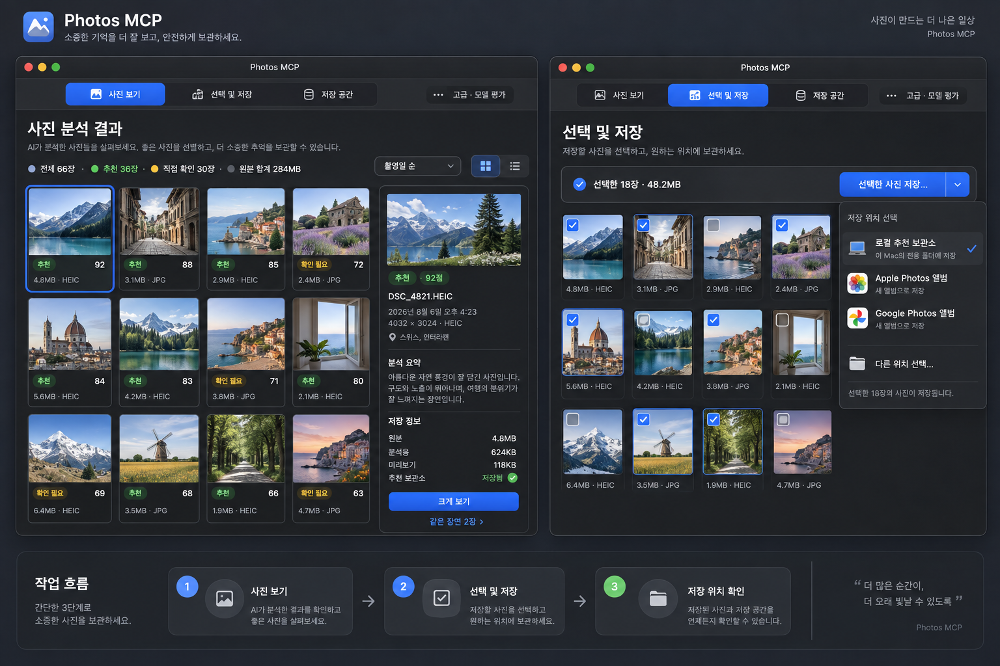
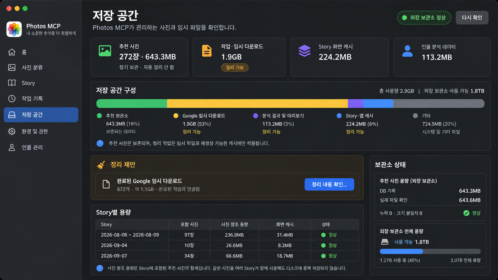

# 사진 분석 결과·저장 공간 대시보드·Vision 복구 개선 계획

작성일: 2026-09-13

상태: Phase A~E(P0) 구현, 전체 회귀·문서·앱 번들 검증 완료

적용 범위: macOS 사진 분석 결과, 선택·내보내기, 저장 용량 원장, Story별 용량, 추천 보관소, Google Picker 임시 다운로드, 분석·인물·Story 파생 캐시, Linux Vision runtime 준비와 실패 복구

관련 문서: [추천 사진 통합 보관과 그룹 앨범 이중 저장 계획](08-recommended-photo-storage-and-album-plan-2026-09-04.md), [Tailscale 추천 사진 생성형 Story Album·Swiper·외부 공유 계획](09-tailscale-swiper-recommendation-gallery-plan-2026-09-06.md), [삭제·재분석·추천 앨범 수명주기 재설계](14-deletion-reanalysis-and-recommendation-lifecycle-plan-2026-09-10.md), [예외 중심 인물 자동 인식·Mac/Android 통합 계획](19-exception-only-people-recognition-mac-android-plan-2026-09-12.md)

## 1. 결론

사진 분석 완료 화면은 아래 세 작업을 한 페이지 하단에 섞지 않고 독립된 작업 공간으로 분리한다.

```text
작업 기록에서 결과 열기
        ↓
사진 보기                     기본 화면, 체크박스 없음
        ↓ 선택 모드
선택 및 저장                  선택·용량 합계·저장 목적지 한 곳에서 처리
        ↓ 저장 완료
저장 위치 확인                로컬/Apple/Google 영수증과 실패 복구

사이드바의 저장 공간          전체 저장량·Story별 참조량·정리 가능한 캐시
더보기 > 고급 > 모델 평가      개발·보정용 사람 검토 도구
```

저장 용량은 한 숫자로 합치지 않고 다음 세 의미를 구분한다.

1. **물리 사용량**: PhotosMcp가 실제로 관리하는 중복 제거된 파일 크기
2. **사진 참조 용량**: 한 Story가 포함하는 고유 추천 사진의 크기 합계
3. **추가 점유량**: Story 화면·공유·인물 검토를 위해 따로 생성한 파생 캐시 크기

Story별 `사진 참조 용량`을 서로 더하면 같은 사진이 중복 집계될 수 있으므로 전체 디스크 사용량으로 표시하지 않는다. 추천 보관소 사진은 장기 보존 데이터이며 기본 정리 후보로 제시하지 않는다. 첫 정리 제안은 완료된 작업과 연결된 Google Picker 임시 다운로드와 재생성 가능한 미리보기여야 한다.

2026-09-13 새벽 Vision 실패는 사진 내용이나 VLM 추론 실패가 아니다. Linux 워크스테이션이 WOL 이후 300초 안에 SSH 준비 상태가 되지 않은 것이 직접 원인이다. 사진 6장은 다음 실행 대상으로 보존되어 있다. 운영 설정의 실효 대기시간은 요청한 정책에 맞춰 300초에서 600초로 교정했다. 같은 실행 안의 제한적 WOL 재전송·1/3/10분 backoff·typed error·`deferred/carry_over` 복구까지 P0로 구현했다.

## 2. 독립 감사 결과

### 2.1 저장 용량 감사

추천 보관소의 `local_recommendation_assets.byte_size`는 실제 보관 파일을 복사한 뒤 `stat()` 한 값을 이미 내구적으로 저장한다. 따라서 추천 사진 전체·날짜별·형식별 용량과 Story별 고유 사진 참조 용량은 현재 데이터만으로 정확히 계산할 수 있다.

반면 분석 결과의 `photo_results`와 `job_assets`에는 원본·분석 입력·미리보기 크기가 없다. 결과 화면을 열 때 최대 1,000개 경로를 동기적으로 다시 확인하면 UI가 멈추고, Google 임시 파일이나 iCloud 원본이 사라진 뒤에는 값을 복구할 수 없다. 분석·수집 시점에 크기와 크기의 출처를 저장해야 한다.

Story·Mac owner gallery·Android·인물 검토·가족 공유 파생 이미지는 경로만 있고 크기와 참조 원장이 없다. 현재는 디렉터리 전체를 순회해야 하며 동일 추천 사진의 thumb/preview가 화면별로 중복 생성될 수 있다. 콘텐츠 해시 기반 파생물 원장으로 전환해야 한다.

### 2.2 결과 화면 사용성 감사

현재 결과 화면은 사진 탐색, 추천 선택, 목적지별 저장, 모델 평가, 진단 내보내기를 같은 footer에 배치한다. 이 때문에 화면에서 가장 중요한 사진과 분석 상세보다 버튼이 더 많은 주의를 요구한다.

카드의 체크박스는 `현재 보고 있는 사진`과 `내보낼 사진`이라는 서로 다른 상태를 동시에 표현한다. 기본 보기에서는 단일 클릭이 바로 큰 뷰어를 열면서 선택 상태도 바꾸므로 탐색 동선이 불안정하다.

권장 동작은 다음과 같다.

- `사진 보기`: 단일 클릭은 오른쪽 상세 선택, 더블 클릭 또는 `크게 보기`만 뷰어를 연다.
- `선택 및 저장`: 이 모드에서만 체크박스와 선택 합계가 나타난다.
- 저장 목적지는 로컬·Apple·Google을 하나의 목적지 sheet에서 선택한다.
- JSON과 분석 파일 위치는 `더보기`의 진단 항목으로 이동한다.
- 밀도 `- / +`는 `보기 옵션`으로 이동한다.
- 일반 창 하단의 중복 `닫기` 버튼은 제거하고 macOS 표준 창 닫기를 사용한다.

### 2.3 Vision 실패 감사

모든 시각은 KST이다.

| 시각 | 결과 |
|---|---|
| 2026-09-13 03:00:18 | 통합 예약 작업 시작 |
| 03:08:39 | Google Photos 정상 종료, 신규 사진 0장 |
| 03:08:47 | Apple Photos 이전 실패 사진 6장 분석 시작 |
| 03:08:50 | Stage 1·중복 분석 성공, `waiting_model` 진입 |
| 03:13:53 | Linux SSH가 300초 안에 준비되지 않아 exit 4 |
| 03:15:20 | Telegram 통합 실패 알림 전송 |

이번 로그에는 과거의 HTTP 503 또는 `127.0.0.1:12801 Address already in use`가 없다. 프로세스 내부 lock과 프로세스 간 lock도 설치 앱에 포함돼 있고 잔여 lock·control socket·포트 점유도 없다. 따라서 9월 11일의 포트 경쟁 재발이 아니라 원격 호스트 기동 실패다.

현재 prepare helper는 WOL 명령을 처음 한 번 실행하고 내부에서 magic packet 3개를 보낸 다음 SSH만 5초 간격으로 확인한다. 대기 중 WOL 재전송, broker 재시도, typed error, 같은 실행 안의 복구가 없다. `retry_count=6`은 여섯 번 재시도했다는 뜻이 아니라 다음 실행으로 이월된 사진 6장의 수다.

## 3. 모델 평가 버튼의 처리 결정

현재 네 버튼은 일반 사용자 기능이 아니라 모델 보정용 private label 수집 도구다. 결과를 저장하거나 Story를 갱신하는 운영 기능이 아니다.

| 현재 버튼 | 실제 역할 | 운영 결과에 직접 반영 | 결정 |
|---|---|---:|---|
| 추천 품질 검토 | 자동 추천과 사용자의 1·2순위 비교용 label 수집 | 아니오 | `고급 > 모델 평가 > 추천 모델 평가`로 이동 |
| 인물 구성 검토 | 같은 사람·다른 사람·배경 label을 수집하던 과거 shadow 실험 | 아니오 | 일반 UI와 신규 진입점 삭제. 과거 데이터 reader만 당분간 보존 |
| 얼굴 동일인 검토 | 얼굴 crop pair의 SFace 임계값 보정 | 아니오 | `고급 > 모델 평가`로 이동 |
| 복수 지지 검토 | 여러 얼굴 증거 기반 병합 후보를 사후 감사 | 아니오 | `고급 > 모델 평가`로 이동 |

`인물 구성 검토`는 후속 문서와 구현에서 SFace 운영 입력으로 부적합하다고 판정된 역사적 shadow 경로다. 버튼은 삭제하되 기존 private JSON과 분석 reader는 과거 실험 재현을 위해 한 번의 정리 버전 동안 유지한다. 나머지 세 도구는 developer mode가 켜진 경우에만 노출한다.

## 4. 화면 구조

### 4.1 결과 창 상단

```text
사진 분석 결과
[사진 보기] [선택 및 저장] [저장 공간] [···]

전체 66장 · 추천 36장 · 직접 확인 30장 · 확인된 원본 합계 284MB
```

크기를 확인할 수 없는 사진은 `0B`가 아니라 `—`로 표시한다. 합계도 `확인된 61/66장 · 271MB`처럼 측정 범위를 함께 표시한다.

### 4.2 사진 보기

```text
┌ 사진 grid ──────────────────────────┬ 상세 inspector ─────────────┐
│ 썸네일                              │ 선택한 사진                  │
│ 추천/확인 필요 · 점수               │ 분석 요약                    │
│ 4.8MB · HEIC                        │ 촬영일·위치·크기·해상도       │
│                                     │                              │
│ 체크박스 없음                       │ 저장 정보                    │
│ 단일 클릭 = 상세 선택               │ 원본/다운로드 사본 4.8MB      │
│ 더블 클릭 = 크게 보기               │ 분석용 이미지 624KB           │
│                                     │ 미리보기 118KB                │
│                                     │ 추천 보관소 저장됨            │
└─────────────────────────────────────┴──────────────────────────────┘
```

오른쪽 상세의 `Finder에서 보기`는 preview가 아니라 실제로 사용자가 기대하는 원본 또는 추천 보관 사본을 우선 reveal한다. 사용할 수 없을 때만 미리보기를 보여주고 명칭을 `분석 미리보기 보기`로 바꾼다.

### 4.3 선택 및 저장

```text
선택한 18장 · 48.2MB                         [선택한 사진 저장…]

체크 가능한 grid
        ↓
저장 위치 선택 sheet
  ○ 로컬 추천 보관소
  ○ Apple Photos 앨범
  ○ Google Photos 앨범
  ○ 다른 위치
        ↓
저장 계획 확인 → 실행 → 목적지별 영수증·재시도
```

Google과 일반 내보내기를 서로 다른 하단 버튼으로 두지 않는다. 같은 mutation plan과 receipt를 사용하고 목적지 adapter만 선택한다.

### 4.4 저장 공간

Mac 앱 사이드바에 독립된 `저장 공간`을 추가한다. 결과 창의 segmented navigation은 현재 작업에 해당하는 저장 요약으로 deep-link한다.

요약 카드:

- 추천 사진: 장수·물리 사용량·외장 보관소 상태
- 작업·임시 다운로드: Google Picker 임시 원본과 완료 작업 정리 가능량
- Story 화면 캐시: owner·mobile·공유 파생 이미지
- 인물 분석 데이터: 얼굴 crop·highlight·embedding

Story 목록의 표기는 다음처럼 구분한다.

```text
2026-08-06 ~ 2026-08-09
97장 · 포함 사진 236.8MB
화면 캐시 31.4MB · 추천 보관소 사진을 재사용
```

Story 삭제 확인에는 `Story와 화면 캐시만 제거되며 추천 사진은 유지됩니다`를 표시한다.

### 4.5 고급 메뉴

```text
···
├ 분석 미리보기 위치 열기
├ 지원용 결과 JSON 내보내기
├ 진단 요약 복사
└ 고급
   └ 모델 평가
      ├ 추천 모델 평가
      ├ 얼굴 동일인 모델 평가
      └ 얼굴 병합 감사
```

## 5. 저장 데이터 모델

### 5.1 작업 사진 크기

`job_assets`에 additive migration으로 다음을 저장한다.

```text
source_byte_size
source_size_kind       original | picker_download | analysis_derivative | remote_declared | unknown
analysis_byte_size
preview_byte_size
size_observed_at
```

공통 provider 모델에는 `byte_size`와 `byte_size_source`를 추가한다.

- Local: 실제 경로 `stat()`
- Apple: `original_filesize` 우선, 없으면 로컬 원본 `stat()`
- Google Picker: 다운로드 완료 직후 `stat()`
- GCS: blob size
- Apple derivative만 확보된 경우: 원본으로 오인하지 않고 `analysis_derivative`

Google import lease에도 다운로드 파일과 sidecar 크기를 기록해 기존 `bytes_reclaimed`와 연결한다.

### 5.2 파생 이미지 원장

Mac·Android·인물 검토·공유가 같은 파생 이미지를 재사용할 수 있게 콘텐츠 주소 기반 원장을 추가한다.

```text
derivative_assets
  derivative_id
  source_content_hash
  derivative_kind
  policy_version
  relative_path
  byte_size
  created_at
  verified_at
  last_accessed_at

derivative_references
  reference_scope
  reference_id
  local_asset_id
  derivative_id
```

실제 키는 `{source_content_hash}/{policy_version}/{kind}.jpg`로 만든다. 현재 preview와 download가 같은 최대 2048px·JPEG 품질 정책을 쓰므로 HTTP의 다운로드 header만 달리하고 파일은 하나를 재사용한다. 참조 수가 0인 파생물만 정리할 수 있다.

### 5.3 저장 통계 service

`application/storage_insights.py`를 추가해 다음 projection을 제공한다.

- 추천 보관소 DB 합계와 현재 파일 검증 합계
- Story별 DISTINCT asset 참조 합계
- 외장 볼륨 가용성·전체/여유 공간
- 작업·Google lease·파생물·인물 분석 범주별 합계
- 누락·크기 불일치·미등록 파일 수
- 정책상 정리 가능한 항목과 예상 확보 용량

화면은 SQLite 집계를 먼저 즉시 표시하고 파일 검증은 백그라운드에서 갱신한다. 최대 1,000개 결과나 수천 개 캐시를 AppKit main thread에서 순회하지 않는다. 외장 볼륨이 없으면 마지막 `recorded_bytes`는 보여주고 `verified_bytes`는 미확인 상태로 둔다.

## 6. 운영 저장 현황 기준선

2026-09-13 읽기 전용 점검 기준이다. 디렉터리 전체 값에는 manifest 등 비사진 파일이 포함될 수 있다.

| 범주 | 현황 |
|---|---:|
| 추천 보관 asset | 272장 · 674,515,133 bytes |
| 추천 디렉터리 전체 | 299파일 · 674,815,960 bytes |
| 활성 Story | 8개 |
| Story에서 참조하는 고유 추천 사진 | 272장 · 674,515,133 bytes |
| owner/mobile/인물 검토 파생 이미지 | 800파일 · 235,082,195 bytes |
| 작업 결과·preview·face artifact | 967파일 · 134,090,544 bytes |
| Google Picker 임시 cache | 1,875파일 · 1,913,188,380 bytes |
| 인물 index·crop | 약 113MB |
| Chrome Picker 전용 profile | 약 1.42GB |

Google lease는 점검 시점 기준 `in_use 778`, `materialized 98`, `released 872`였다. 대시보드는 단순 상태만으로 삭제 대상을 추정하지 않고 현재 작업·Story·추천 보관 참조 여부를 다시 확인한 뒤 정리 계획을 보여준다.

## 7. Vision 복구 정책

### 7.1 즉시 반영

실제 prepare helper가 읽는 다음 두 운영 설정의 timeout을 600초로 통일했다.

```text
~/.nanobot/linux-llama-cpp.env  LINUX_LLM_READY_TIMEOUT_S=600
~/.nanobot/linux-llm.env        LINUX_LLM_READY_TIMEOUT_S=600
```

이 설정은 다음 prepare 호출부터 적용된다. 워크스테이션이 계속 꺼져 있거나 WOL을 받지 못하는 상태를 해결하는 것은 아니므로 성공으로 간주하지 않고 다음 P0 항목을 함께 구현한다.

### 7.2 P0 복구 기능

1. 600초 안에서 제한된 WOL 재전송: 0·60·120·240·420초, 최대 5회
2. transient typed error: `linux_ssh_not_ready`, `remote_api_not_ready`, `tunnel_not_ready`
3. non-retryable typed error: 인증·target mismatch·runtime config 누락
4. 전체 작업 6시간 deadline 안에서 1분·3분·10분 backoff prepare 재시도
5. transient 소진 시 `failed`가 아니라 `deferred/carry_over`
6. Telegram·Android·Mac 작업 상세에 원인, 이월 장수, 다음 재시도 정책 표시
7. stdout과 stderr를 길이 제한·민감정보 제거 후 함께 기록해 WOL 시도 이력을 보존

사용자 메시지는 다음처럼 기술 원인을 행동 가능한 상태로 번역한다.

```text
Apple Photos 6장은 Linux 워크스테이션이 준비되지 않아 다음 실행으로 넘겼습니다.
사진은 유실되지 않았습니다. 마지막 대기 10분 · WOL 5회
```

### 7.3 P1 복구 효율

- 02:55 Linux readiness preflight와 03:00 사진 작업 분리
- Stage 1·중복 분석 checkpoint를 deferred job이 재사용
- helper script·환경 schema를 저장소의 versioned installer/template로 관리
- health에 helper version, effective inner timeout, 마지막 WOL/SSH 상태 표시
- 자동 Mac MLX fallback은 모델 품질 계약이 달라 기본 비활성, 사용자 정책으로만 허용

## 8. 구현 순서

### Phase A — 결과 화면 정보 구조 정리

- 상단 segmented navigation 추가
- 기본 보기의 checkbox·footer action 제거
- 단일 클릭/더블 클릭 동작 분리
- 세 모델 평가 도구를 developer panel로 이동
- `인물 구성 검토` 신규 UI 제거와 historical reader 보존
- 기존 AppKit 결과 테스트를 새 노출 정책으로 갱신

완료 기준:

- 처음 연 사용자가 사진을 보는 데 모델 평가 버튼을 해석할 필요가 없다.
- 저장 작업은 `선택 및 저장` 한 곳에서 시작한다.
- 기본 보기에서 선택 상태가 의도치 않게 바뀌지 않는다.

### Phase B — 사진별 크기 vertical slice

- schema migration과 provider 크기 수집
- 기존 안전 경로에 한해 비파괴 백필
- 카드, inspector, 선택 합계, 업로드 예정량 연결
- unknown·derivative·원본 의미를 UI에서 구분

완료 기준:

- 새 Apple·Google·local 작업의 각 사진에서 크기 출처가 보존된다.
- 1,000장 결과 화면이 main thread 파일 순회 없이 열린다.
- 알 수 없는 크기를 0B로 표현하지 않는다.

### Phase C — 저장 공간 대시보드

- `storage_insights`와 AppKit 사이드바 화면
- Story별 DISTINCT asset 합계
- 외장 볼륨 recorded/verified 상태
- 정리 계획 preview와 예상 확보량

완료 기준:

- 전체 물리 사용량과 Story 참조량을 혼동하지 않는다.
- 외장 볼륨이 없어도 마지막 기록을 읽을 수 있다.
- 추천 보관소는 기본 정리 후보에 포함되지 않는다.

### Phase D — 파생물 원장과 안전한 정리

- 콘텐츠 주소 기반 derivative asset/reference
- owner/mobile/people/share 중복 캐시 통합
- preview와 download 파일 재사용
- 참조 0 파생물 GC와 비파괴 기존 캐시 색인

완료 기준:

- 다른 Story가 참조하는 파생물을 제거하지 않는다.
- 공개 API에는 절대 경로·파일명·content hash·provider ID가 노출되지 않는다.

### Phase E — Vision same-run recovery

- 제한적 WOL 재전송, typed error, backoff, deferred 상태
- 상세 알림과 health 관측성
- 원격 OFF, 느린 부팅, 인증 오류, API 준비 지연, tunnel 실패 회귀 테스트

완료 기준:

- 일시적인 원격 준비 실패가 첫 5~10분에 전체 작업을 terminal failed로 끝내지 않는다.
- 복구 불가 설정 오류만 즉시 실패한다.
- 이월 사진 수와 다음 동작이 Mac·Android·Telegram에서 동일하게 보인다.

## 9. 검증 항목

- 같은 asset을 여러 Story가 참조해도 전체 물리 용량은 한 번만 합산
- 한 Story 안의 중복 asset도 한 번만 합산
- 외장 볼륨 미연결·읽기 오류·파일 누락·크기 불일치
- Google 임시 파일 삭제 뒤 과거 결과의 recorded size 유지
- Apple original size와 derivative size 구분
- 1,000개 결과의 비동기 크기 projection과 스크롤 성능
- developer mode를 끄면 모델 평가 도구 미노출
- 결과 JSON에 절대 경로·내부 hash 비노출
- 파생물 참조가 남으면 정리 금지
- 원격 머신 OFF 상태에서 WOL 재시도와 deferred 전환
- 인증·설정 오류는 불필요하게 6시간 재시도하지 않음
- 재실행에서 실패 사진 6장과 Stage 1 checkpoint가 유실되지 않음

## 10. 디자인 기준 시안

개인 사진과 실제 인물을 재사용하지 않은 구조 시안이다. 최종 픽셀 규격이 아니라 화면 책임과 작업 동선을 합의하기 위한 구현 기준이다.

### 결과 보기·선택 및 저장



### 저장 공간 대시보드



## 11. 구현 결과

### 11.1 결과 화면

- 결과 창을 `사진 보기`, `선택 및 저장`, `저장 공간` 세 진입점으로 분리했다.
- 기본 사진 보기에서는 체크박스·저장·모델 평가 footer를 숨긴다.
- 단일 클릭은 inspector 선택, 더블 클릭은 큰 사진 보기로 분리했다.
- `- / +` 밀도 버튼을 `사진 보기 크기` 메뉴 하나로 교체했다.
- 일반 사용자는 `선택한 N장 저장…` 한 버튼에서 Apple·로컬·Google 목적지를 선택한다.
- 추천 품질·얼굴 동일인·복수 지지 검토는 `PHOTOS_MCP_DEVELOPER_MODE=1`인 경우에만 보존하고, 폐기된 인물 구성 검토는 신규 UI에서 항상 숨긴다.

### 11.2 용량 원장과 대시보드

- `Photo`, Google lease, `job_assets`에 원본/다운로드·분석본·미리보기 크기와 측정 출처를 추가했다.
- 기존 작업을 열 때 존재하는 일반 파일만 `stat()`하여 크기를 비파괴 보강하며, symlink와 사라진 파일은 건드리지 않는다.
- 카드·inspector·선택 합계에 크기를 표시하고, 미측정 값은 `—`로 표시한다.
- Mac 사이드바에 독립 `저장 공간` 화면을 추가했다. SQLite 기록을 먼저 보여주고 실제 파일 검증은 백그라운드에서 수행한다.
- 추천 보관소의 기록/실측/누락/불일치, Google 임시 다운로드, 분석·인물 데이터, Chrome 전용 profile, 외장 볼륨 여유 공간을 구분한다.
- Story는 고유 추천 사진 참조 용량과 화면 캐시 용량을 따로 표시한다.
- 정리 기능은 즉시 삭제하지 않고 예상 확보량과 보호 범위를 보여주는 preview만 제공한다.

### 11.3 Story 파생 이미지

- 콘텐츠 해시·정책·종류 기반 경로와 `derivative_assets`/`derivative_references` 원장을 추가했다.
- 동일 source의 preview와 download는 같은 EXIF 제거 JPEG 파일을 재사용한다.
- 기존 share별 캐시는 요청 시 hardlink로 비파괴 승격하고, hardlink가 불가능할 때만 새 파생 이미지를 만든다.
- 다른 Story 참조가 남은 파생물은 제거하지 않으며 참조가 0인 파일만 정리한다.

### 11.4 Vision 복구

- 운영 env와 versioned helper의 실효 대기시간을 600초로 통일했다.
- WOL을 0·60·120·240·420초에 최대 5회 전송한다.
- SSH·원격 API·터널·lock 시간 초과를 retryable typed error로, 설정·승인·LAN target 불일치를 즉시 실패 오류로 분류했다.
- broker는 1분·3분·10분 backoff를 적용하고 최종 일시 실패를 `deferred/carry_over`로 보존한다.
- deferred 자식은 통합 작업을 6시간 동안 붙잡지 않고 즉시 종결되며 Telegram에 이월 장수와 사진 유실 없음이 표시된다.
- Mac 환경 화면에는 helper 버전, 실효 timeout, 최근 WOL 횟수와 error code를 표시한다.
- helper의 target mismatch 오류 경로는 네트워크 접속 없이 테스트하며 상태 JSON과 lock 정리를 검증한다.

### 11.5 검증 기록

- 전체 테스트: `1,066 passed`
- 결과·저장·AppKit 집중 테스트: `126 passed`
- 문서 링크·구조 검증: Markdown `111개` 통과
- zsh helper 구문 및 LAN target mismatch 경로 통과
- 설치 helper와 저장소 원본 byte-for-byte 일치 확인
- macOS standalone 앱은 codesign, health, runtime import, vendor runtime, 인물 runtime smoke를 통과한 설치본으로 교체한다.

읽기 전용 실제 저장소 점검에서는 추천 보관소 272장, Story 8개, Google 임시 cache 약 1.91GB가 정상 집계됐다. 기존 Google lease에는 크기 column이 없던 기간이 있으므로 DB 기록값은 0일 수 있지만, `실제 파일 확인`을 누르면 파일시스템 검증값과 미측정 건수를 별도로 보여준다.

## 12. 후속 최적화

다음 항목은 이번 P0의 완료를 막지 않는 선택적 P1이다.

- 02:55 Vision preflight를 03:00 사진 작업과 별도 예약으로 분리
- deferred 재실행 간 Stage 1 checkpoint 재사용률 계측
- 최초 대규모 기존 캐시 승격을 위한 유휴 시간 bulk indexer
- storage snapshot TTL과 정리 승인·영수증 workflow 연결
