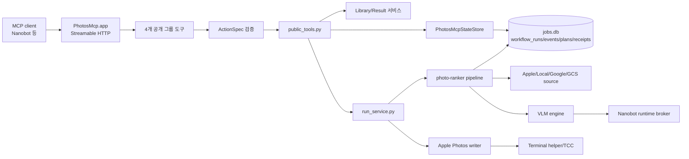
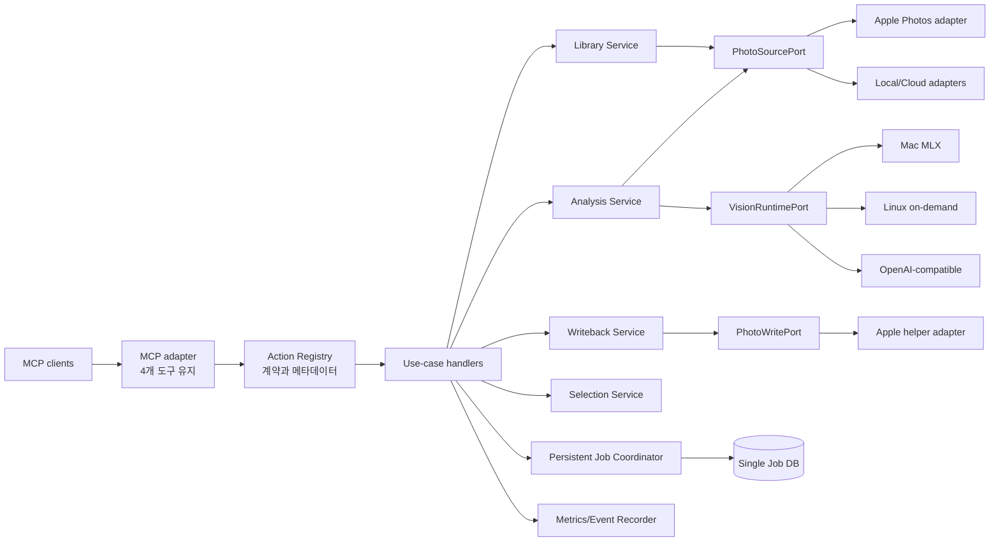

# photos-mcp 기능 개선 로드맵

- 작성일: 2026-08-01
- 상태: Phase 1 Job Coordinator 및 Phase 4 안전 쓰기 핵심 구현 완료
- 기준 저장소: `photos-mcp`
- 선행 문서: `01`, `02`, `03` planning 문서와 `docs/15-refactor-direction.md`

## 1. 결론

현재 `photos-mcp`는 외부 MCP 계약을 4개 그룹 도구로 단순화했고, `PhotosMcp.app`이 HTTP 데몬과 macOS 권한 경계를 소유하도록 정리되어 있다. 이 외부 구조는 유지하는 것이 맞다.

다음 개선의 중심은 도구 수를 늘리는 것이 아니라 내부 실행 신뢰성과 사진 분석 품질을 높이는 것이다. 우선순위는 다음과 같다.

1. 메모리 작업과 SQLite 작업으로 나뉜 실행 상태를 하나의 영속 작업 모델로 통합한다.
2. 사진 조회, 로컬 원본 준비, iCloud 다운로드 상태를 단일 source 계층으로 통합한다.
3. 앨범 쓰기 작업에 미리보기, 멱등성, 실행 영수증과 부분 실패 복구를 추가한다.
4. VLM 실행을 Nanobot 내부 구현에서 분리하고 로컬 Mac, Linux 원격 서버, OpenAI 호환 서버를 같은 공급자 계약으로 다룬다.
5. 사진 설명 품질을 고정 데이터셋과 독립 평가기로 반복 검증해 모델 선택 근거로 사용한다.

운영 정책은 원격 Linux VLM 기본 허용, 모든 앨범 변경 전 plan 승인, 실패 workflow의 사용자 승인 기반 재개, 비식별 개인 thumbnail의 품질 평가 세트 포함으로 확정한다.

즉시 전면 재작성하거나 Swift 네이티브 앱으로 교체할 필요는 없다. 현재 외부 계약을 고정한 채 내부를 단계적으로 교체하는 편이 위험과 회귀 비용이 가장 낮다.

### 1.1 2026-08-01 구현 진행

- [x] Linux Qwen3.6을 기본 vision runtime으로 지정
- [x] Nanobot import 없이 Linux wake, service와 SSH tunnel을 준비하는 command adapter 추가
- [x] `/v1/models` 기반 multimodal preflight와 실제 이미지 smoke 검증
- [x] `photos_query(action="guide")`와 health에 vision runtime 정보 노출
- [x] 모든 write에 확정 대상 기반 `MutationPlan`과 영속 승인 token 적용
- [x] 재실행 후 Apple Photos 권한, 읽기, 앨범 자동화, thumbnail capability 실기기 검증
- [x] macOS Photos 권한 팝업 응답 시간을 확보하도록 preflight timeout을 10초에서 30초로 조정
- [x] facade background run과 vendor 작업을 같은 SQLite 및 같은 `run_id`로 통합
- [x] 재시작 시 `awaiting_resume_approval` 전환 및 승인 후 checkpoint 기반 in-place 재개
- [x] 분석 후 확정된 photo ID와 thumbnail 경로를 포함하는 상세 `MutationPlan`
- [x] 메뉴 앱의 변경 계획 승인·거절 UI
- [x] 자동 `idempotency_key`, `MutationReceipt`, 앨범 추가 부분 실패 및 timeout의 실제 상태 재조정

### 1.2 재실행 운영 검증

2026-08-01 20:02 KST에 설치 앱을 다시 실행한 뒤 `http://127.0.0.1:18791/health`를 확인했다.

| 항목 | 결과 | 확인 내용 |
| --- | --- | --- |
| 데몬 | `ready` | HTTP/MCP endpoint 정상 |
| Photos 권한 | `ok` | PhotoKit `authorized` |
| 라이브러리 읽기 | `ok` | 실제 사진 21,786개 DB 로드, sample 조회 성공 |
| 앨범 자동화 | `ok` | 46개 앨범 조회와 automation probe 성공 |
| thumbnail | `ok` | 실제 sample thumbnail export 성공, fallback 미사용 |
| 기본 VLM | `on_demand` | Linux Qwen3.6, 요청 전에는 endpoint를 상주시킬 필요 없음 |

재실행 전에 발생했던 `not_determined`와 timeout은 앱 권한 승인 및 재실행 후 해소되었다. 이 상태에서 조회와 쓰기 preflight를 통과하므로 다음 기능 검증을 진행할 수 있다.

후속 번들 재검증에서는 macOS Photos 권한 팝업이 표시된 뒤 사용자가 허용을 누르기 전에 10초 제한이 먼저 끝난 것이 timeout의 주원인이었다. 이때 `not_determined`, `requested=true`가 기록됐으며 사용자 승인 후 다음 실행에서는 `authorized`가 확인됐다. 사진 보관함 초기화 시간도 일부 포함될 수 있지만, 21,786장이라는 사진 수만으로 timeout 원인을 단정할 근거는 없다. 권한 응답 시간을 확보하기 위해 기본값을 30초로 늘렸고 `PHOTOS_MCP_PREFLIGHT_TIMEOUT_SECONDS`로 시스템별 조정이 가능하다.

이후 30초 제한을 네 검사에 순차 적용하면서 자동화와 thumbnail timeout이 합산되어 데몬 시작이 약 65초 늦어지는 회귀를 확인했다. timeout된 Python worker는 AppleScript를 강제 취소하지 못해 자동 재검사마다 중복 worker와 Photos DB 로드가 누적됐고, 메뉴 메인 스레드가 `join()`을 기다려 앱이 멈춘 것처럼 보였다. 이를 다음과 같이 수정했다.

- HTTP/MCP 데몬을 preflight보다 먼저 시작한다.
- preflight coordinator를 메뉴 메인 스레드 밖에서 실행한다.
- 권한 팝업 제한은 30초로 유지하고 일반 capability 제한은 기본 10초로 분리한다.
- 시작 시에는 권한과 DB 읽기만 검사하고, 취소할 수 없는 AppleScript 자동화·thumbnail 실검사는 메뉴의 명시적 `Run Checks` 또는 실제 기능 사용 시점으로 지연한다.
- timeout된 같은 key의 worker가 살아 있으면 새 worker를 만들지 않는다.
- Photos 권한이 이미 `ok`이면 다른 capability warning만으로 전체 preflight를 자동 반복하지 않는다.

수동으로 실행하는 일반 capability 제한은 `PHOTOS_MCP_CAPABILITY_PREFLIGHT_TIMEOUT_SECONDS`로 조정할 수 있다.

통합 구현은 facade workflow, 실행 이벤트, 변경 계획과 영수증을 vendor `photo-ranker/jobs.db` 안의 별도 테이블에 저장한다. 기존 `synthetic-runs.json`은 최초 실행 시 SQLite로 가져오기 위한 호환 입력으로만 남고 신규 상태의 기준 저장소로 사용하지 않는다. 앱이 종료될 때 `pending`, `running`, `waiting_source`, `waiting_model`, `writing`이었던 run은 다음 시작에서 자동 실행하지 않고 `awaiting_resume_approval`로 전환된다.

사용자는 `photos_query(action="resume_plan")`으로 원요청을 확인하고 `photos_workflow(action="resume")`의 승인 token을 명시적으로 승인해야 한다. 승인 후에는 새 ID를 만들지 않고 같은 `run_id`를 vendor pipeline에 전달한다. 사진별 `filter`와 `vlm` checkpoint는 workflow 최종 단계 전까지 유지되며 성공적으로 끝난 뒤에만 정리된다.

앨범 workflow는 더 이상 범위 승인 직후 사진을 쓰지 않는다. 먼저 분석을 background로 완료하고 실제 photo ID와 비식별 preview 경로가 들어 있는 `MutationPlan`을 생성해 `awaiting_mutation_approval`로 멈춘다. 메뉴 또는 MCP에서 승인한 뒤 해당 `photos_write`를 실행하며, 결과는 `MutationReceipt`에 완료·부분 성공·재조정 필요 상태로 남는다. 앨범 추가가 부분 성공하거나 timeout이 발생한 뒤 같은 요청을 다시 보내면 쓰기를 반복하지 않고 현재 앨범의 photo ID를 조회해 확정·미확정 목록을 갱신한다.

30초 preflight 보정 후 새 서명의 첫 실행에서 사용자가 권한 팝업에 응답할 시간이 확보됐고 `photos_read`, automation, thumbnail도 완료됐다. TCC가 새 CDHash를 반영한 다음 실행에서는 네 capability가 모두 `ok`였다. 최종 설치 앱은 `daemon=ready`, `preflight=ok`, background job 없음으로 확인했다.

## 2. 검토 범위와 기준

이번 검토는 다음 코드를 기준으로 했다.

- MCP 등록과 HTTP 데몬: `src/photos_mcp/server.py`, `daemon.py`
- 공개 도구와 옵션 계약: `src/photos_mcp/facade/action_options.py`, `public_tools.py`
- 조회, 실행, 결과 처리: `library_service.py`, `run_service.py`, `result_service.py`
- 앱 상태와 작업 상태: `state.py`, `job_state.py`, vendor `photo-ranker/db.py`
- 사진 원본 접근: vendor `photo-source`, `photo-ranker/sources.py`
- 분석 파이프라인: vendor `photo-ranker/pipeline.py`, VLM 관련 모듈
- Apple Photos 쓰기: vendor `photo-ranker/album_writer.py`와 Terminal helper
- 런타임 연결: `runtime_broker_client.py`, `preflight.py`
- 운영 UI와 검증: `menu_app.py`, `tests/`, `scripts/`, 기존 benchmark 문서

평가 기준은 기능 범위, 장애 복구, 데이터 안전성, 분석 품질, 운영 독립성, 관찰 가능성, 테스트 용이성이다.

## 3. 현재 구조

### 3.1 공개 기능 표면

현재 서버는 다음 4개 MCP 도구만 공개한다.

| 도구 | 역할 | 대표 기능 |
| --- | --- | --- |
| `photos_query` | 상태와 조회 | 사진 검색, 실행 상태, 결과와 산출물 조회 |
| `photos_select` | 분석과 선별 | 단일 사진 분석, 범위 분류, 우수 사진 선별 |
| `photos_write` | 명시적 변경 | 앨범 추가, 내보내기, 분류 앨범 구성, 정리 |
| `photos_workflow` | 복합 작업 | 조회부터 분석, 선별, 쓰기까지 일괄 실행 |

`ActionSpec`가 action별 허용, 필수, 금지 옵션을 검증하므로 LLM이 위험한 저수준 조합을 직접 만드는 것을 줄였다. 이 계약은 현재 구조의 장점이며 유지해야 한다.

### 3.2 내부 실행 흐름

- 짧은 조회는 facade 서비스가 즉시 처리한다.
- 긴 분석과 workflow는 `public_tools.py`에서 background task로 시작한다.
- 분석 파이프라인은 1단계 품질, 얼굴, EXIF 평가 후 후보에 한해 2단계 VLM 분석을 수행한다.
- vendor 작업과 체크포인트는 SQLite에 저장한다.
- facade와 vendor는 같은 `run_id`를 사용하고 동일 SQLite 안의 coordinator 및 pipeline 테이블에 기록한다.
- Apple Photos 읽기와 쓰기의 일부는 권한 귀속을 위해 Terminal helper를 사용한다.
- VLM은 MLX 또는 OpenAI 호환 API를 사용할 수 있으나 런타임 broker 연결은 Nanobot 구현에 직접 의존한다.

## 4. 현재 구조의 강점

1. 외부 MCP 도구가 4개로 제한되어 모델의 도구 선택 부담이 작다.
2. action별 옵션 허용 목록이 있어 잘못된 쓰기 경로와 파라미터 누출을 방지한다.
3. 앱이 HTTP 데몬과 macOS 권한 경계를 소유해 MCP client와 실행 수명을 분리했다.
4. 분석 파이프라인에 단계별 checkpoint와 결과 DB가 있어 재사용 가능한 기반이 있다.
5. transport health와 Apple Photos capability를 분리해 장애 원인을 구별할 수 있다.
6. MLX와 OpenAI 호환 VLM 경로, 원격 Linux 모델 비교 도구가 이미 존재한다.
7. 공개 계약, packaging, helper, preflight에 대한 단위 테스트 기반이 비교적 넓다.

## 5. 개선이 필요한 핵심 문제

### 5.1 작업 상태가 이중화되어 있다

`PhotosMcpStateStore`의 메모리 작업과 vendor `JobDB`의 영속 작업이 서로 다른 생명주기와 식별자를 가진다. facade는 `asyncio.create_task()`로 합성 workflow를 시작하고 vendor 작업 식별자를 별칭으로 연결한다.

영향은 다음과 같다.

- 앱 재시작 시 메모리 workflow의 진행 문맥을 잃을 수 있다.
- vendor 작업은 남아 있어도 상위 workflow는 실패나 실행 중으로 잘못 보일 수 있다.
- 취소, 재시도, 결과 조회가 어느 식별자를 기준으로 하는지 복잡해진다.
- 메뉴 UI, MCP 응답, DB가 서로 다른 상태를 표시할 가능성이 있다.

### 5.2 facade 복잡도가 큰 분기 파일로 이동했다

외부 도구는 단순해졌지만 `public_tools.py`와 `run_service.py`가 action routing, 파라미터 변환, background 실행, vendor 호출, 응답 조립을 함께 맡는다.

새 action을 추가할 때 여러 분기와 평면 파라미터를 수정해야 하며, 조회와 변경의 경계도 코드 구조만으로는 명확하지 않다. 공개 도구 단순화가 내부 유지보수 단순화로 아직 이어지지 않은 상태다.

### 5.3 사진 원본 준비 상태가 여러 계층에 중복되어 있다

`photo-source`와 `photo-ranker` 양쪽에 Apple Photos 조회, 로컬 파일 판정, iCloud 원본 준비와 metadata 처리 로직이 있다. 같은 사진이 검색 단계에서는 사용 가능하지만 분석 단계에서는 준비되지 않은 것으로 판정될 수 있다.

이 구조는 다음 문제를 만든다.

- iCloud 대기와 timeout 정책이 호출 경로마다 달라진다.
- prefetch와 실제 분석의 cache key가 어긋날 수 있다.
- Apple Photos, 로컬 폴더, 향후 Photos MCP 입력이 서로 다른 의미를 갖는다.

### 5.4 쓰기 작업의 재시도 안전성이 부족하다

앨범 추가와 분류 작업은 외부 상태를 변경하지만 일관된 변경 계획, 멱등성 키, 실행 영수증, 부분 실패 보상 계약이 없다. Terminal helper timeout이 발생했을 때 실제 쓰기가 끝났는지 단순 실패인지 구분하기 어려울 수 있다.

특히 LLM이나 자동화가 같은 요청을 다시 보내면 앨범 중복 생성, 일부 사진만 추가, 정리 작업의 과도한 삭제가 발생할 위험이 있다.

### 5.5 VLM 실행이 photos-mcp 밖의 구현에 결합되어 있다

`runtime_broker_client.py`가 Nanobot의 broker 코드를 직접 가져온다. 이 결합은 독립 배포와 다른 MCP client 사용을 어렵게 하고, Nanobot 설치 상태에 따라 photos-mcp 기능이 달라지게 만든다.

Linux 원격 서버의 전원 깨우기, 모델 lease, idle 종료와 같은 운영 정책도 사진 분석 도메인과 분리된 안정적 인터페이스가 필요하다.

### 5.6 분석 품질이 런타임 정책으로 연결되지 않는다

모델 benchmark와 설명 품질 검토 도구는 추가되었지만, 실제 실행 시 다음을 일관되게 결정하는 정책 계층은 없다.

- 빠른 분류와 상세 설명에 사용할 모델
- 모델별 이미지 크기, prompt, timeout과 context
- 원격 서버 실패 시 fallback 허용 여부
- 사람, 장소, 문서, 야간 사진 등 유형별 최소 품질
- 모델 버전과 prompt 버전을 결과에 기록하는 방법

속도만 빠른 모델과 설명 품질이 높은 모델을 작업 성격에 따라 선택할 수 있어야 한다.

### 5.7 관찰 가능성과 개인정보 정책이 부족하다

현재 로그만으로 단일 MCP 요청이 source 준비, VLM 호출, writeback까지 어디에서 지연되었는지 한 번에 추적하기 어렵다. 원격 VLM 사용 시 thumbnail이 네트워크로 전송되므로 사용자가 명확히 선택할 수 있는 개인정보 정책도 필요하다.

로그와 결과에는 최소한 요청 식별자, 단계별 시간, 모델과 prompt 버전, fallback 여부, 입력 이미지 크기, 재시도와 write receipt가 남아야 한다. 원본 이미지와 base64 payload는 기본적으로 기록하지 않아야 한다.

### 5.8 문서와 실제 계약이 일부 어긋나 있다

예를 들어 `docs/11-feature-map.md`는 이전 공개 도구 이름을 포함하지만 현재 서버와 테스트는 4개 그룹 도구를 사용한다. action catalog가 코드와 문서에 수작업으로 중복되어 있어 기능 변경 시 문서가 뒤처질 수 있다.

## 6. 목표 구조

### 6.1 설계 원칙

1. 공개 도구 이름과 상위 action 의미는 유지한다.
2. 모든 background 작업은 시작 전에 DB에 기록하고 하나의 `run_id`만 사용한다.
3. action별 handler는 입력 command와 결과 model을 명시적으로 가진다.
4. 사진 접근, VLM, Apple Photos 쓰기는 port와 adapter로 분리한다.
5. 변경 작업은 계획과 적용을 구분하고 모든 적용 결과를 영수증으로 남긴다.
6. Nanobot은 MCP client일 뿐 photos-mcp 핵심 코드의 dependency가 되지 않는다.
7. 모델 선택은 이름이 아니라 capability와 품질 profile을 기준으로 한다.
8. 공개 평가 데이터와 사용자가 승인한 비식별 개인 thumbnail을 함께 사용하되, 평가 자산은 실제 개인 사진 및 운영 산출물과 분리 보관한다.

## 7. 세부 개선안

### 7.1 단일 영속 Job Coordinator

- `run_id`를 facade와 vendor 전체에서 유일 식별자로 사용한다.
- `queued`, `running`, `waiting_source`, `waiting_model`, `writing`, `succeeded`, `failed`, `cancelled`, `interrupted`, `awaiting_resume_approval` 상태 전이를 고정한다.
- 앱 시작 시 미완료 작업을 검사해 안전하게 중단하고 `awaiting_resume_approval`로 전환한다. 실패하거나 중단된 workflow는 자동 재개하지 않는다.
- 재개 가능한 stage, 이미 완료된 변경, 재실행 시 예상 동작을 사용자에게 보여주고 명시적 승인 token을 받은 뒤에만 재개한다.
- 취소 요청을 DB에 먼저 기록하고 단계 경계에서 cooperative cancellation을 확인한다.
- 상위 workflow와 하위 stage를 parent/child 관계로 저장한다.
- UI, MCP status, result 조회는 모두 같은 repository를 사용한다.

### 7.2 Action Registry와 handler 분리

- `ActionSpec`에 설명, 위험 수준, background 여부, capability 요구 사항, 결과 schema를 추가한다.
- `public_tools.py`는 검증과 handler dispatch만 담당하도록 축소한다.
- `run_service.py`의 분기를 action별 command handler로 이동한다.
- catalog에서 MCP 설명, 문서 표, 유효성 테스트를 생성해 계약 중복을 없앤다.
- 공개 도구를 추가하지 않고 `photos_query(action="capabilities")` 또는 health resource에서 기계 판독 가능한 catalog를 제공한다.

### 7.3 PhotoSourcePort 통합

- 검색 결과를 공통 `PhotoAsset`으로 정규화한다.
- `asset_id`, source 종류, local/cloud 상태, 원본과 preview 위치, metadata, checksum을 표준화한다.
- `ensure_local(asset, purpose, deadline)`로 다운로드와 대기 의미를 하나로 만든다.
- preview 분석과 원본 export의 해상도 요구를 분리한다.
- 동일 파일의 중복 다운로드를 막고 준비 상태를 DB/cache에 기록한다.

### 7.4 안전한 Writeback Service

- 모든 변경 action이 먼저 `MutationPlan`을 만든다.
- plan에는 생성 또는 재사용할 앨범, 추가할 사진, 건너뛸 사진, 삭제 후보와 예상 변경 수를 포함한다.
- 새 앨범 생성뿐 아니라 기존 앨범에 사진을 추가하는 작업도 항상 plan을 사용자에게 제시하고 승인받은 뒤 실행한다.
- 승인 token은 plan 내용의 hash와 연결하고, plan 대상이 바뀌거나 만료되면 다시 승인받는다.
- 적용 요청은 `idempotency_key`를 받아 같은 요청의 중복 실행을 막는다.
- 완료 후 `MutationReceipt`에 실제 변경, 실패 항목, helper 응답과 재조정 결과를 기록한다.
- timeout 뒤에는 실패로 단정하지 않고 Apple Photos 상태를 다시 읽어 결과를 조정한다.
- `cleanup_album`과 대량 변경은 기본 dry-run 또는 명시적 확인 token을 요구한다.

### 7.5 독립 VisionRuntimePort

- `analyze(image, profile, deadline)`과 `capabilities()`를 핵심 계약으로 둔다.
- 공급자는 `mlx_local`, `openai_compatible`, `linux_on_demand` adapter로 분리한다.
- Linux adapter가 wake, readiness, model lease, 호출, release를 책임지고 photos-mcp는 Nanobot 코드를 import하지 않는다.
- `fast_tagging`, `detailed_caption`, `people_event`, `document_ocr` 같은 profile을 정의한다.
- 결과에 provider, model revision, quantization, prompt version, latency와 fallback을 기록한다.
- 기본 개인정보 정책은 `remote_allowed`로 두어 Linux VLM 사용을 허용한다. 품질과 작업 profile에 따라 원격 모델을 자동 선택할 수 있으며 사용자는 요청별 또는 전역 `local_only` 설정으로 원격 전송을 차단할 수 있다.
- 실제 원격 전송 전에는 원본 대신 작업에 필요한 최소 해상도의 thumbnail을 만들고 EXIF와 위치 metadata를 제거한다.

### 7.6 Apple Photos helper 안정화

- helper 호출에 명시적 request ID와 구조화된 JSON 응답을 사용한다.
- subprocess 시작, 권한 거부, 실제 작업 timeout을 서로 다른 오류 코드로 구분한다.
- helper가 작업 전후 상태와 처리한 photo ID를 반환하게 한다.
- 장기적으로는 Terminal UI 자동화 의존을 줄이되, 당장 전체 Swift 재작성은 하지 않는다.
- 먼저 현재 helper를 안정적인 `PhotoWritePort` adapter 뒤에 격리한다.

### 7.7 관찰 가능성과 개인정보 보호

- MCP request ID, run ID, stage ID를 전 로그에 연결한다.
- 단계별 queue, source 준비, inference, writeback 시간을 수집한다.
- 모델 메모리 사용량은 공급자가 제공할 수 있을 때 peak와 steady 값을 결과 metadata에 기록한다.
- 원본 경로, 얼굴 이름, base64 이미지와 전체 prompt는 기본 로그에서 제외한다.
- 원격 전송 여부와 전송한 이미지 크기를 결과에 표시한다.
- 진단 bundle은 사용자가 명시적으로 생성할 때만 개인정보를 제거한 형태로 만든다.

### 7.8 사진 설명 품질 검증 체계

모델이 생성한 설명을 단순 성공 여부로 평가하지 않고 다음 방식으로 검증한다.

1. 공개 또는 합성 이미지와 사용자가 포함을 승인한 비식별 개인 thumbnail로 고정 평가 세트 100~200장을 유형별로 구성한다.
2. 인물 수, 주요 사물, 장소 유형, 행동, 시간대, 텍스트 존재 여부를 정답 label로 기록한다.
3. 각 모델의 출력 형식 유효성, 사실 일치, 누락, 환각, 세부 설명, 처리 시간을 자동 채점한다.
4. 독립 judge 모델은 후보 모델 이름을 가린 상태에서 설명을 비교한다.
5. 일부 표본은 사람이 원본 사진과 함께 재검토해 judge 편향을 보정한다.
6. prompt와 모델 revision이 바뀔 때 같은 세트로 회귀 시험을 수행한다.

개인 thumbnail은 평가 세트에 넣기 전에 얼굴, 차량 번호, 주소, 문서와 화면의 식별 가능한 문자열을 가리고 EXIF, GPS, 원본 파일명과 Photos 식별자를 제거한다. 비식별 변환본과 변환 이력은 로컬 암호화 저장소에서만 관리하며 Git, 일반 로그, 원격 artifact 저장소에는 포함하지 않는다. 사용자는 개별 자산 또는 평가 세트 전체를 철회하고 삭제할 수 있어야 한다.

권장 핵심 지표는 다음과 같다.

- `grounded_fact_score`: 사진에서 확인 가능한 사실의 정확도
- `hallucination_rate`: 사진에 없는 인물, 사물, 장소를 단정한 비율
- `event_coverage`: 핵심 사건과 행동을 포착한 비율
- `attribute_accuracy`: 인물 수, 시간대, 실내외 등 속성 정확도
- `description_usefulness`: 검색과 앨범 분류에 실제 도움이 되는 정도
- `schema_valid_rate`: 요구 JSON 계약 준수율
- `latency_p50/p95`, 오류율, peak memory

평가 도구는 실제 분석 코드와 분리하고, 결과 JSON과 요약 Markdown을 함께 생성한다. 자동 judge 점수만으로 모델을 선정하지 않고 정답 기반 지표와 사람 검토를 함께 사용한다.

## 8. 단계별 실행 계획

### Phase 0. 현재 계약과 문서 기준선 고정

- `docs/11-feature-map.md`를 실제 4개 도구와 action 목록에 맞춘다.
- Action Registry와 문서 간 차이를 검사하는 테스트를 추가한다.
- 대표 action별 현재 응답 schema와 오류 코드를 snapshot으로 고정한다.
- 현재 live smoke와 사진 품질 benchmark를 기준선으로 저장한다.

완료 조건: 코드, MCP 목록, 기능 문서의 action 이름이 모두 일치한다.

### Phase 1. 영속 Job Coordinator 통합

상태: **핵심 구현 완료 (2026-08-01)**

- 단일 `run_id`, 상태 전이와 repository를 도입한다.
- 메모리 synthetic run을 영속 작업으로 대체한다.
- 앱 재시작 조정, 취소, 사용자 승인 재개 시험을 추가한다.
- UI와 MCP 응답을 같은 상태 source로 전환한다.

완료 조건: 실행 중 앱을 재시작해도 모든 작업이 `interrupted` 또는 `awaiting_resume_approval`로 일관되게 정리되고, 사용자 승인 없이 자동 재개되지 않는다.

### Phase 2. action handler 분리

상태: **핵심 분리 완료 (2026-08-02)**. 네 public action은 `query_handler.py`, `select_handler.py`, `write_handler.py`, `workflow_handler.py`로 분리했고, `public_tools.py`는 공개 router와 workflow coordinator 보조 함수만 유지한다. 각 router의 위임과 기존 공개 계약 회귀를 자동 시험한다. command/result type의 정적 모델화는 후속 품질 개선 항목이다.

- `public_tools.py`를 validator와 dispatcher로 축소한다.
- 조회, 분석, 선별, 쓰기, workflow handler를 분리한다.
- command/result type과 공통 error envelope를 도입한다.
- 기존 공개 계약 회귀 테스트를 그대로 통과시킨다.

완료 조건: 새 action 추가 시 registry, handler, 테스트 외의 큰 분기 파일을 수정하지 않는다.

### Phase 3. 사진 source와 asset readiness 통합

상태: **핵심 통합 완료 (2026-08-02)**. browse·inspect·prefetch와 analyze thumbnail·metadata·Apple local-availability probe는 모두 `PhotoSourcePort`를 통해 photo-source vendor와 통신한다. 결과는 공통 `PhotoAsset`으로 정규화해 `asset_id`, `local_path_available`, `readiness`를 노출하고, 같은 `PhotosMcpStateStore`의 즉시 분석 probe가 readiness를 재사용한다. 상태는 workflow SQLite의 `photo_assets` 테이블에도 저장돼 앱 재시작 뒤 복원되며, 기본 5분 TTL 뒤에는 다시 확인한다. GCS `gs://bucket/prefix` 입력도 source adapter에서 bucket/prefix로 분리한다. Apple browse와 ranker pipeline은 `apple_photos_runtime`의 process-wide `PhotosDB` 초기화를 공유해 대형 보관함의 cold start가 동시 요청마다 중복되지 않으며, 현재 보관함 경로와 `_skip_searchinfo` 옵션으로 부가 색인 비용을 줄인다.

- 공통 `PhotoAsset`과 `PhotoSourcePort`를 도입한다.
- Apple Photos 검색, prefetch와 ranker source의 중복 경로를 통합한다.
- cloud-only, missing, unsupported, ready 상태 의미를 고정한다.
- iCloud timeout, 중복 다운로드와 cache 회귀 시험을 추가한다.

완료 조건: 검색에서 `ready`인 asset은 같은 실행의 분석 단계에서도 별도 판정 없이 사용 가능하다.

### Phase 4. 안전한 쓰기 계약 적용

상태: **핵심 구현 완료 (2026-08-01)**. 앨범 추가의 timeout 후 조회 재조정까지 구현했으며, category organize와 import의 범용 재조정 및 destructive dry-run 강화는 후속 운영 검증으로 남긴다.

- `MutationPlan`, `idempotency_key`, `MutationReceipt`를 도입한다.
- 앨범 생성, 사진 추가, category organize, cleanup 순서로 적용한다.
- timeout 후 상태 재조정과 부분 실패 복구를 구현한다.
- 앨범 추가를 포함한 모든 write action에 plan 확인과 승인 token을 적용하고, destructive action에는 dry-run을 추가로 강제한다.

완료 조건: 동일 요청을 반복해도 중복 변경이 없고 실제 변경 결과를 photo ID 단위로 추적할 수 있다.

### Phase 5. VLM 공급자와 품질 정책 개선

상태: **고정 공개 평가 세트와 비교 보고서 구현 완료 (2026-08-02)**. `VisionRuntimePort`와 명시적 prepare command adapter를 사용해 Photos MCP에서 Nanobot Python import를 제거했다. 기본 Linux OpenAI 호환 경로와 `local_only` MLX 경로는 유지하며, 외부 runtime은 준비 명령으로만 연동한다. benchmark는 외부 라벨 파일로 `grounded_fact_score`, 이벤트·속성 정확도와 용어 기반 환각률을 자동 집계하고, `compare_vlm_benchmarks.py`는 동일 입력·프롬프트·계약 조건을 확인한 뒤에만 모델 추천 보고서를 만든다. `resources/vlm-benchmark/coco2017-public-v1.json`은 20장의 공개 COCO image URL·SHA-256·사람 검토 라벨을 고정하고, 준비 도구는 원본을 사용자 cache에만 저장한다. provider별 정기 실행은 운영 환경의 endpoint와 비용 정책에 따라 scheduler에서 실행한다.

- Nanobot 직접 import를 제거하고 `VisionRuntimePort`를 도입한다.
- Mac MLX, 일반 OpenAI 호환, Linux on-demand adapter를 구현한다.
- Linux 원격 사용을 기본 허용한 상태에서 profile별 모델 선택, timeout, fallback과 `local_only` 예외 정책을 적용한다.
- 공개 이미지와 로컬 보관 비식별 개인 thumbnail로 구성된 고정 데이터셋 및 독립 품질 평가를 CI 외 정기 benchmark로 실행한다.

완료 조건: MCP client가 Nanobot이 아니어도 같은 VLM 기능이 동작하고, 모델 선택 이유가 품질 보고서로 재현된다.

### Phase 6. helper와 운영 안정성 개선

상태: **운영 지표·개인정보 최소화 핵심 반영 중 (2026-08-02)**. 결과 요약에는 queue, source 준비, filter, dedup, inference, writeback, total 시간을 `execution_metrics`로 제공한다. 경로·사진 식별자·얼굴 crop 식별자는 기본 source/pipeline 로그에서 제외했다. Apple Photos Terminal helper는 request ID를 포함한 성공 envelope를 사용하고, IPC 경계는 timeout·launch·응답·helper 실패를 안전한 오류 code로 구분한다. 환경 검사 창은 기본/선택 capability와 이미지 분석 모델 상태를 분리해 보여 주며, 실제 macOS 권한과 장시간 workflow의 live 검증은 계속 필요하다.

- Apple Photos helper의 구조화 응답과 오류 분류를 적용한다.
- request/run correlation과 단계별 metric을 추가한다.
- 메뉴 앱에 active run, 대기 이유, provider, cancel/retry를 표시한다.
- 실제 설치 앱 기준 장시간 workflow와 권한 회귀 시험을 수행한다.

완료 조건: 운영자가 UI와 로그만으로 지연 단계와 복구 가능 여부를 판단할 수 있다.

## 9. 우선순위

| 우선순위 | 작업 | 이유 |
| --- | --- | --- |
| P0 | 문서/계약 동기화 | 잘못된 계약을 기준으로 추가 개발하는 것을 방지 |
| P0 | Job Coordinator 통합 | 재시작, 취소, 결과 신뢰성의 기반 |
| P0 | 쓰기 멱등성과 영수증 | 사용자 사진 보관함 변경의 안전성 확보 |
| P1 | action handler 분리 | 이후 기능 추가와 테스트 비용 절감 |
| P1 | PhotoSourcePort 통합 | iCloud와 원본 준비 실패 감소 |
| P1 | VisionRuntimePort 분리 | Linux VLM과 독립 배포의 기반 |
| P1 | 품질 평가 데이터셋 | 모델 선택을 주관적 비교에서 재현 가능한 평가로 전환 |
| P2 | helper 고도화 | 권한과 timeout 장애의 진단성 개선 |
| P2 | 메뉴 UI와 metric | 운영 편의성과 장기 분석 가시성 향상 |

## 10. 검증 전략

### 10.1 단위 및 계약 테스트

- 모든 action의 필수, 허용, 금지 옵션
- 상태 전이와 잘못된 전이 거부
- source 상태 정규화와 cache key
- 멱등성 키 재사용과 write receipt
- provider capability와 fallback 결정
- 개인정보가 로그에 포함되지 않는지 검사

### 10.2 통합 테스트

- HTTP initialize부터 background 결과 조회까지 전 흐름
- 작업 중 앱 재시작 후 상태 조정
- 실패 또는 중단된 workflow가 승인 전에는 실행되지 않고 유효한 승인 token으로만 재개되는지 확인
- iCloud 미다운로드 사진의 대기, timeout과 재시도
- VLM provider 실패 후 정책에 따른 fallback
- 기본 정책에서 Linux VLM이 선택 가능하고 `local_only` 요청에서는 원격 호출이 차단되는지 확인
- Apple Photos 쓰기 timeout 뒤 실제 상태 재조정
- 앨범 추가가 plan 승인 전에는 실행되지 않고, plan 변경 뒤 이전 승인 token이 거부되는지 확인
- 동일 mutation 반복 실행 시 중복 없음

### 10.3 실환경 검증

- 설치된 `PhotosMcp.app`과 실제 TCC 권한으로 확인한다.
- Mac 로컬 VLM과 Linux 원격 VLM을 같은 평가 세트로 비교한다.
- 100회 연속 분석에서 성공률, p95 지연, 메모리, 결과 일관성을 기록한다.
- 최소 1회의 앱 재시작과 Linux wake/release를 장기 시험에 포함한다.
- 쓰기 시험은 전용 테스트 앨범과 복사본에 한정한다.

## 11. 성공 지표

- background 작업의 100%가 시작 전에 영속 저장된다.
- 앱 재시작 뒤 orphan 상태가 발생하지 않고 실패 workflow가 사용자 승인 없이 자동 재개되지 않는다.
- 동일 쓰기 요청 재시도에서 중복 앨범과 중복 사진 추가가 0건이다.
- 앨범 추가를 포함한 write action의 plan 승인 누락 실행이 0건이다.
- 코드와 생성 문서의 action catalog 불일치가 0건이다.
- photos-mcp 핵심 package에서 Nanobot import가 0건이다.
- 원본 이미지와 base64 payload의 기본 로그 기록이 0건이다.
- 품질 benchmark의 schema 준수율이 100%에 가깝게 유지된다.
- 모델 교체 시 grounded score와 환각률의 회귀 여부를 자동 보고한다.
- 상태 조회 p95는 로컬 환경에서 200ms 이내를 목표로 한다.
- background 요청 수락은 실제 분석과 분리해 500ms 이내를 목표로 한다.

## 12. 첫 구현 묶음 제안

첫 작업은 Phase 0과 Phase 1의 최소 범위를 한 묶음으로 진행하는 것이 좋다.

1. 현재 action catalog를 JSON으로 직렬화하는 읽기 전용 API를 추가한다.
2. `docs/11-feature-map.md`와 공개 도구 문서를 registry 기준으로 동기화한다.
3. 기존 DB에 facade workflow용 run과 stage table을 추가하는 migration을 설계한다.
4. `asyncio.create_task()` 등록 전에 run을 저장하고 task 종료 시 상태를 확정한다.
5. 앱 시작 시 미완료 run을 조정하는 recovery 함수를 추가한다.
6. 재시작, 취소, alias run ID 회귀 테스트를 추가한다.

이 묶음은 사용자 사진을 쓰는 동작을 바꾸지 않으면서 이후 개선의 신뢰성 기반을 만든다.

## 13. 이번 범위에서 하지 않을 일

- 공개 MCP 도구를 다시 다수의 세부 도구로 늘리지 않는다.
- 전체 앱을 Swift로 재작성하지 않는다.
- Apple Photos를 다른 사진 저장소로 대체하지 않는다.
- 순위 가중치와 얼굴 인식 알고리즘을 job 구조 변경과 동시에 전면 교체하지 않는다.
- 개인 원본 사진이나 원본 benchmark 산출물을 Git에 저장하지 않는다.
- 자동 judge 점수 하나만으로 운영 모델을 결정하지 않는다.

## 14. 확정 운영 정책

다음 정책을 구현 기본값으로 확정한다.

1. 원격 Linux VLM 사용은 기본 허용한다. 작업 profile과 품질 정책이 원격 모델을 자동 선택할 수 있으며 `local_only`를 명시한 요청만 원격 전송을 금지한다.
2. 앨범 생성, 기존 앨범 사진 추가, 분류 앨범 구성과 cleanup을 포함한 모든 write action은 `MutationPlan`을 먼저 보여주고 사용자 승인을 받은 뒤 실행한다.
3. 실패하거나 앱 재시작으로 중단된 workflow는 자동 재개하지 않는다. 재개 범위와 예상 변경을 보여주고 사용자 승인 token을 받은 뒤 이어서 실행한다.
4. 품질 평가 세트에는 사용자가 승인한 개인 사진의 비식별 thumbnail을 포함한다. 식별 정보 제거, 로컬 암호화 보관, Git 제외와 철회 삭제를 필수 조건으로 한다.
