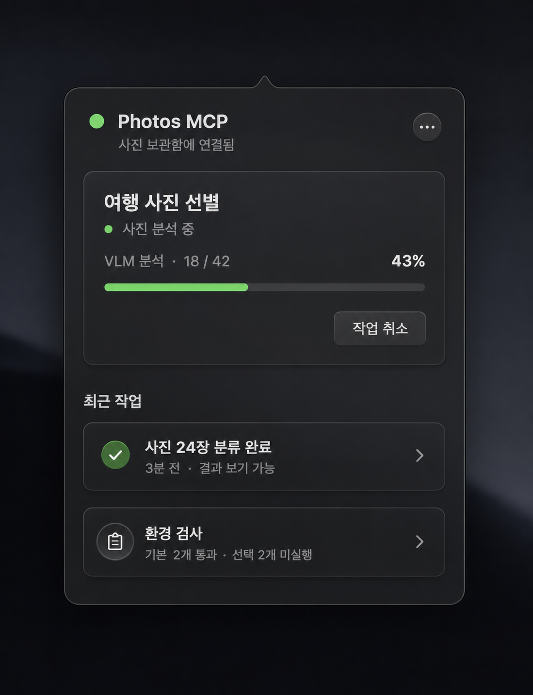
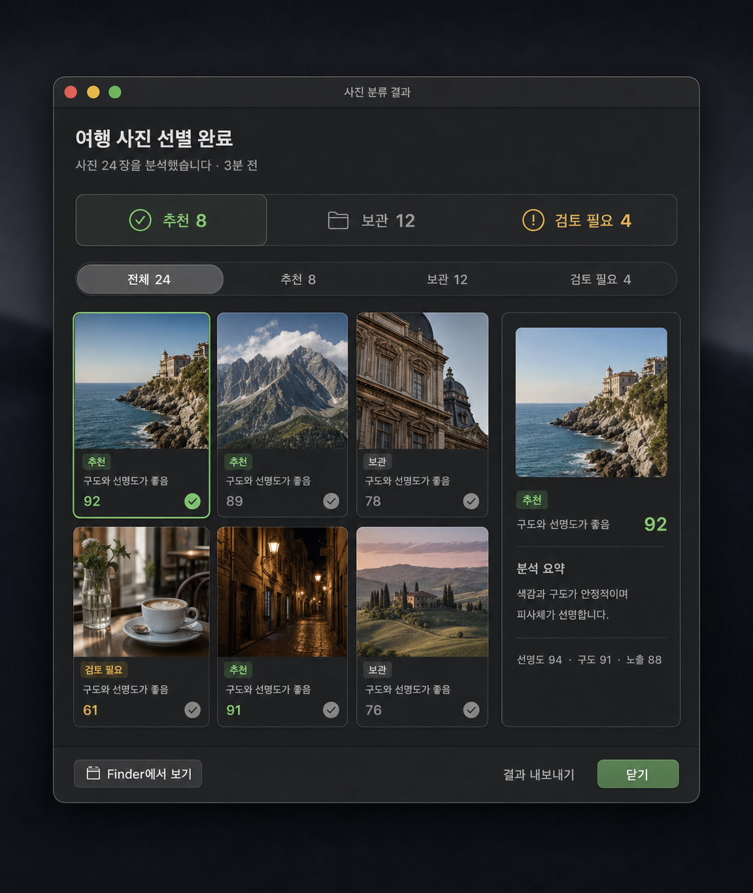
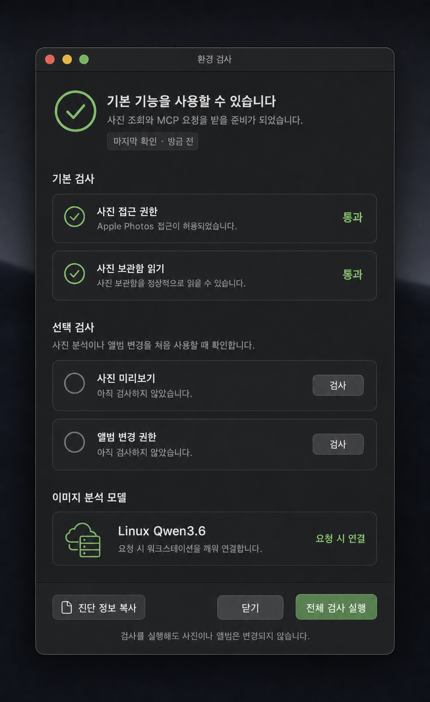
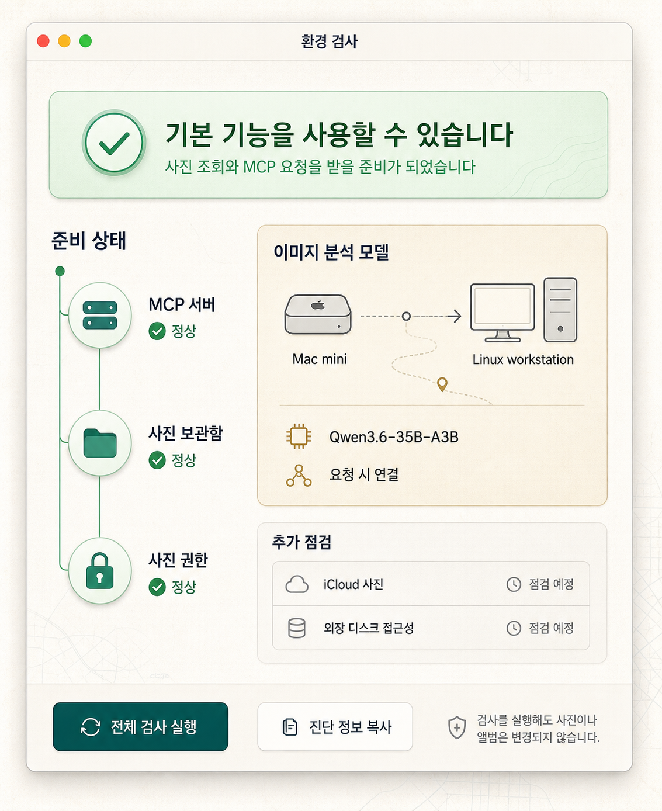

# PhotosMcp 메뉴 팝오버 UX 개선안

- 작성일: 2026-08-01
- 최종 갱신: 2026-08-02
- 상태: 핵심 구현 및 설치 앱 검증 완료, Photos 권한 사용자 승인 대기
- 대상: `src/photos_mcp/menu_app.py`
- 선행 조건: 기본 기능 검증 전에 운영 화면의 상태 의미와 조작 흐름을 먼저 정리

## 0. 구현 현황

2026-08-02 기준으로 Phase 1, Phase 2와 Phase 4의 핵심 범위를 설치 앱에 반영했다. 정상 상태에서는 빈 섹션을 제거한 소형 팝오버를 사용하고, 작업 실행·승인 대기·실제 오류가 있을 때만 관련 영역과 행동을 확장한다.

| 범위 | 상태 | 반영 내용 |
| --- | --- | --- |
| 상태와 정보 위계 | 완료 | 서버·사진 보관함·선택 검사를 분리하고 선택 검사 `미실행`을 중립 상태로 표시 |
| 동적 팝오버 | 완료 | 콘텐츠 기반 260~620pt 높이, 빈 작업·승인·최근 작업 섹션 생략, 최근 작업 3개 제한 |
| 안전한 관리 동작 | 완료 | 서버 제어·기록 지우기·종료·진단 기능을 `···` 관리 메뉴로 이동 |
| 변경 계획 검토 | 완료 | 앨범명·사진 수·비식별 preview 확인 후에만 승인 또는 거절 가능 |
| 사진 결과 보기 | 완료 | 저장된 결과와 preview 기반 읽기 전용 결과 창, 필터·선택 상세·Finder 열기·안전한 요약 복사 |
| 환경 검사 | 완료 | 기본/선택 검사 분리, 선택 검사 지연 상태 중립화, 원격 VLM 상태와 진단 복사 제공 |
| 한국어 UI | 완료 | 메뉴 팝오버와 결과·환경·승인 화면의 사용자 문구를 한국어로 정리 |
| 접근성·레이아웃 후속 | 부분 완료 | 동적 높이와 최소 클릭 영역은 반영했으며, 전체 Auto Layout 전환과 VoiceOver 실기기 검증은 후속 개선 대상으로 유지 |

기존 변경분 재검토 과정에서 다음 런타임 문제도 함께 수정했다.

- 숨겨진 팝오버는 주기마다 다시 그리지 않고, 열려 있을 때만 화면을 갱신한다.
- vendored photo-ranker 서버 모듈을 재사용해 반복 로딩에 따른 SQLite 연결과 파일 디스크립터 증가를 막는다.
- 재사용되는 `JobDB`는 `check_same_thread=False`, 재진입 잠금, 5초 busy timeout을 사용해 HTTP·작업 poller·환경 검사 스레드가 안전하게 공유한다.
- 결과 조회 응답에서는 원본 사진 경로를 제외하고 persisted result와 비식별 preview/review 정보만 합친다.

### 0.1 검증 결과

- 전체 단위 테스트: `190 passed in 1.40s`
- SQLite 교차 스레드 회귀 테스트: 통과
- 설치 앱 빌드, ad-hoc 서명과 `--health`: 통과
- 실제 MCP `initialize`: HTTP 200
- 실제 MCP 도구 목록: `photos_query`, `photos_select`, `photos_workflow`, `photos_write`
- 새 프로세스 시작 후 SQLite `ProgrammingError`: 0건
- 유휴 CPU 8회 표본: 0.1~0.4%, RSS 약 251MB
- SQLite 관련 파일 핸들: 20초 관찰에서 6개로 유지
- AppKit 생성 smoke: 팝오버 7개, 환경 검사 15개, 결과 보기 14개 하위 view 생성

현재 설치 앱은 daemon과 MCP transport가 `ready`이지만, 새로 서명된 앱의 macOS Photos 권한 상태가 `not_determined`이다. 이 때문에 `photos_read` 시작 검사는 10초 후 timeout으로 표시된다. 사진 보관함 기능의 최종 live workflow 검증은 사용자가 macOS 권한 팝업에서 Photos 접근을 허용한 뒤 다시 실행한다. 권한 대기 상태에서도 MCP 상태 조회와 네 가지 facade 도구 목록 조회는 정상 동작한다.

## 1. 결론

현재 팝오버는 서버 상태, capability 검사, 실행 작업, 사진 변경 승인, 최근 작업을 한 화면에 모두 펼친다. 이 때문에 정상 상태에서도 빈 섹션과 경고가 화면 대부분을 차지하고, 사용자가 지금 해야 할 행동이 무엇인지 바로 알기 어렵다.

개선 방향은 **상태 요약을 먼저 보여주고, 행동이 필요한 정보만 확장하는 운영 패널**이다. 정상일 때는 작고 조용하게, 실행 중일 때는 진행 상황을, 오류나 승인 대기 상태에서는 해결 행동을 가장 먼저 보여준다.

즉 다음 원칙을 적용한다.

1. `Ready`와 지연 검사를 함께 `Warning`으로 표현하지 않는다.
2. 빈 `Active Jobs`, 빈 `Pending Photo Changes` 섹션은 표시하지 않는다.
3. 일상 동작과 위험한 동작을 같은 수준의 버튼으로 배치하지 않는다.
4. 사진 변경은 팝오버에서 즉시 승인하지 않고 상세 계획을 확인한 뒤 승인한다.
5. 고정 좌표 UI를 상태에 따라 높이가 변하는 native stack layout으로 교체한다.
6. 시스템 언어가 한국어이면 모든 사용자 문구를 한국어로 표시한다.

## 2. 현재 화면에서 확인한 문제

### 2.1 상태 의미가 충돌한다

상단의 `Ready · Warning · 0 active`는 서버가 정상인지 문제가 있는지 한눈에 판단하기 어렵다. 현재 `photos_automation`, `photos_thumbnail` 검사는 시작 지연을 막기 위해 의도적으로 보류되는데, 이 상태가 일반 장애와 같은 `Warning`으로 합쳐진다.

상태는 다음 세 축을 분리해야 한다.

| 축 | 예시 | 화면 의미 |
| --- | --- | --- |
| 서버 | 실행 중, 시작 중, 중지됨 | MCP 요청을 받을 수 있는지 |
| 사진 보관함 | 연결됨, 권한 필요, 읽기 실패 | 기본 사진 조회가 가능한지 |
| 선택 검사 | 미실행, 검사 중, 통과, 실패 | 앨범 쓰기와 thumbnail 분석을 검증했는지 |

선택 검사의 `미실행`은 경고가 아니라 중립적인 안내다. 실제 실패나 사용자 조치가 필요한 경우에만 노란색 또는 빨간색 상태를 사용한다.

### 2.2 정보 위계가 약하다

- 앱 이름, 서버 중지, 검사, 새로고침, 종료가 같은 카드 안에서 경쟁한다.
- endpoint와 최근 작업 수가 일반 사용자에게 필요한 설명 없이 노출된다.
- 정상인 검사 두 개가 큰 영역을 차지하지만 실제로 조치할 내용은 없다.
- 빈 작업과 빈 승인 영역도 제목과 카드 높이를 유지한다.
- 최근 작업은 `Completed · f1293fd2`처럼 내부 ID가 제목이어서 어떤 작업인지 알기 어렵다.

### 2.3 행동의 위험 수준이 구분되지 않는다

`Stop`과 `Run Checks`가 같은 크기의 주요 버튼으로 노출되고, 종료 버튼도 상단에 항상 보인다. 서버 중지와 앱 종료는 일상 동작이 아니므로 `···` 보조 메뉴 안으로 옮기는 편이 안전하다.

사진 변경의 `Approve`는 대상 사진, 앨범, preview를 충분히 확인하지 않고 실행할 수 있다. 현재 구현된 `MutationPlan` 정보를 활용해 별도 검토 단계를 제공해야 한다.

### 2.4 레이아웃이 상태 변화에 대응하지 못한다

현재 UI는 `420 x 640` 고정 팝오버와 수동 좌표를 사용한다. 콘텐츠가 적으면 하단이 비고, 작업이나 승인 항목이 많으면 일부만 잘라 별도 scroll 영역에 넣는다. 폰트 크기, 긴 한국어 문구, 접근성 설정에도 취약하다.

## 3. 목표 화면 구조



위 이미지는 서버가 정상 연결된 상태에서 사진 분석 작업 하나가 실행 중인 경우의 고해상도 예상안이다. 구현 시 이미지의 고정 픽셀을 복제하기보다 상태 요약, 진행 작업 강조, 빈 섹션 제거, 최근 작업과 환경 검사의 점진적 공개 원칙을 우선 적용한다.

### 3.1 정상 상태

```text
┌──────────────────────────────────────┐
│  Photos MCP                     ···  │
│  ● 사진 보관함에 연결됨              │
│  요청을 받을 준비가 되었습니다        │
│                                      │
│  최근 작업                            │
│  ✓ 사진 24장 분류 완료       3분 전   │
│                                      │
│  환경 검사  기본 2개 통과 · 선택 2개 〉│
└──────────────────────────────────────┘
```

- 정상 상태에서는 약 280~340pt 높이만 사용한다.
- endpoint는 기본 화면에서 숨기고 `··· > 연결 정보`에서 복사할 수 있게 한다.
- 선택 검사가 아직 실행되지 않은 것은 회색 안내로만 표시한다.
- 최근 작업이 없으면 `최근 작업` 섹션도 생략한다.

### 3.2 작업 실행 중

```text
┌──────────────────────────────────────┐
│  Photos MCP                     ···  │
│  ● 사진 분석 중                      │
│                                      │
│  여행 사진 선별                      │
│  VLM 분석 · 18 / 42              43% │
│  ━━━━━━━━━━━━━░░░░░░░░              │
│                          작업 취소    │
│                                      │
│  최근 작업                         〉 │
└──────────────────────────────────────┘
```

- 실행 작업을 상태 헤더 바로 아래 최우선 영역에 배치한다.
- 내부 `request_kind` 대신 사용자에게 이해되는 작업명과 현재 단계를 표시한다.
- 작업 취소만 해당 카드 안에 두고 서버 중지와 구분한다.

### 3.3 조치 또는 승인 필요

```text
┌──────────────────────────────────────┐
│  Photos MCP                     ···  │
│  ● 확인이 필요한 항목이 있습니다      │
│                                      │
│  사진 변경 승인 대기                  │
│  '가족' 앨범에 사진 12장 추가         │
│                     계획 검토         │
│                                      │
│  환경 검사                            │
│  ! 앨범 접근 확인 필요       다시 검사│
└──────────────────────────────────────┘
```

- 승인 대기는 작업 이력보다 위에 노출한다.
- `계획 검토`를 누르면 대상 앨범, 사진 수, 비식별 preview, 예상 변경을 보여주는 별도 sheet 또는 window를 연다.
- 승인과 거절은 상세 화면의 마지막 단계에서만 제공한다.
- 실패한 검사에는 실패 이유와 한 가지 명확한 복구 행동만 표시한다.

## 4. 시각·상호작용 원칙

### 4.1 시각 방향

- macOS 기본 재질과 label color를 사용하되 모든 영역을 테두리 카드로 감싸지 않는다.
- 카드 배경은 실행 중 작업, 승인 대기, 실제 오류처럼 구분이 필요한 영역에만 사용한다.
- 초록색은 정상, 노란색은 사용자 조치 필요, 빨간색은 기능 중단에만 사용한다.
- 상태는 색만으로 전달하지 않고 아이콘과 문구를 함께 사용한다.
- 제목 15pt semibold, 섹션 12~13pt semibold, 본문 11~12pt를 기본으로 하고 시스템 접근성 폰트 확대를 고려한다.
- 최소 클릭 영역은 28pt, 주요 행동은 32pt 이상으로 유지한다.

### 4.2 메뉴 바 아이콘

- `PM` 텍스트 대신 template image 방식의 사진 또는 겹친 사진 아이콘을 사용한다.
- 정상 상태에서는 기본 아이콘, 실행 중에는 작은 진행 표시, 조치 필요 시에만 배지를 표시한다.
- 메뉴 바 제목만 보고도 상세 팝오버를 열 필요가 없도록 오류 때만 짧은 상태 표시를 허용한다.

### 4.3 버튼 체계

| 수준 | 사용 예 | 표현 |
| --- | --- | --- |
| 주요 | 계획 검토, 권한 열기 | 강조 버튼, 한 화면에 하나 |
| 보조 | 다시 검사, 작업 취소 | 일반 버튼 또는 text button |
| 관리 | 서버 재시작, 서버 중지, 앱 종료, 기록 지우기 | `···` 메뉴 |

수동 새로고침은 주기 갱신이 정상 동작하는 한 기본 화면에서 제거한다. 디버깅이 필요하면 관리 메뉴에 둔다.

### 4.4 한국어와 용어

기본 문구는 다음처럼 바꾼다.

| 현재 | 개선 |
| --- | --- |
| `Ready · Warning · 0 active` | `사진 보관함에 연결됨` 또는 `확인이 필요한 항목이 있습니다` |
| `Run Checks` | `환경 검사` 또는 문맥에 따라 `다시 검사` |
| `Active Jobs` | `진행 중인 작업` |
| `Pending Photo Changes` | `사진 변경 승인` |
| `Recent Jobs` | `최근 작업` |
| `Completed · <id>` | `<작업명> 완료` |
| `Available: result + summary` | `<사진 수>장 · 결과 보기 가능` |
| `Clear` | 관리 메뉴의 `완료 기록 지우기` |

향후 영어를 다시 직접 섞지 않도록 문자열을 locale dictionary 또는 전용 presentation 계층으로 분리한다.

## 5. 구현 구조

### 5.1 presentation model 분리

`PhotosMcpStateStore.snapshot()`을 AppKit view가 직접 해석하지 않도록 순수 Python presentation model을 둔다.

```text
PhotosMcpStateSnapshot
  -> build_menu_view_model(snapshot)
  -> MenuViewModel
  -> AppKit renderer
```

`MenuViewModel`은 다음을 계산한다.

- 전체 표시 상태와 한 줄 설명
- 실제 조치가 필요한 검사와 단순 미실행 검사 구분
- 표시할 섹션과 우선순위
- 사용자 친화적인 작업명, 단계, 완료 시각과 사진 수
- 사용할 primary action과 secondary action
- popover 목표 높이

이 변환은 AppKit 없이 단위 테스트할 수 있어 상태 조합 회귀를 줄인다.

### 5.2 레이아웃 교체

- 고정 `NSMakeRect` 좌표 대신 `NSStackView`와 Auto Layout을 사용한다.
- 전체 콘텐츠를 하나의 `NSScrollView`에 넣고 popover 높이는 최소 260pt, 최대 620pt 범위에서 조절한다.
- 빈 섹션은 view를 숨기는 것이 아니라 view model 단계에서 생성하지 않는다.
- 최근 작업은 기본 3개만 표시하고 `모두 보기`에서 확장한다.
- 긴 오류 문구는 한 줄 요약과 tooltip 또는 상세 화면으로 분리한다.

### 5.3 상세 화면

팝오버 안에 모든 정보를 넣지 않고 다음 항목은 별도 native sheet/window로 연다.

- 사진 변경 계획 검토와 승인
- 전체 환경 검사 결과와 해결 방법
- 작업 결과와 실패 상세
- 연결 정보와 진단 정보 복사

초기 구현은 `NSAlert`와 accessory view로 시작할 수 있지만, preview가 포함되는 변경 계획은 독립 `NSWindowController`가 더 적합하다.

#### 사진 결과 보기



완료 작업을 선택하면 읽기 전용 결과 window를 연다. 상단에는 추천, 보관, 검토 필요 수를 요약하고, 같은 기준의 segmented filter로 thumbnail을 좁힌다. 사진을 선택하면 점수만 보여주는 대신 VLM 요약과 선명도, 구도, 노출 등 판정 근거를 함께 표시한다.

- 기본 정렬은 추천 점수 내림차순으로 한다.
- thumbnail에는 비식별 preview만 사용하고 원본 경로와 개인 메타데이터를 노출하지 않는다.
- `결과 내보내기`와 `Finder에서 보기`는 결과 열람 동작이며 Apple Photos 앨범을 변경하지 않는다.
- 앨범 추가가 필요하면 결과 화면에서 바로 쓰지 않고 별도 `MutationPlan` 검토 흐름으로 이동한다.
- 실패 사진은 빈 타일로 숨기지 않고 실패 이유와 다시 분석 가능한지를 표시한다.

#### 환경 검사





두 번째 시안은 구현 기준으로 직접 제작한 운영 화면이다. 위쪽의 준비 완료 배너가 즉시 사용 가능 여부를 전달하고, 좌측은 사진 MCP의 준비 순서, 우측은 `Mac mini`에서 필요할 때만 `Linux workstation`의 분석 모델로 연결하는 경로를 보여준다. 실제 창도 같은 세 구획(`준비 상태`, `이미지 분석 모델`, `추가 점검`)으로 구성한다.

환경 검사 window는 MCP와 사진 조회에 필요한 기본 검사, 실제 분석이나 앨범 변경 전에만 필요한 선택 검사를 분리한다. 아직 실행하지 않은 선택 검사는 회색 중립 상태로 표시하며, 실제 실패일 때만 노란색 또는 빨간색과 복구 행동을 제공한다.

- 기본 검사는 앱 시작 시 확인한 최신 결과와 확인 시각을 보여준다.
- 선택 검사는 항목별 `검사`와 `전체 검사 실행`을 모두 제공한다.
- 검사 실행이 사진이나 앨범을 변경하지 않는다는 안전 문구를 항상 표시한다.
- 원격 VLM은 상시 장애 판정 대신 `요청 시 연결`, `깨우는 중`, `연결됨`, `연결 실패`의 별도 상태를 사용한다.
- `진단 정보 복사`에는 endpoint, 검사 시간, 상태와 오류 요약만 포함하고 사진 식별자나 원본 경로는 제외한다.

## 6. 단계별 실행 계획

### Phase 1. 상태 의미와 기본 레이아웃

1. `MenuViewModel`과 상태 파생 함수를 추가한다.
2. 지연 검사를 warning에서 중립 `미실행`으로 표현한다.
3. 헤더, 조치 배너, 진행 작업, 최근 작업, 검사 요약 순으로 정보 구조를 바꾼다.
4. 빈 섹션과 불필요한 내부 ID를 제거한다.
5. `PM`을 template 메뉴 바 아이콘으로 교체한다.

### Phase 2. 조작과 안전성

1. 서버 중지, 재시작, 앱 종료, 기록 지우기를 `···` 메뉴로 이동한다.
2. 사진 변경 승인 전에 상세 계획을 보여주는 검토 화면을 추가한다.
3. 검사 실패 상태별로 `권한 설정 열기`, `다시 검사`, `진단 복사` 행동을 연결한다.
4. 작업 행에서 결과 확인과 실패 상세를 열 수 있게 한다.

### Phase 3. 동적 레이아웃과 접근성

1. `NSStackView`와 Auto Layout으로 전환한다.
2. 콘텐츠에 따라 popover 높이를 조정한다.
3. VoiceOver label, keyboard focus, 색상 외 상태 표현을 검증한다.
4. 한국어를 기본으로 하고 locale별 문자열 분리 기반을 만든다.

### Phase 4. 기능 테스트와 실사용 검증

1. 상태 조합별 view model 단위 테스트를 추가한다.
2. 정상, 검사 보류, 권한 실패, 실행 중, 승인 대기, 작업 실패 화면을 fixture로 검증한다.
3. 설치 앱을 다시 빌드하고 실제 Photos 권한 및 21,000장 이상 보관함에서 응답성을 확인한다.
4. 기본 기능 smoke test를 실행해 UI 변경이 MCP 요청과 작업 상태 갱신을 막지 않는지 확인한다.
5. 다크 모드, 라이트 모드, 한국어 긴 문구, 작은 화면에서 시각 검증한다.

## 7. 완료 기준

- 정상 유휴 상태에서 팝오버 높이가 360pt 이하이고 빈 섹션이 보이지 않는다.
- 서버 정상과 선택 검사 미실행이 `Warning` 한 단어로 합쳐지지 않는다.
- 사용자는 첫 두 줄만 보고 요청 가능, 작업 중, 승인 필요, 장애 중 하나를 구분할 수 있다.
- 일반 화면에 서버 중지와 앱 종료가 주요 버튼으로 노출되지 않는다.
- 사진 변경 승인은 대상 앨범, 사진 수와 preview를 확인한 뒤에만 가능하다.
- 최근 작업 제목에 내부 ID 대신 작업 종류와 결과가 표시된다.
- 모든 상태와 행동은 색상 없이도 텍스트 또는 아이콘으로 구분된다.
- UI 갱신 중 MCP endpoint 응답과 background 작업 진행이 멈추지 않는다.
- 기존 메뉴 동작 테스트와 전체 테스트가 통과하고 설치 앱에서 live smoke 검증을 완료한다.

## 8. 권장 착수 범위

첫 구현은 Phase 1과 Phase 2의 관리 메뉴 이동까지 묶는 것이 적절하다. 이 범위만으로도 첨부 화면의 빈 공간, 혼란스러운 warning, 버튼 과밀, 내부 ID 노출 문제를 대부분 해결할 수 있다.

변경 계획 preview window는 사진 thumbnail과 승인 안전성을 함께 다뤄야 하므로 그 다음 독립 작업으로 진행한다. UX 개편 후 기본 기능 테스트를 실행하고, 실제 작업·승인 상태 fixture를 추가해 이후 기능 개선의 화면 회귀 기준으로 사용한다.
