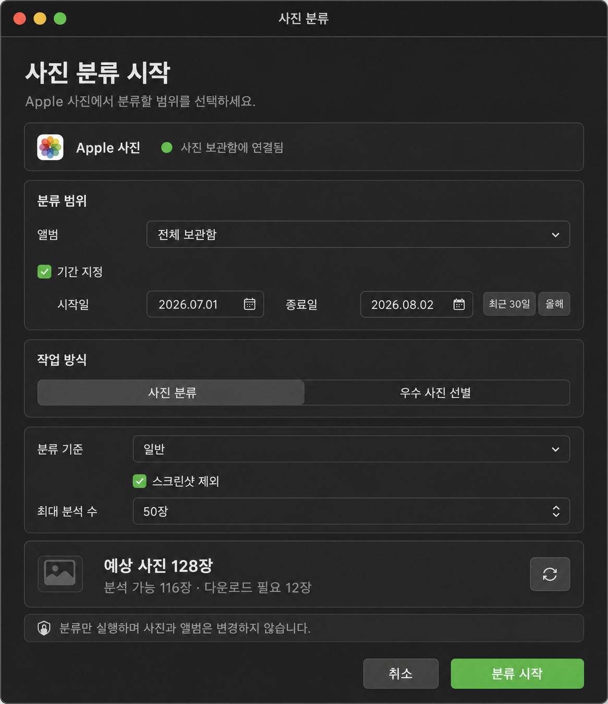

# PhotosMcp 직접 사진 분류 앱 계획

- 작성일: 2026-08-02
- 상태: Phase 1~3 구현 및 설치 앱 1차 실환경 검증 완료
- 대상: `PhotosMcp.app`, `photos_select(action="classify_range")`, Apple 사진 보관함 조회 계층
- 목표: LLM 대화 없이도 사용자가 앨범과 기간을 선택해 사진 분류를 직접 실행

## 구현 현황

2026-08-02 기준으로 다음 범위를 코드에 반영했다.

| 범위 | 상태 | 구현 |
| --- | --- | --- |
| 결과 0건 판정 | 완료 | 실제 결과 수가 0이면 결과 열기를 비활성화하고 `사진 결과 0건` 표시 |
| 읽기 전용 앨범 목록 | 완료 | Apple 사진 DB의 앨범 이름, UUID, 사진 수를 `PhotoSourcePort`로 조회 |
| 공통 명령 계약 | 완료 | 날짜, 작업 방식, 분류 기준, 최대 분석 수를 `ClassificationCommand`로 검증 |
| 범위 미리 계산 | 완료 | 후보, 분석 가능, 다운로드 필요, 실행 수와 넓은 범위 확인 여부 계산 |
| AppKit 직접 실행 창 | 완료 | 앨범, 선택적 기간, 방식, 기준, 스크린샷 제외, 최대 분석 수 입력 |
| 메뉴 진입점 | 완료 | 팝오버와 관리 메뉴에 `사진 분류 시작` 추가 |
| 공통 실행 경로 | 완료 | HTTP MCP를 우회하되 동일한 `handle_select`와 photo-ranker 작업 저장소 사용 |
| 테스트 | 완료 | 공통 서비스, AppKit 레이아웃·접근성, 실제 앨범 목록과 범위 계산 검증 |
| 설치 앱 1차 실환경 검증 | 완료 | Apple 사진 1장을 Linux Qwen3.6으로 분류해 결과 1건 저장, 설치본 재빌드·서명·헬스 확인 |
| 확장 실환경 검증 | 후속 | 10장 이상 혼합 분류, 창 재진입, VoiceOver와 확대 글꼴 확인 |

실제 Apple 사진 보관함에서는 앨범 46개를 읽었다. `202006` 앨범과 `2020-01-01~2020-12-31` 기간을 함께 지정했을 때 후보 40장, 이번 실행 10장, 로컬 분석 가능 0장, 다운로드 필요 40장으로 반환되어 iCloud 준비 상태도 구분됐다. 같은 앨범에 사진이 없는 미래 기간을 지정하면 `empty`, 후보 0장, 실행 불가로 반환됐다.

실사진 실행에서는 `천체사진_202208` 앨범의 사진 1장을 직접 분류 경로로 요청했다. 작업 `e1d67d9c`는 `linux_qwen36` 런타임을 사용해 약 62초 후 `completed`로 종료됐으며 실제 결과 1건이 저장됐다. 요청 응답 전에 동기 사진 준비가 이벤트 루프를 점유하던 문제는 작업을 먼저 예약하고 accepted 응답을 반환하도록 고쳐, 앱 창의 전용 비동기 루프에서 백그라운드 작업이 계속 실행되도록 했다.

최종 회귀 검사는 `274 passed`이며, 설치 앱은 2026-08-02 09:44에 다시 빌드했다. 코드서명 검사, 데몬 `ready`, Apple 사진 읽기 `ok`, Linux VLM `ready`를 확인했다. 메뉴바 전용 앱에 대한 Computer Use 접근성 연결은 시간 초과되어 설치본 화면 캡처는 자동화하지 못했으며, AppKit 레이아웃·접근성 계약 테스트로 화면 구조를 검증했다.

### 2026-08-02 RAW 사진 및 결과 진입 보완

Sony `ARW` 사진은 원본 경로가 있어 미리보기에서 분석 가능으로 계산됐지만 Pillow가 RAW 원본을 열지 못해 실제 실행 결과가 0건이 되는 문제가 있었다. Apple 사진 보관함의 `path_derivatives`에서 로컬 JPEG master derivative를 우선 선택하도록 photo-source와 photo-ranker의 경로 해석을 통합했다. 따라서 원본이나 앨범을 변경하지 않고도 RAW/HEIC 사진을 읽기 전용 JPEG 미리보기로 분석할 수 있다.

`우수 사진 선별` 직접 실행은 동기 완료를 기다리지 않고 백그라운드 작업으로 즉시 수락하도록 변경했다. 같은 문제가 발생했던 `2026-04-01~2026-04-20` 범위에서 ARW 2장을 재검증한 결과 0.224초에 작업이 수락됐고, 약 64.5초 뒤 결과 2건과 추천 1건, 미리보기 2개가 저장됐다. 메인 팝오버의 완료 작업에는 투명 화살표 대신 `결과 보기` 버튼을 명시적으로 표시한다. 이 보완 후 전체 검사는 `277 passed`다.

## 0. 선행 UX 문제와 처리 방향

최근 작업의 `완료`와 `결과 보기 가능`은 서로 다른 의미다. 작업이 오류 없이 끝났더라도 결과 사진이 0건이면 결과 창을 열 수 있다고 안내해서는 안 된다.

현재 코드에서는 두 종류의 결과 저장 경로가 섞여 있었다.

- 단일 사진 분석은 `workflow_runs.result`에 결과를 저장한다.
- 범위 분류는 photo-ranker의 `photo_results`에 여러 사진 결과를 저장한다.
- 기존 결과 창은 항상 `photo_results`만 읽어 단일 사진 분석 결과를 0건으로 표시했다.
- 작업 목록은 완료 상태만으로 `result_available=true`를 추론해 실제 0건 작업도 결과가 있다고 표시했다.

따라서 다음 계약을 적용한다.

| 실제 결과 | 최근 작업 표시 | 결과 창 |
| --- | --- | --- |
| 1건 이상 | `사진 결과 N건` | 열기 가능 |
| 0건 | `사진 결과 0건` | 열기 불가, 중립 상태 |
| 개수 미확인 | `결과 보기 가능` 또는 `요약만 확인 가능` | 저장 위치 확인 후 결정 |
| 실패 | 사용자용 한글 오류 | 열기 불가 |

단일 사진 분석은 `workflow_runs.result`를 공통 결과 항목으로 변환하고, 범위 분류는 `photo_results`의 실제 행 수를 조회한다. `local_download_probe_timeout` 같은 내부 오류 코드는 사용자에게 원본 사진 다운로드 상태 확인이 지연되었다는 한글 설명으로 바꾼다.

## 1. 결론

PhotosMcp를 다음 두 진입 경로를 가진 하나의 제품으로 운영하는 것이 적합하다.

1. MCP 진입: LLM이 `photos_query`, `photos_select`, `photos_workflow`, `photos_write`를 호출한다.
2. 앱 진입: 사용자가 `PhotosMcp.app`에서 앨범, 기간, 작업 방식을 선택하고 직접 실행한다.

두 경로는 별도의 분류 구현을 갖지 않는다. AppKit 화면과 MCP handler가 같은 application service와 작업 저장소를 사용해야 결과, 취소, 진행률, 오류, 쓰기 승인 규칙이 동일하게 유지된다.

직접 실행의 기본값은 읽기 전용 `사진 분류`다. Apple 사진이나 앨범을 변경하는 기능은 직접 실행 화면에 섞지 않고 기존 변경 계획 검토와 승인 절차를 통과시킨다.

## 2. UX 시안



시안은 기존 PhotosMcp의 다크 AppKit 시각 언어를 유지하면서, 입력 순서를 `사진 보관함 상태 → 범위 → 작업 방식 → 옵션 → 예상 대상 → 실행`으로 정리했다. 구현 시 이미지 픽셀을 복사하기보다 아래 정보 위계와 상태 계약을 우선한다.

### 2.1 입력 항목

| 영역 | 입력 | 기본값과 규칙 |
| --- | --- | --- |
| 사진 보관함 | Apple 사진 연결 상태 | 읽기 권한이 없으면 실행 대신 권한 안내 |
| 앨범 | 전체 보관함 또는 앨범 1개 | 선택 사항, 이름과 사진 수 표시 |
| 기간 | 미지정, 최근 30일, 올해, 직접 지정 | 시작일은 종료일보다 늦을 수 없음 |
| 작업 방식 | 사진 분류, 우수 사진 선별 | 기본은 읽기 전용 사진 분류 |
| 분류 기준 | 일반, 인물, 풍경 | 기존 `selection_profile`과 매핑 |
| 제외 조건 | 스크린샷 제외 | 기본 켜짐 |
| 최대 분석 수 | 10, 25, 50, 100, 250, 500, 1000 | 기본 50장 |

### 2.2 실행 전 범위 확인

앨범 또는 기간이 바뀌면 바로 작업을 시작하지 않고 먼저 범위를 계산한다.

```text
예상 사진 128장
분석 가능 116장 · 다운로드 필요 12장
```

- `예상 사진`: 필터에 맞는 전체 후보 수
- `분석 가능`: 현재 로컬 원본 또는 분석 가능한 미디어 수
- `다운로드 필요`: iCloud 원본 준비가 필요한 수
- 대량 실행: 앨범과 기간을 모두 지정하지 않았거나 후보가 최대 분석 수를 크게 넘으면 한 번 더 확인
- 0건: 실행 버튼을 비활성화하고 `선택한 범위에 사진이 없습니다` 표시

이 확인 단계는 사용자가 실수로 전체 보관함 수만 장을 처리하거나, 다운로드되지 않은 사진 때문에 긴 작업을 시작하는 일을 막는다.

### 2.3 실행 상태

| 상태 | 화면 동작 |
| --- | --- |
| 앨범 불러오는 중 | 선택 항목 skeleton 또는 spinner, 실행 비활성화 |
| 범위 확인 중 | 예상 사진 카드에 진행 표시 |
| 실행 가능 | 대상 수와 안전 안내 표시, 실행 활성화 |
| 실행 중 | 단계, 처리 수, 취소 표시 |
| 원본 대기 | 다운로드 필요 수와 Photos에서 확인하는 방법 표시 |
| 결과 있음 | `사진 N장 분류 완료`, 결과 창 열기 |
| 결과 없음 | `분류 완료 · 결과 0건`, 조건 변경 행동 제공 |
| 실패 | 내부 코드 대신 한글 원인과 재시도 행동 표시 |

## 3. 권장 구조

```text
AppKit 직접 실행 창 ─┐
                    ├─ ClassificationCommandService
MCP select handler ─┘          │
                               ├─ PhotoSourcePort
                               ├─ photos_run / photo-ranker
                               ├─ PhotosMcpStateStore
                               └─ 공통 결과 조회 서비스
```

### 3.1 공통 명령 계약

앱 화면의 값을 UI 전용 dictionary로 넘기지 않고 공통 명령으로 변환한다.

```python
ClassificationCommand(
    source="apple",
    album="",
    date_from="2026-07-01",
    date_to="2026-08-02",
    mode="classify",
    selection_profile="general",
    exclude_screenshots=True,
    limit=50,
)
```

`ClassificationCommandService`는 MCP의 `handle_select()`와 AppKit controller 양쪽에서 호출한다. 초기 구현에서는 기존 `photos_run(intent="classify")`를 감싸고, 이후 검증과 진행 상태 정규화를 이 계층으로 옮긴다.

### 3.2 앨범 목록 조회

현재 vendored `AlbumWriter.list_albums()`에는 `{name, uuid, count}` 조회 기능이 있지만 쓰기 책임 객체에 들어 있다. 직접 실행 화면이 이 객체를 바로 사용하면 읽기와 쓰기 경계가 흐려진다.

권장 변경은 `PhotoSourcePort`에 읽기 전용 `list_albums(source)`를 추가하거나 별도 `AlbumCatalogPort`를 만드는 것이다. Apple 구현은 기존 Terminal helper와 동일한 권한/timeout 규칙을 사용하고 다음 형태를 반환한다.

```json
{
  "albums": [
    {"id": "album-uuid", "name": "여행", "photo_count": 342}
  ],
  "count": 1,
  "status": "ready"
}
```

앨범 이름은 표시용이고, 실행 범위 식별에는 가능한 한 UUID를 유지한다. 목록 조회 실패와 목록 0건도 분리한다.

### 3.3 범위 미리 계산

새 `ClassificationScopeService.preview(command)`를 두고 기존 사진 목록 필터를 재사용한다. 반환값은 후보 수, 분석 가능 수, 다운로드 필요 수, 적용된 limit, 경고를 포함한다. 앱은 이 응답만으로 실행 버튼과 안전 안내를 결정한다.

MVP에서는 후보 최대 100개까지만 상세 준비 상태를 확인하고 전체 후보 수는 source query의 count를 사용한다. 수만 장 전체를 미리 순회해 화면이 멈추지 않도록 timeout과 취소를 적용한다.

### 3.4 AppKit 창

`PhotosMcpDirectClassificationController`를 별도 `NSWindowController`로 추가한다.

- 메뉴 팝오버 상단에 주요 행동 `사진 분류 시작`을 제공한다.
- 앨범 목록과 범위 계산은 background executor에서 실행한다.
- AppKit view 변경은 main thread에서만 수행한다.
- 직접 실행 후 기존 작업 poller와 `PhotosMcpStateStore`를 사용한다.
- 완료 후 기존 `PhotosMcpResultsController`를 열어 MCP 실행 결과와 같은 화면을 사용한다.
- 창을 닫아도 작업은 중단하지 않으며 메뉴 팝오버의 진행 작업에서 다시 찾을 수 있다.

## 4. 안전성과 개인정보

- 직접 분류 기본 경로는 읽기 전용이다.
- 결과 화면은 기존 정책처럼 원본 절대 경로를 외부 응답에 노출하지 않는다.
- 앨범 생성, 앨범 추가, 사진 변경은 `MutationPlan` 승인 없이는 실행하지 않는다.
- 실행 전 `분류만 실행하며 사진과 앨범은 변경하지 않습니다`를 명시한다.
- Photos 권한이 없거나 아직 결정되지 않았으면 시스템 설정 이동 또는 다시 확인만 제공한다.
- iCloud 원본 다운로드 실패는 일반 분석 실패와 분리하고 재시도 가능한 사진 수를 제공한다.

## 5. 단계별 구현안

### Phase 1: 데이터 계약 - 완료

- `PhotoSourcePort` 또는 `AlbumCatalogPort`에 앨범 목록 추가
- `ClassificationCommand`와 입력 검증 추가
- `ClassificationScopePreview` 응답 추가
- 0건, timeout, 권한 없음, iCloud 대기 테스트

### Phase 2: 직접 실행 창 - 완료

- AppKit controller와 view model 구현
- 앨범, 기간 preset, 분류 방식, limit 입력
- 범위 변경 시 generation 기반 비동기 미리 계산과 오래된 응답 무시
- 메뉴 팝오버의 `사진 분류 시작` 진입점 추가

### Phase 3: 공통 실행과 결과 - 완료

- MCP와 앱의 실행을 `DirectClassificationService`와 기존 `handle_select`로 통합
- 진행률, 취소, 완료, 0건, 실패 상태 연결
- 기존 결과 창 재사용 및 최근 작업 정확한 결과 수 표시

### Phase 4: 실환경 검증 - 1차 완료, 확장 검증 후속

- 전체 보관함, 특정 앨범, 기간만, 앨범+기간 조합 검증
- 로컬 사진과 iCloud 사진 혼합 검증
- 0건 및 1건 결과 검증 - 완료
- 앱 창을 닫았다 다시 열었을 때 작업 복구 검증
- MCP 실행과 직접 실행 결과 계약 비교 - 완료
- 키보드 이동과 접근성 레이블 자동 검사 - 완료
- 10장 이상 혼합 분류, 창 재진입, VoiceOver, 작은 화면과 확대 글꼴 - 후속

## 6. 완료 기준

1. 사용자가 LLM 없이 메뉴 바에서 3단계 이내에 분류 창을 열 수 있다.
2. 앨범과 기간은 각각 선택 사항이며 함께 사용할 수 있다.
3. 실행 전에 예상 사진 수와 다운로드 필요 수가 보인다.
4. 0건 작업은 `결과 보기 가능`으로 표시되지 않는다.
5. MCP와 직접 실행이 같은 작업 저장소, 취소, 결과 창을 사용한다.
6. 읽기 전용 분류로 사진이나 앨범이 변경되지 않는다.
7. 쓰기 기능은 기존 변경 계획 승인 절차를 우회할 수 없다.
8. 설치 앱에서 특정 앨범 10장 이상 분류 후 결과 수와 결과 창 항목 수가 일치한다.

## 7. ImageGen 생성 기록

- 생성 도구: Codex 내장 `image_gen`
- 생성 파일: `docs/planning/assets/photos-mcp-direct-classification-ux-concept-v1.png`
- 참고 이미지: 사용자가 제공한 현재 PhotosMcp 팝오버 화면. 제품의 다크 AppKit 시각 언어만 참고하고 기존 비율과 정보 구조는 복제하지 않았다.

사용한 핵심 프롬프트는 다음과 같다.

```text
Use case: ui-mockup
Asset type: high-fidelity native macOS desktop application window for product planning documentation
Input images: Image 1 is a visual style reference for the current PhotosMcp dark AppKit interface only. Preserve its restrained graphite-and-green product identity, but do not copy its cramped proportions, oversized empty spaces, or unclear status cards.
Primary request: Design a shippable native macOS dark-mode window where a user can classify Apple Photos directly, without starting from an LLM chat or MCP call.
Window and composition: one centered macOS window, approximately 900 x 1040 logical points, balanced vertical layout, native title bar with traffic lights, window title rendered verbatim as "사진 분류". Use an 8-point spacing grid, generous but efficient margins, aligned labels and controls, no browser chrome, no phone frame.
Required flow: Apple 사진 연결 상태, 앨범, 선택적 기간, 작업 방식, 분류 기준, 스크린샷 제외, 최대 분석 수, 예상 사진 수, 읽기 전용 안전 안내, 취소와 분류 시작.
Style/medium: realistic production-ready macOS AppKit product UI, not concept art. Graphite background, subtle elevated surfaces, native control shapes, crisp SF-symbol-like line icons, white primary text, gray secondary text, restrained green only for readiness and the primary action.
Constraints: practical usable hierarchy; clear alignment; compact enough to fit without scrolling; no purple; no gradients; no glassmorphism; no decorative illustrations; no English labels; no watermark.
```
