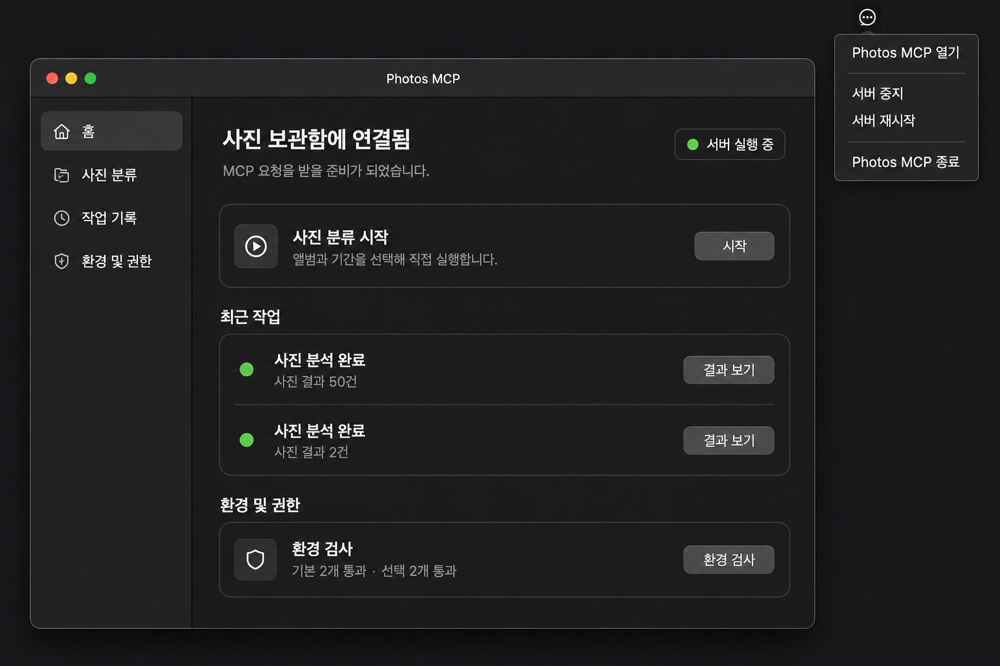
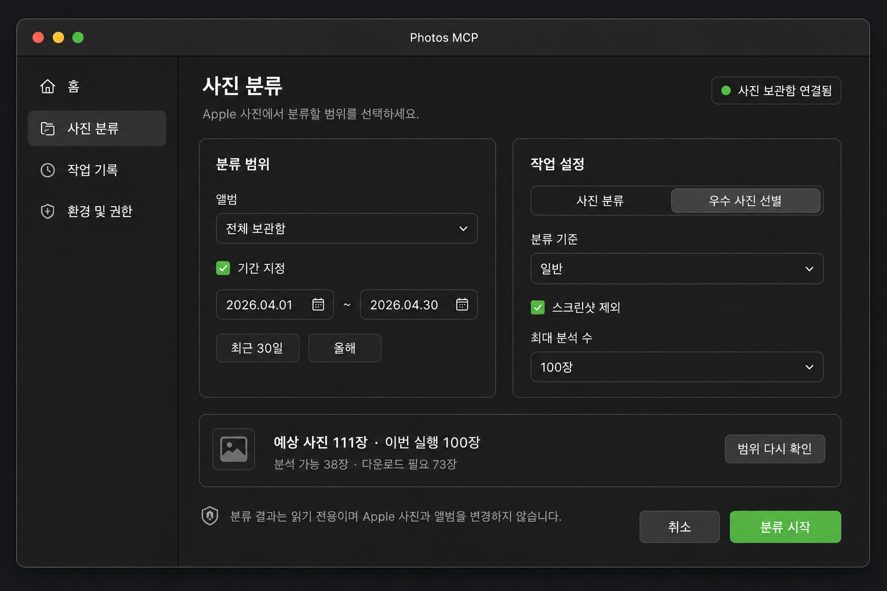
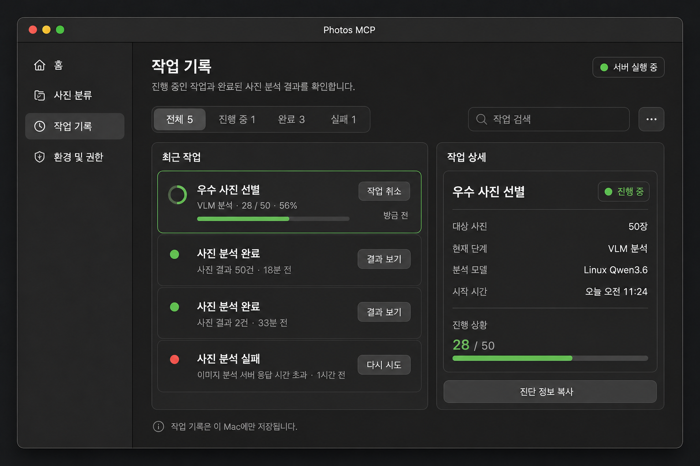
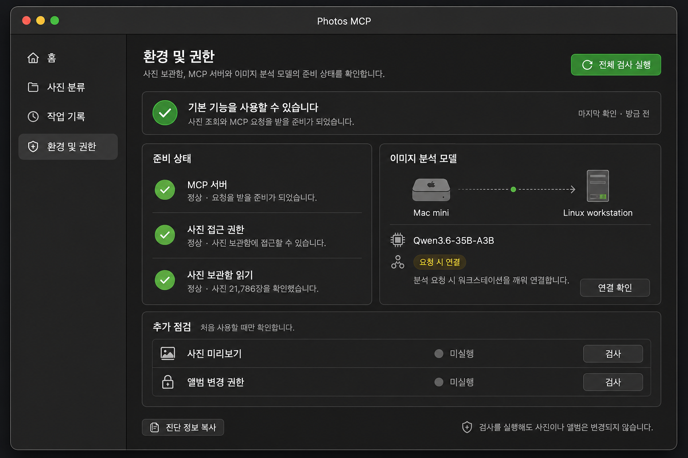
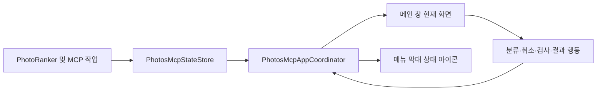

# PhotosMcp 메인 앱 창과 메뉴 막대 역할 분리안

- 작성일: 2026-08-02
- 상태: 구현 및 시각 검증 완료
- 대상: `PhotosMcp.app`의 앱 생명주기, 메인 창, 메뉴 막대 상태 메뉴
- 관련 문서: `05-menu-popover-ux-redesign-2026-08-01.md`, `06-direct-photo-classification-app-2026-08-02.md`

## 1. 결론

PhotosMcp는 더 이상 메뉴 막대 팝오버를 주 작업 화면으로 사용하지 않고, 실행하면 일반 macOS 앱처럼 기본 메인 창을 보여주는 구조로 전환하는 것이 적절하다.

권장 구조는 다음과 같다.

1. `PhotosMcp.app` 실행 시 메인 창을 기본으로 연다.
2. 메인 창은 홈, 사진 분류, 작업 기록, 환경 및 권한을 한 탐색 구조에서 제공한다.
3. 메뉴 막대 아이콘을 누르면 큰 작업 팝오버 대신 작은 네이티브 운영 메뉴만 표시한다.
4. 메인 창을 닫아도 MCP 서버는 계속 실행한다.
5. Dock 아이콘을 다시 누르거나 메뉴의 `Photos MCP 열기`를 선택하면 기존 메인 창을 복구한다.
6. 앱을 완전히 종료할 때만 MCP 서버와 작업 poller를 함께 종료한다.

이 구조는 사용자에게 일반 앱과 같은 예측 가능한 진입점을 제공하고, Computer Use와 VoiceOver 같은 자동화·접근성 도구가 안정적인 일반 창을 대상으로 동작할 수 있게 한다. 동시에 상시 실행 MCP daemon이라는 기존 운영 목적도 유지한다.

### 1.1 2026-08-02 구현 보정 결과

- `ui-ux-pro-max`, `swift-macos`, `ios-hig-design`, `refactoring-ui`, `ux-heuristics` 스킬로 재감사했다.
- `ui-ux-pro-max`가 제안한 웹 랜딩 페이지용 Inter, 보라색, Hero 레이아웃은 현재 AppKit 앱과 맞지 않아 적용하지 않았다.
- 공통 UI 글꼴은 이름으로 고정하지 않고 `NSFont.systemFont`를 사용해 macOS와 한글 fallback을 따르게 했다.
- 4pt·8pt 간격 체계와 10~12pt 카드 모서리, semantic 회색 패널, 사용자 시스템 강조색을 공통 토큰으로 적용했다.
- 홈은 서버 배지, 사진 분류 시작 카드, 묶인 최근 작업, 환경 요약 순서로 시안과 동일하게 재배치했다.
- 사진 분류는 `분류 범위 / 작업 설정` 2열과 전체 폭 범위 요약 구조로 변경했다.
- 작업 기록은 상태 필터, 왼쪽 작업 목록, 오른쪽 선택 작업 상세의 master-detail 구조로 변경했다.
- 환경 화면은 3개 준비 상태 행, Mac mini와 Linux workstation 연결 흐름, 모델 상태 및 연결 확인, 세로형 추가 점검으로 변경했다.
- 사이드바와 환경 화면 아이콘은 ImageGen PNG 대신 SF Symbols를 사용한다.
- `house`, `photo.on.rectangle.angled`, `clock.arrow.circlepath`, `checkmark.shield`, `macmini`, `desktopcomputer`, `cpu`를 같은 outline 계층으로 사용한다.
- 주 동작은 `controlAccentColor`, 성공·경고·실패 상태만 각각 시스템 green·yellow·red를 사용한다.

이전에 만든 PNG는 설계 이력으로만 남기며 앱 번들에는 포함하지 않는다. 네이티브 아이콘 매핑은 `main_window_appkit.py`의 `_SYSTEM_SYMBOLS`를 단일 원천으로 사용한다.

```text
home               -> house
classification     -> photo.on.rectangle.angled
jobs               -> clock.arrow.circlepath
environment        -> checkmark.shield
device-mac-mini    -> macmini
device-workstation -> desktopcomputer
model-chip         -> cpu
```

## 2. 현재 구조의 한계

현재 `run_menu_app()`은 `NSApplicationActivationPolicyRegular`을 사용하지만, 실제 앱 UI 소유자는 `PhotosMcpMenuController` 하나다. 이 컨트롤러가 다음 책임을 모두 갖는다.

- 메뉴 막대 상태 아이콘
- 큰 상태 팝오버
- daemon 시작과 중지
- 작업 poller와 주기적 화면 갱신
- 직접 분류 창
- 결과 창
- 환경 검사 창
- 변경 승인과 관리 메뉴

메뉴 막대 앱은 일반 창이 없을 때 접근성 트리와 화면 캡처 대상이 불안정해질 수 있다. 현재 Computer Use도 실행 프로세스는 찾지만 기본 창을 얻지 못해 시간 초과되는 경우가 있다. 큰 팝오버는 콘텐츠가 늘어날수록 화면 크기와 위치의 영향을 받고, 앱 기능과 서버 운영 명령이 같은 표면에서 경쟁한다.

또한 현재 `···` 메뉴에는 사진 분류, 환경 검사, 권한 설정, 연결 복사, 작업 기록 삭제, 서버 제어가 함께 들어 있다. 일반 기능과 운영·파괴적 기능의 구분이 충분하지 않다.

## 3. 목표 UX



시안은 최종 픽셀 명세가 아니라 정보 구조와 창 역할을 검토하기 위한 기준이다. 구현에서는 AppKit 기본 control, 시스템 폰트, 접근성 크기와 Auto Layout을 우선한다.

### 3.1 메인 창

- 기본 크기: 약 `1180 x 780pt`
- 최소 크기: `1080 x 680pt`
- 사용자가 조절한 크기와 위치를 autosave name으로 복구
- 일반 title bar, traffic light, Dock 아이콘 사용
- 좌측 sidebar와 우측 content 구조
- 앱 실행 직후 `홈` 선택

권장 sidebar는 다음 네 항목이다.

| 항목 | 역할 |
| --- | --- |
| 홈 | 연결 상태, 빠른 실행, 최근 작업, 환경 요약 |
| 사진 분류 | 앨범·기간·작업 방식·분류 기준 입력과 실행 |
| 작업 기록 | 진행 중·완료·실패 작업, 결과 보기, 취소 |
| 환경 및 권한 | 기본 검사, 선택 검사, VLM 상태, 복구 행동 |

### 3.2 홈

홈은 현재 팝오버의 유용한 부분만 가져온다.

```text
사진 보관함에 연결됨                 ● 서버 실행 중
MCP 요청을 받을 준비가 되었습니다.

사진 분류 시작                                      시작

최근 작업
사진 분석 완료 · 사진 결과 50건                 결과 보기
사진 분석 완료 · 사진 결과 2건                  결과 보기

환경 및 권한
기본 2개 통과 · 선택 2개 통과                    환경 검사
```

- 내부 endpoint와 job id는 기본 화면에 표시하지 않는다.
- 최근 작업은 3~5개만 보여주고 전체 기록은 sidebar로 이동한다.
- 진행 중인 작업이 있으면 최근 작업보다 위에 진행률과 취소 행동을 표시한다.
- 실패 또는 승인 대기는 정상 카드보다 먼저 표시한다.

### 3.3 사진 분류



현재 별도 `PhotosMcpDirectClassificationController`의 입력 흐름을 메인 content 화면으로 옮기는 것이 최종 목표다.

- 앨범과 기간 선택
- 분류 또는 우수 사진 선별
- 프로필, screenshot 제외, 최대 분석 수
- 범위 미리 계산과 다운로드 필요 수
- 읽기 전용 안내
- 분류 시작

작업이 접수되면 입력 화면을 강제로 닫지 않고 `작업 기록` 또는 홈의 진행 상태로 전환한다. 사용자가 같은 조건을 수정해 새 작업을 준비할 수 있도록 마지막 입력값은 메모리에 유지한다.

#### 사진 분류 탭 레이아웃

입력 항목을 긴 세로 form으로 쌓지 않고 메인 창의 가로 폭을 활용한 2열 구조로 배치한다.

| 영역 | 내용 |
| --- | --- |
| 왼쪽 `분류 범위` | 앨범, 기간 사용 여부, 시작일·종료일, 기간 preset |
| 오른쪽 `작업 설정` | 사진 분류·우수 사진 선별, 분류 기준, screenshot 제외, 최대 분석 수 |
| 하단 `범위 요약` | 예상 사진 수, 이번 실행 수, 분석 가능 수, 다운로드 필요 수 |
| footer | 읽기 전용 안전 안내, 취소, 분류 시작 |

범위 미리 계산은 입력 card 안에 섞지 않고 두 열 아래의 전체 폭 요약 card로 둔다. 사용자는 조건을 변경한 뒤 `범위 다시 확인`을 눌러 계산 결과를 갱신하고, 계산이 완료된 command와 현재 입력값이 같을 때만 `분류 시작`을 활성화한다.

상태별 표현은 다음과 같다.

- 계산 전: `분류 범위를 확인해 주세요`, 분류 시작 비활성
- 계산 중: progress indicator와 `사진 범위를 확인하고 있습니다`
- 실행 가능: 예상 수량과 로컬·다운로드 필요 수 표시
- 0건: `선택한 범위에 사진이 없습니다`, 분류 시작 비활성
- 권한 필요: 환경 및 권한 탭으로 이동하는 `권한 확인` 행동 제공
- 작업 접수: 작업 기록 탭의 해당 작업을 선택해 진행 상태 표시

화면 너비가 최소 크기에 가까워지면 날짜 preset과 보조 설명을 먼저 줄이고, 두 열을 바로 한 열로 바꾸지 않는다. 한 열 전환은 content 폭이 `720pt` 아래일 때만 고려한다.

### 3.4 작업 기록과 결과



- 작업 기록은 status별 filter와 시간순 목록을 제공한다.
- 완료 작업은 결과 수와 `결과 보기`를 항상 함께 표시한다.
- 결과는 메인 창의 detail 화면으로 우선 표시한다.
- 구현 1단계에서는 현재 `PhotosMcpResultsController` 창을 재사용할 수 있지만, 최종 상태에서는 메인 창 안의 갤러리와 inspector로 통합한다.
- 원본 경로와 사진 식별자는 계속 UI·내보내기 경계에서 보호한다.

#### 작업 기록 탭 레이아웃

작업 기록은 master-detail 구조를 사용한다.

| 영역 | 내용 |
| --- | --- |
| 상단 filter | 전체, 진행 중, 완료, 실패 수와 검색 |
| 왼쪽 목록 | 상태, 작업명, 결과 수 또는 진행률, 상대 시간, 핵심 행동 |
| 오른쪽 상세 | 대상 수, 현재 단계, 분석 모델, 시작·완료 시간, 진행률, 오류 설명 |
| 보조 메뉴 | 완료 기록 지우기, 실패 기록 지우기, 전체 기록 지우기 |

진행 중 작업은 progress bar와 `작업 취소`, 완료 작업은 정확한 결과 수와 `결과 보기`, 실패 작업은 사용자 문구로 변환한 원인과 `다시 시도`를 표시한다. 내부 job id, provider endpoint, 원본 경로는 기본 목록에 노출하지 않는다.

선택 상태는 배경과 1px accent border를 함께 사용해 색만으로 구분하지 않는다. 키보드 위·아래 이동으로 목록을 선택하고, `Return`은 상세의 기본 행동을 실행한다.

완료 작업에서 `결과 보기`를 누르면 같은 content 영역을 다음 순서로 전환한다.

```text
작업 기록 목록
  -> 선택한 작업 상세
  -> 사진 결과 gallery + inspector
  -> 뒤로 가기
  -> 이전 filter와 scroll 위치 복구
```

기존 결과 창은 Phase 1~2에서 호환 경로로 유지하지만, sidebar를 가진 메인 창이 안정화된 후에는 별도 top-level window를 기본 경로로 사용하지 않는다.

### 3.5 환경 및 권한



현재 환경 검사 창의 기능은 sidebar 화면으로 이동한다.

- 기본 준비 상태
- 처음 사용할 때만 필요한 선택 검사
- Linux VLM 연결과 사용 모델
- 전체 검사 실행
- 필요한 항목별 재검사 또는 권한 설정 열기
- 진단 정보 복사

환경 검사는 작업 기록과 별도 영역으로 유지하며, 정상·미실행·경고·실패를 색상뿐 아니라 문구와 아이콘으로 구분한다.

#### 환경 및 권한 탭 레이아웃

환경 화면은 `기본 준비 상태`, `이미지 분석 모델`, `추가 점검`의 세 책임을 분리한다.

| 영역 | 내용 |
| --- | --- |
| 상단 banner | 전체 사용 가능 여부와 마지막 확인 시각 |
| 왼쪽 `준비 상태` | MCP 서버, 사진 접근 권한, 사진 보관함 읽기 |
| 오른쪽 `이미지 분석 모델` | Mac mini, Linux workstation, 모델명, 요청 시 연결 상태 |
| 하단 `추가 점검` | 사진 미리보기, 앨범 변경 권한의 개별 검사 |
| footer | 진단 정보 복사와 읽기 전용 안전 안내 |

기본 검사는 앱 핵심 기능을 결정하므로 항상 표시한다. 선택 검사는 실행하지 않은 상태를 회색 `미실행`으로 표현하고, 실제 실패와 같은 노란색 경고로 합치지 않는다.

Linux 모델은 상시 연결로 오해되지 않도록 다음 상태를 구분한다.

- `요청 시 연결`: 정상 정책이며 경고가 아님
- `깨우는 중`: 진행 indicator와 함께 표시
- `연결됨`: 모델명과 확인 시각 표시
- `연결 실패`: 한 줄 원인과 `다시 연결` 행동 제공
- `사용 불가`: 현재 기능 영향과 로컬 fallback 여부 표시

`전체 검사 실행`은 기본 검사와 선택 검사를 순차 실행하되 각 행의 결과를 완료 즉시 갱신한다. 검사가 사진이나 앨범을 변경하지 않는다는 안내는 footer에 항상 유지한다.

## 4. 메뉴 막대 역할

상태 아이콘은 큰 `NSPopover`를 열지 않고 표준 `NSMenu`를 표시한다.

```text
Photos MCP 열기
──────────────
서버 중지
서버 재시작
──────────────
Photos MCP 종료
```

서버가 중지된 경우 `서버 중지`는 `서버 시작`으로 바뀐다. 상태 아이콘 tooltip에는 `사진 보관함에 연결됨`, `사진 분석 중`, `확인 필요`, `서버 중지됨` 중 하나를 표시한다.

다음 항목은 메뉴 막대에서 제거하고 메인 창으로 이동한다.

- 사진 분류 시작
- 환경 검사
- 사진 권한 설정 열기
- 연결 정보 복사
- 완료·실패·전체 작업 기록 지우기

작업 기록 삭제는 실수 가능성이 있으므로 작업 기록 화면의 보조 메뉴로 이동하고, 전체 삭제는 확인 절차를 거친다.

## 5. 창 생명주기

권장 정책은 `창 닫기 != 앱 종료`다.

| 사용자 행동 | 결과 |
| --- | --- |
| 앱 최초 실행 | daemon 시작 후 메인 창 표시 |
| 메인 창 닫기 | 창만 숨기고 daemon과 메뉴 막대 유지 |
| Dock 아이콘 클릭 | 기존 메인 창을 앞으로 가져옴 |
| 메뉴의 `Photos MCP 열기` | 기존 메인 창을 앞으로 가져옴 |
| 앱을 다시 `open` | 중복 프로세스 대신 기존 창 활성화 |
| `Photos MCP 종료` | 작업 안전 확인 후 daemon 종료와 앱 종료 |

macOS 표준 동작을 위해 `NSApplicationDelegate`의 다음 흐름을 명시적으로 구현한다.

- `applicationDidFinishLaunching_`: coordinator 설치와 메인 창 표시
- `applicationShouldHandleReopen_hasVisibleWindows_`: 닫힌 메인 창 복구
- `applicationWillTerminate_`: timer, direct service runtime, daemon 정리
- `windowShouldClose_`: 메인 창만 닫고 서버는 유지

분석 중 종료는 즉시 작업을 유실시키지 않도록 현재 영속 작업 계약과 복구 정책을 사용하되, 종료 전에 진행 작업 수를 알려준다.

## 6. 권장 코드 구조

현재 대형 `menu_app.py`를 역할별로 분리한다.

```text
main.py
  -> PhotosMcpAppCoordinator (NSApplicationDelegate)
       -> PhotosMcpMainWindowController
       -> PhotosMcpStatusMenuController
       -> PhotosMcpDaemonController
       -> PhotosMcpStateStore

PhotosMcpMainWindowController
  -> HomeViewController
  -> ClassificationViewController
  -> JobHistoryViewController
  -> EnvironmentViewController
  -> ResultDetailViewController
```

권장 파일 경계는 다음과 같다.

| 파일 | 책임 |
| --- | --- |
| `app_coordinator.py` | 앱 delegate, 창·daemon 생명주기, 공통 action routing |
| `main_window_appkit.py` | sidebar, content 전환, 메인 창 상태 |
| `status_menu_appkit.py` | 최소 메뉴 막대 메뉴와 상태 아이콘 |
| `home_presentation.py` | 메인 홈의 순수 view model |
| `classification_appkit.py` | 기존 직접 분류 UI의 content controller 전환 |
| `job_history_appkit.py` | 작업 목록, 결과 진입, 취소와 기록 관리 |
| `environment_appkit.py` | 기존 환경 검사 화면의 content controller 전환 |
| `result_appkit.py` | 결과 갤러리와 상세 inspector |

기존 이름을 한 번에 모두 바꾸기보다 새 coordinator와 main window를 먼저 추가하고, 검증된 controller를 차례로 이동한다.

## 7. 상태와 갱신 구조

화면마다 별도 timer를 만들지 않는다. coordinator가 기존 `PhotosMcpStateStore.snapshot()`을 읽는 단일 refresh 주기를 소유하고, 현재 보이는 화면에 view model을 전달한다.



핵심 원칙은 다음과 같다.

- state store와 daemon은 한 인스턴스만 유지한다.
- 메인 창을 닫아도 poller와 daemon은 유지한다.
- 숨겨진 화면은 매 주기 전체 재생성하지 않는다.
- 최근 작업·진행률·검사 결과는 같은 snapshot에서 파생한다.
- AppKit controller는 vendor DB를 직접 읽지 않고 daemon adapter를 통해 결과를 가져온다.

## 8. 단계별 구현안

### Phase 1: 앱 shell과 생명주기

- `PhotosMcpAppCoordinator`와 `PhotosMcpMainWindowController` 추가
- 앱 실행 시 기본 창 표시
- 창 close, Dock reopen, 중복 open 동작 구현
- 홈 화면에 현재 상태와 기존 action 연결
- 기존 팝오버는 임시 feature flag 뒤에 유지

완료 기준: 앱 실행과 재실행에서 항상 하나의 메인 창을 복구하고 MCP endpoint가 유지된다.

### Phase 2: 메뉴 막대 최소화

- `NSPopover`와 작업 dashboard 연결 제거
- status item에 표준 `NSMenu` 연결
- `Photos MCP 열기`, 서버 시작·중지, 재시작, 종료만 제공
- 상태 icon과 tooltip 갱신 유지

완료 기준: 메뉴 막대에서 분류·환경·기록 삭제가 사라지고 서버 운영 명령만 보인다.

### Phase 3: 기능 화면 통합

- 직접 분류 창을 sidebar content로 이동
- 환경 검사 창을 sidebar content로 이동
- 작업 기록 전체 목록 추가
- 결과 갤러리를 메인 detail로 이동
- 기존 별도 controller는 호환 shim을 거쳐 제거

완료 기준: 일상 기능이 메인 창 밖의 임시 팝업에 의존하지 않는다.

### Phase 4: 접근성·시각 검증

- Auto Layout과 window resizing 검증
- 키보드 sidebar 이동과 focus chain
- VoiceOver label, role, value 검증
- 밝은 모드와 어두운 모드
- 축소·확대 글꼴과 긴 한국어 문구
- Computer Use에서 기본 창 발견, 화면 캡처, 버튼 진입 검증

완료 기준: Computer Use가 앱 이름 또는 bundle path로 메인 창의 accessibility tree를 안정적으로 읽고 주요 기능에 진입한다.

## 9. 테스트 계획

### 순수 로직

- 홈 view model의 상태 우선순위
- 최신 작업 정렬과 결과 수
- 서버 상태에 따른 메뉴 제목
- 진행 중·승인 대기·환경 오류 우선 표시

### AppKit

- 최초 창 표시와 최소 크기
- sidebar 네 항목과 기본 `홈` 선택
- 닫기 후 daemon 유지
- Dock reopen과 `Photos MCP 열기`
- 결과 보기와 환경 검사 action routing
- menu bar에 허용된 항목만 존재
- 모든 button과 navigation item의 접근성 label

### 설치 앱

1. standalone 빌드와 codesign 검증
2. 첫 실행에서 메인 창 표시
3. `http://127.0.0.1:18791/health` ready
4. 메인 창 close 후 health 유지
5. Dock과 status menu에서 창 복구
6. 분류 1회 실행, 진행률, 완료, 결과 갤러리 확인
7. 환경 검사 실행과 권한 안내 확인
8. 종료 후 endpoint와 프로세스 정리 확인

## 10. 위험과 대응

| 위험 | 대응 |
| --- | --- |
| main window와 status menu가 서로 다른 상태 표시 | 단일 coordinator와 snapshot 사용 |
| 창 close가 daemon 종료로 오해됨 | close 시 창만 닫히며 메뉴 막대에서 실행 중임을 유지 |
| controller 이동 중 기존 기능 회귀 | Phase 1에서 기존 action을 재사용하고 화면별로 이동 |
| 작업 중 앱 종료 | 진행 작업 수 안내와 영속 복구 계약 유지 |
| 큰 `menu_app.py`를 한 번에 분리하는 위험 | coordinator 추가 후 controller 단위로 점진 이전 |
| Dock 아이콘과 메뉴 막대 아이콘이 중복으로 느껴짐 | Dock은 앱 작업 공간, 메뉴 막대는 상시 daemon 상태와 운영 제어로 역할 명시 |

## 11. 권장 결정

구현은 다음 결정을 기준으로 진행하는 것이 좋다.

- 메인 창은 기본 표시한다.
- 메인 창을 닫아도 서버는 유지한다.
- status item 클릭은 표준 운영 메뉴를 연다.
- 일상 기능은 모두 메인 창으로 이동한다.
- 결과와 환경 화면은 장기적으로 메인 content에 통합한다.
- 기존 팝오버는 새 메인 창이 안정화된 뒤 제거한다.

이 방식이면 PhotosMcp는 `메뉴 막대 유틸리티`가 아니라 `사진 분류 앱이면서 상시 실행 MCP 서버`라는 두 역할을 충돌 없이 제공할 수 있다.

## 12. ImageGen 생성 기록

- 생성 도구: Codex 내장 `image_gen`
- 생성 파일: `docs/planning/assets/photos-mcp-main-window-ux-concept-v1.png`
- 생성 파일: `docs/planning/assets/photos-mcp-classification-tab-ux-concept-v1.png`
- 생성 파일: `docs/planning/assets/photos-mcp-job-history-tab-ux-concept-v1.png`
- 생성 파일: `docs/planning/assets/photos-mcp-environment-tab-ux-concept-v1.png`
- 참고 이미지: 사용자가 제공한 현재 작업 dashboard와 `···` 관리 메뉴
- 추가 참고: 기존 직접 분류, 사진 결과, 환경 검사 시안에서 기능 요구만 가져오고 메인 창 shell에 맞게 다시 설계
- 사용 목적: 구현 전 메인 창과 최소 status menu의 책임 분리 검토

사용한 핵심 프롬프트는 다음과 같다.

```text
Use case: ui-mockup
Asset type: high-fidelity native macOS desktop application main window for implementation planning
Primary request: Redesign Photos MCP as a normal native macOS application with one persistent main window. The menu-bar icon is no longer the work dashboard and is reduced to a small operational menu.
Main window: sidebar with 홈, 사진 분류, 작업 기록, 환경 및 권한. Home shows connection, quick classification, recent results, and environment summary.
Menu-bar menu: Photos MCP 열기, 서버 중지, 서버 재시작, Photos MCP 종료 only.
Style: production-ready native AppKit dark mode, restrained graphite surfaces, clear hierarchy, no purple, no gradients, no glassmorphism.
```

다른 탭 시안은 위 prompt의 공통 shell을 유지하면서 각 화면에 다음 요구를 추가해 별도로 생성했다.

```text
사진 분류: 2열 form, 분류 범위와 작업 설정 분리, 전체 폭 범위 요약, 읽기 전용 안전 안내.
작업 기록: 상태 filter, 목록-상세 split view, 진행률·취소·결과 보기·재시도, private thumbnail 제외.
환경 및 권한: 준비 상태와 VLM 연결 분리, 선택 검사의 중립 미실행 상태, 개별 검사와 진단 복사.
```
