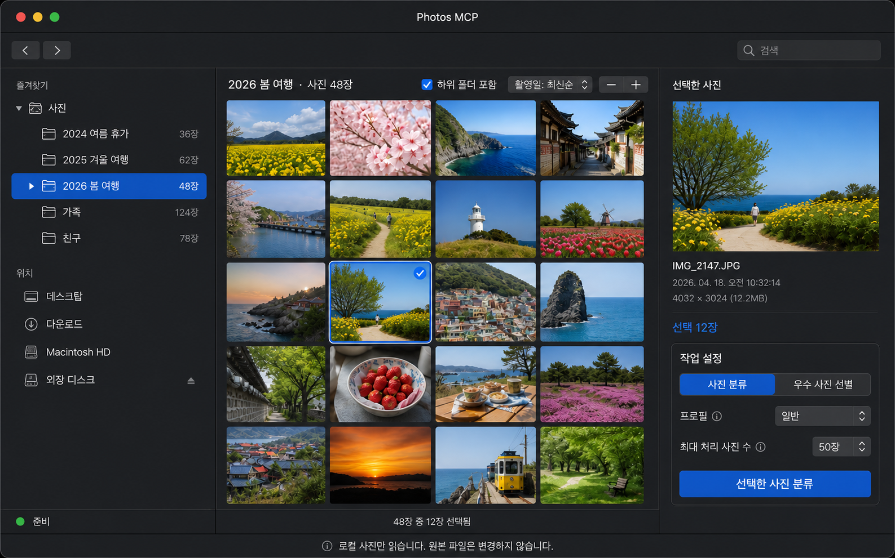

# 로컬 폴더 앱 내 탐색과 직접 사진 분류 계획

- 작성일: 2026-08-07
- 최종 개정: 2026-08-07
- 상태: Phase 1~3 및 Apple HIG 기반 UX 재작업 완료, 대규모 성능 계측은 후속
- 대상: `PhotosMcp.app` 사진 분류 탭, `photos_select`, local photo-source, photo-ranker background job
- 목표: 별도 Finder 선택창 없이 앱 안에서 폴더를 탐색하고, 화면용 축소 이미지를 확인한 뒤 정확히 선택한 사진만 읽기 전용으로 분류

## 1. 결정 사항

로컬 사진은 `NSOpenPanel`을 주 탐색 화면으로 사용하지 않는다. 첨부 시안처럼 하나의 Photos MCP 앱 창 안에 다음 세 영역을 항상 유지한다.

```text
┌──────────────────┬────────────────────────────┬──────────────────┐
│ 폴더 소스 목록   │ 사진 썸네일 격자          │ 선택 사진        │
│ NSOutlineView    │ NSCollectionView           │ Inspector        │
│                  │                            │ + 작업 설정      │
└──────────────────┴────────────────────────────┴──────────────────┘
```

- 왼쪽에서 폴더를 선택하면 중앙 사진이 바뀐다.
- 중앙에서 사진을 선택하면 오른쪽 Inspector가 바뀐다.
- 오른쪽에서 작업 방식과 처리 수를 확인한 뒤 선택한 사진만 분류한다.
- 중앙 미리보기는 원본 파일을 직접 화면 크기로 디코딩하지 않고 셀 크기에 맞춘 축소 이미지를 사용한다.
- 원본 사진과 폴더는 조회만 하며 자동 이동, 이름 변경, 메타데이터 수정 또는 삭제를 하지 않는다.
- 접근 권한이 없는 외부 위치에 한해서만 `NSOpenPanel`을 `위치 접근 허용` 보조 흐름으로 사용한다.

기존의 `NSOpenPanel + 선택 요약 창` 구현은 코어 계약 검증을 위한 중간 단계로 기록하되, 최종 UX로 사용하지 않는다.

## 2. 확정 시안



시안의 기준은 다음과 같다.

- 일반 macOS 앱 창 안에서 모든 탐색과 선택을 완료한다.
- 초기 분할 비율은 왼쪽 26%, 중앙 47%, 오른쪽 27%로 하고 사용자가 분할선을 조절할 수 있게 한다.
- 왼쪽의 큰 `폴더 선택` 버튼은 제거한다.
- 중앙 격자는 창 너비와 밀도 설정에 따라 열 수가 자동으로 변한다.
- 오른쪽 Inspector와 작업 설정은 사진을 탐색하는 동안 계속 보이게 한다.
- 하단에는 현재 폴더의 사진 수와 실제 작업 대상 선택 수를 구분해 표시한다.

## 3. 사용자 흐름

1. 사용자가 사진 분류 탭에서 `로컬 폴더에서 분류`를 연다.
2. 왼쪽에는 `사진`, `데스크탑`, `다운로드`, 내장 디스크와 외장 볼륨이 즉시 보인다.
3. 사용자가 폴더를 펼치거나 선택하면 필요한 하위 항목만 지연 로딩한다.
4. 중앙에는 선택 폴더의 지원 이미지가 축소 썸네일로 표시된다.
5. `하위 폴더 포함`이 켜져 있으면 선택 폴더 아래의 이미지도 검색 결과에 포함한다.
6. 사용자가 사진 카드를 클릭하면 그 사진만 Inspector 포커스가 되며 기존 작업 대상 체크는 바뀌지 않는다.
7. 각 사진 오른쪽 위의 체크박스, 현재 목록 전체 선택과 전체 해제로 실제 작업 대상을 정한다. Command-클릭이나 Shift-클릭을 몰라도 여러 장을 고를 수 있어야 한다.
8. `선택한 사진 분류`를 누르면 현재 선택 집합만 background job으로 전달한다.
9. 작업이 수락되면 탐색 창을 닫지 않고 진행 상태를 표시하거나, 사용자가 작업 기록 탭으로 이동해 계속 확인할 수 있게 한다.

## 4. 화면 구조

### 4.1 상단 도구 막대

- 뒤로, 앞으로: 폴더 이동 기록을 탐색한다.
- 검색: 현재 폴더 또는 `하위 폴더 포함` 범위 안에서 파일명을 검색한다.
- 위치 접근 허용: 기본 목록에서 접근할 수 없는 경로를 사용자가 명시적으로 추가할 때만 표시한다.

검색, 정렬 또는 폴더 이동 중에는 중앙 헤더에 즉시 진행 상태를 표시해 빈 화면을 오류로 오해하지 않게 한다.

### 4.2 왼쪽 폴더 소스 목록

`NSOutlineView`를 source-list 스타일로 사용한다.

- 즐겨찾기: 사진, 데스크탑, 다운로드
- 위치: Macintosh HD, 연결된 외장 볼륨, 사용자가 접근을 허용한 위치
- 폴더는 펼칠 때만 자식 디렉터리를 읽는다.
- 숨김 폴더, 패키지 내부와 접근 불가 폴더는 기본적으로 제외한다.
- 사진 수는 비동기로 계산하고 계산 전에는 `...`, 완료 후에는 `48장`처럼 표시한다.
- 선택한 폴더는 macOS 표준 파란 source-list 강조로 나타낸다.

폴더 행 선택은 탐색만 수행하며, 폴더 안의 모든 사진을 자동으로 작업 대상으로 선택하지 않는다.

### 4.3 중앙 사진 격자

기존 결과 갤러리의 `NSCollectionView`, `NSCollectionViewFlowLayout`, 화면 폭 기반 3~6열 계산과 셀 재사용 방식을 재사용한다.

- 기본 정렬: 촬영일 최신순
- 추가 정렬: 촬영일 오래된순, 파일명, 파일 수정일, 파일 크기
- 밀도 `- / +`: 고정 열 수를 선택하는 대신 선호 셀 폭을 변경한다.
- 실제 열 수: 중앙 영역의 현재 폭과 선호 셀 폭으로 자동 계산한다.
- 창 크기 변경과 전체 화면 전환 시 격자를 즉시 재배치한다.
- 가로·세로 사진 모두 `aspectFill`로 셀을 채우되 원본 비율은 왜곡하지 않는다.
- Inspector에서 보고 있는 사진에는 얇은 파란 포커스 테두리만 표시한다.
- 실제 작업 대상은 각 사진 오른쪽 위의 항상 보이는 네이티브 체크박스로 표시한다.
- 카드 클릭은 포커스만 이동하고 체크 상태를 변경하지 않는다. 체크박스 클릭은 포커스와 무관하게 작업 대상을 추가하거나 해제한다.
- 키보드 방향키는 포커스를 이동하고, Space는 체크 상태를 토글하며, Command-A와 Escape는 각각 현재 목록 전체 선택과 전체 해제를 수행한다.

현재 선택 수는 하단에 `48장 중 12장 선택됨`으로 표시한다. 선택이 0장이면 실행 버튼을 비활성화한다.

### 4.4 오른쪽 Inspector와 작업 설정

오른쪽 Inspector는 기존 결과 화면의 상세 정보 구조를 유지한다.

- 선택 사진의 큰 미리보기: `aspectFit`
- 파일명, 촬영일, 픽셀 크기, 파일 크기
- 전체 작업 대상 수
- 사진 분류 / 우수 사진 선별
- 프로필: 일반, 인물, 풍경
- 최대 처리 사진 수
- `선택한 사진 분류` 기본 작업 버튼

포커스 사진 한 장과 실제 다중 선택 집합을 혼동하지 않도록 Inspector 제목은 `보고 있는 사진`, 작업 대상은 `분류 대상 N장`으로 별도 표시한다.

## 5. AppKit 구성

| 영역 | 컴포넌트 | 역할 |
| --- | --- | --- |
| 전체 | `NSSplitViewController` | 세 영역 분할, 사용자의 폭 조절과 전체 화면 대응 |
| 왼쪽 | `NSOutlineView` + `NSScrollView` | 폴더·볼륨 계층, 지연 확장 |
| 중앙 | `NSCollectionView` + `NSCollectionViewFlowLayout` | 사진 셀 재사용, 반응형 격자와 다중 선택 |
| 오른쪽 | `NSViewController` + `NSStackView` | Inspector와 작업 설정 |
| 상단 | `NSToolbar`, `NSSearchField` | 이동, 검색, 접근 위치 추가 |
| 썸네일 | Image I/O + `NSCache` | 화면 크기용 축소 이미지 생성과 제한 캐시 |

Finder 전체 화면을 앱에 삽입하는 공개 AppKit 컴포넌트는 없으므로, Finder 선택창을 재사용하는 대신 위 네이티브 컴포넌트를 조합한다.

## 6. 폴더와 사진 데이터 구조

UI 상태는 다음 역할로 분리한다.

```text
LocalFolderDataSource
  ├─ 루트와 볼륨 목록
  ├─ 자식 폴더 지연 탐색
  └─ 접근 가능 여부와 사진 수

LocalPhotoCollectionDataSource
  ├─ 현재 폴더 사진 목록
  ├─ 하위 폴더 포함, 검색, 정렬
  └─ 화면 표시 항목과 다중 선택 매핑

ThumbnailService
  ├─ 목표 픽셀 크기 계산
  ├─ 비동기 축소 이미지 생성
  ├─ 메모리 캐시와 취소
  └─ 셀 재사용 시 잘못된 이미지 표시 방지

LocalPhotoSelectionState
  ├─ 현재 폴더
  ├─ Inspector 포커스 사진
  └─ 실제 분류 대상 절대 경로 집합
```

폴더 트리와 사진 격자가 직접 job을 만들지 않고 `LocalPhotoSelectionState`를 통해 기존 `ClassificationCommand`로 선택 결과를 전달한다.

## 7. 화면용 이미지 축소 정책

중앙에 보이는 이미지는 원본 파일을 변경한 복사본이 아니라 메모리에서 생성한 표시 전용 썸네일이다.

1. 현재 셀의 point 크기와 화면의 `backingScaleFactor`를 곱해 목표 픽셀 크기를 계산한다.
2. Image I/O `CGImageSourceCreateThumbnailAtIndex`와 orientation transform을 사용한다.
3. 목록 화면은 셀 크기에 필요한 픽셀만 생성하고 Inspector는 별도의 더 큰 목표 크기를 사용한다.
4. 파일 경로, 수정 시각, 목표 픽셀 크기를 캐시 키로 사용한다.
5. 현재 viewport와 바로 다음 화면 정도만 미리 생성한다.
6. 폴더 이동, 검색 변경 또는 셀 재사용 시 오래된 작업을 취소하거나 결과를 폐기한다.
7. `NSCache`의 비용을 픽셀 메모리 기준으로 제한해 대량 사진에서도 메모리가 계속 증가하지 않게 한다.

전체 원본 디코딩, 모든 사진의 선행 썸네일 생성, UI 메인 스레드에서의 디스크 탐색은 금지한다.

## 8. 기존 코어 계약 재사용

이미 구현된 다음 내용은 유지한다.

```python
ClassificationCommand(
    source="local",
    source_path="/Users/me/Pictures/2026-spring",
    selected_photo_ids=(
        "/Users/me/Pictures/2026-spring/day1/IMG_0001.jpg",
        "/Users/me/Pictures/2026-spring/day1/IMG_0002.jpg",
    ),
    mode="select_best",
    limit=50,
)
```

- 루트 폴더와 선택 파일 실재 여부 검증
- 지원 이미지 확장자 검증
- 루트 바깥 경로와 심볼릭 링크 경계 차단
- 중복 경로와 최대 처리 수 초과 차단
- local source에서만 `selected_photo_ids` 허용
- photo-ranker의 동일 루트 경계 재검증
- 선택 경로만 로딩하고 같은 폴더의 미선택 사진 제외
- job status와 summary에서 절대 경로를 제거하고 선택 수만 노출

즉, 코어와 background job 전달은 다시 만들지 않고 탐색·미리보기 UI만 최종 구조로 교체한다.

## 9. 파일 접근과 권한

현재 직접 배포 앱은 샌드박스 entitlement를 사용하지 않으므로 사용자가 일반적으로 접근 가능한 폴더와 볼륨은 왼쪽 목록에서 바로 탐색할 수 있다.

- TCC 또는 파일 권한으로 읽을 수 없는 위치는 잠금 상태로 표시한다.
- 해당 행에서 `위치 접근 허용`을 선택했을 때만 `NSOpenPanel`을 연다.
- 향후 App Sandbox를 도입하면 선택 경로를 security-scoped bookmark로 저장한다.
- 네트워크 볼륨과 제거된 외장 디스크는 별도의 unavailable 상태로 표시하고 앱을 멈추지 않는다.

## 10. 구현 단계

### Phase 1. 3분할 셸과 폴더 탐색 - 완료

- 현재 로컬 선택 확인 창을 resizable `NSSplitViewController` 창으로 교체한다.
- 왼쪽 `NSOutlineView`와 기본 루트, 외장 볼륨, 지연 확장을 구현한다.
- 뒤로, 앞으로, 현재 폴더와 접근 오류 상태를 연결한다.

### Phase 2. 사진 격자와 썸네일 파이프라인 - 완료

- 중앙 `NSCollectionView`에 파일 목록, 검색, 정렬과 하위 폴더 포함을 연결한다.
- Image I/O 축소, 비동기 worker, viewport prefetch, `NSCache` 비용 제한을 구현한다.
- 기존 결과 갤러리의 자동 열 계산과 밀도 제어를 공통 helper로 분리한다.

### Phase 3. Inspector와 정확한 선택 실행 - 완료

- 포커스와 다중 선택 상태를 데이터와 UI에서 분리한다.
- 사진 카드 오른쪽 위 체크박스를 작업 대상의 유일한 직접 선택 수단으로 제공한다.
- 오른쪽 Inspector와 작업 설정을 현재 디자인에 맞춰 연결한다.
- 기존 `ClassificationCommand`에 정확한 선택 경로만 전달한다.
- 실행 수락, 오류, 취소와 작업 기록 이동 상태를 연결한다.

### Phase 4. 권한과 대규모 검증 - 후속

- 접근 불가 폴더, 외장 디스크 제거, 손상 이미지와 지원하지 않는 파일을 검증한다.
- 1,000장과 10,000장 폴더에서 첫 화면 시간, 스크롤, 검색, 메모리 상한을 계측한다.
- 창 크기 변경, 전체 화면, Retina 배율과 다중 선택 회귀 테스트를 수행한다.

## 11. 구현 영향 범위

| 파일 또는 영역 | 계획 |
| --- | --- |
| `local_file_selection_appkit.py` | 고정 선택 확인 창을 3분할 탐색 controller로 교체 |
| 신규 folder data source | 루트·볼륨·자식 폴더의 비동기 탐색 담당 |
| 신규 thumbnail service | Image I/O 축소, 취소, 캐시 담당 |
| `result_gallery_appkit.py` | 자동 열 계산과 컬렉션 레이아웃 helper 재사용 또는 공통화 |
| `menu_app.py` | `NSOpenPanel` 직접 실행 대신 앱 내 탐색 창 진입 |
| `direct_classification.py` | 기존 local command와 선택 검증 유지 |
| facade와 photo-ranker | 기존 선택 전달·경계 검증 유지 |
| AppKit layout tests | split pane, source list, collection, Inspector와 상태 전이 검증 추가 |

## 12. 검증 기준

기능 완료 조건:

1. 앱 내 탐색 창이 Finder 선택창 없이 바로 열린다.
2. 왼쪽 폴더를 선택하면 중앙 사진과 헤더 수량이 일치한다.
3. 하위 폴더 포함 여부가 목록과 실행 대상에 동일하게 반영된다.
4. 중앙 사진은 원본 비율을 유지한 화면용 축소 이미지로 표시된다.
5. 창 폭과 `- / +`에 따라 열 수와 셀 크기가 자동 조정된다.
6. 1,000장 폴더를 열어도 UI 메인 스레드가 장시간 멈추지 않는다.
7. 폴더를 빠르게 이동해도 재사용 셀에 이전 폴더의 사진이 나타나지 않는다.
8. 선택 0장에서는 실행할 수 없고, 표시 선택 수와 job 선택 수가 일치한다.
9. 선택하지 않은 같은 폴더 사진은 분석 입력에 포함되지 않는다.
10. 사진 검색과 미리보기만으로 원본 파일의 시각, 크기와 해시가 바뀌지 않는다.
11. 접근 불가 또는 제거된 위치가 전체 앱 실패로 이어지지 않는다.
12. 작업 status, summary와 진단 정보에 선택 파일의 절대 경로가 노출되지 않는다.

UX 완료 조건:

- 사용자는 임의 화면에서 현재 폴더, 현재 사진 수, 선택 수와 실행 작업을 즉시 이해할 수 있다.
- 폴더 포커스, 사진 포커스와 실제 작업 대상의 의미가 시각적으로 구분된다.
- 탐색, 선택, 확인과 실행이 하나의 창에서 자연스럽게 이어진다.
- 기본 작업 버튼은 한 개만 강조하고 부가 제어는 도구 막대와 설정 영역에 배치한다.

## 13. 기준선과 후속 검증

중간 단계인 native picker 구현까지의 자동 회귀 검사는 `389 passed`였다. 3분할 UI 구현 뒤에는 로컬 폴더 스캔 범위와 3-pane AppKit layout 검사를 추가했고, HIG 재작업 뒤에는 포커스와 체크 대상의 독립성 회귀 검사를 더해 전체 `391 passed`를 통과했다.

설치 앱을 새로 빌드한 뒤 코드서명, `--health`, `--runtime-import-smoke`, `--vendor-runtime-smoke`를 다시 통과했다. 실제 창에서 `폴더 열기`로 로컬 브라우저를 열고 데스크탑의 이미지 3장을 표시했다. A의 체크박스를 켠 뒤 B 카드를 클릭해도 A가 `분류 대상 1장`으로 유지되고 Inspector만 B로 이동했으며, B까지 체크하면 실행 버튼이 `선택한 2장 분류`로 바뀌는 것을 확인했다. `전체 선택 3장 → 전체 해제 0장`, 파일명 검색 `3장 → 검색 결과 2장 → 검색 해제 3장`도 확인했다. 이 검증은 사용자 사진을 모델로 전송하거나 분류 job을 시작하지 않았다.

Phase 4에서 다음을 수행한다.

- 전체 자동 테스트
- 설치 앱 재빌드와 런타임 smoke test
- 샘플 폴더 10장 정확 선택 검증
- 실제 사진 1,000장 탐색·선택 성능 검증
- Linux VLM을 이용한 선택 사진 분류와 작업 기록·결과 수 일치 검증

개인 사진을 사용하는 실검증은 사용자가 명시적으로 선택한 로컬 데이터에 한해 수행하며, 테스트 자산과 경로는 Git에 포함하지 않는다.

## 14. Apple HIG 기반 UX 재점검과 재작업 확정안

### 14.1 적용 기준

이번 재점검은 설치 앱의 실제 화면을 기준으로 `swift-macos`와 `ux-heuristics` 체크리스트를 적용하고, 다음 Apple 공식 지침과 AppKit 계약을 함께 대조한다.

- [Designing for macOS](https://developer.apple.com/design/human-interface-guidelines/designing-for-macos/): 큰 화면의 장점을 활용하되 읽기 어려울 정도로 정보 밀도를 높이지 않고, 창 크기 변경과 전체 화면을 지원한다.
- [Typography](https://developer.apple.com/design/human-interface-guidelines/typography): macOS 기본 본문은 13pt, 최소 크기는 10pt이며 시스템 글꼴의 크기·굵기·색으로 위계를 만든다.
- [Toolbars](https://developer.apple.com/design/human-interface-guidelines/toolbars): 이동, 현재 보기 제목, 검색과 자주 쓰는 동작을 논리적으로 묶고 과밀하게 배치하지 않는다.
- [Sidebars](https://developer.apple.com/design/human-interface-guidelines/sidebars): `NSOutlineView` source-list 스타일과 시스템 강조색을 사용하고, 창이 좁아질 때 중앙 콘텐츠를 우선한다.
- [Focus and selection](https://developer.apple.com/design/human-interface-guidelines/focus-and-selection/): 현재 포커스와 사용자가 확정한 선택을 별도 상태로 다룬다.
- [Buttons](https://developer.apple.com/design/human-interface-guidelines/buttons): 아이콘만으로 불명확한 동작은 짧은 동사형 텍스트와 도움말로 설명한다.
- [NSCollectionView](https://developer.apple.com/documentation/appkit/nscollectionview): 컬렉션의 단일 포커스 이동은 AppKit 선택을 사용하고 실제 처리 대상은 별도 체크 상태로 보존한다.
- [NSTableView source-list style](https://developer.apple.com/documentation/appkit/nstableview/style-swift.enum/sourcelist): 폴더 계층의 행 높이와 들여쓰기를 시스템 source-list 규칙에 맞춘다.

인터넷에서 확인한 서드파티 macOS 에이전트 스킬은 배포·서명·권한 흐름에 초점을 둔 경우가 많았다. 이 화면의 레이아웃과 상호작용 기준은 설치된 `swift-macos` 스킬을 AppKit 구현 지침으로 사용하고, 시각·행동 판단은 Apple HIG 원문을 우선한다.

### 14.2 기준선 휴리스틱 평가

설치 앱 기준 점수는 **6/10**이다.

| 문제 | 관련 원칙 | 심각도 | 수정 |
| --- | --- | ---: | --- |
| 여러 장 선택에 Command-클릭 지식이 필요하고 다음 사진 클릭 시 기존 선택이 해제될 수 있다. | 인지보다 회상, 오류 예방 | 3 | 카드마다 항상 보이는 체크박스를 두고 포커스와 작업 대상 상태를 분리한다. |
| 파란 테두리가 Inspector 포커스와 작업 대상 선택을 동시에 뜻한다. | 일관성, 시스템 상태 가시성 | 3 | 파란 테두리는 포커스, 체크박스는 분류 대상으로 의미를 한정한다. |
| 진입 화면의 `로컬 폴더에서 분류`가 보관함 상태 카드 옆에 붙어 서로 다른 역할이 한 줄에서 충돌한다. | 시각 위계, 현실 세계와 일치 | 2 | `사진 가져올 곳` 영역에서 Apple 사진과 로컬 폴더를 동등한 소스 선택 행으로 제공한다. |
| 상단 도구 막대, 중앙 헤더와 Inspector의 글꼴이 작고 주변 여백과 비례하지 않는다. | 가독성, 미니멀 디자인 | 2 | 13pt 본문 기준의 제한된 글꼴 계층과 8pt 간격 체계로 다시 배치한다. |
| 썸네일 아래 파일명이 좁게 잘리고 Inspector에도 반복된다. | 미니멀 디자인 | 2 | 중앙은 사진 탐색에 집중하고 파일명·날짜·크기는 Inspector에서만 온전히 표시한다. |
| 뒤로·앞으로, 전체 선택과 실행 가능 여부의 비활성 상태가 충분히 설명되지 않는다. | 상태 가시성, 오류 예방 | 2 | 상태에 따라 즉시 비활성화하고 선택 수·상한·다음 행동을 인접 문구로 표시한다. |

재작업 완료 평가는 심각도 3 이상 문제가 없는 **9/10**이다. 대규모 폴더 성능과 VoiceOver 실사용 검증은 Phase 4의 잔여 위험으로 유지한다.

### 14.3 타이포그래피와 간격 체계

화면마다 임의 크기를 늘리는 방식 대신 macOS 내장 텍스트 위계에 가까운 제한된 토큰을 사용한다.

| 용도 | 기준 | 사용 위치 |
| --- | --- | --- |
| Window/Pane Title | 17pt, Semibold | 현재 폴더, Inspector 제목 |
| Section Title | 15pt, Semibold | 폴더, 작업 설정 |
| Headline | 13pt, Semibold | 파일명, 주요 상태, 버튼 |
| Body | 13pt, Regular | 체크박스, 폴더 행, 설정 값 |
| Callout | 12pt, Regular | 사진 수, 선택 수, 보조 설명 |
| Footnote | 10~11pt, Regular | 날짜·용량, 읽기 전용 안내, 오류 상세 |

- 바깥 여백 20~24pt, 카드 내부 16pt, 관련 컨트롤 간 8pt, 그룹 간 16~24pt를 기본으로 한다.
- 상단 도구 막대는 56pt 높이로 하고 이동 버튼, 위치 추가, 검색을 세 그룹으로 분리한다.
- 아이콘 전용 버튼은 32pt 이상의 클릭 영역과 접근성 이름·툴팁을 갖는다.
- 파일명처럼 잘릴 수 있는 정보는 Inspector에서 두 줄까지 표시하고 중앙 카드에서는 반복하지 않는다.

### 14.4 기능별 최종 행동 계약

| 기능 | 확정 동작 | 상태·오류 피드백 |
| --- | --- | --- |
| 로컬 폴더 진입 | `사진 가져올 곳`의 `로컬 폴더 사진 선택` 행 전체 또는 명확한 `열기` 버튼으로 진입한다. | Apple 사진 분류와 역할이 섞이지 않게 별도 소스로 표현한다. |
| 뒤로 / 앞으로 | 폴더 이동 기록만 탐색하고 사진 체크 집합은 폴더가 바뀔 때 초기화한다. | 이동할 기록이 없으면 버튼을 비활성화한다. |
| 위치 추가 | 기본 source list에 없는 위치의 접근 권한만 추가한다. | 취소하면 현재 폴더와 선택을 그대로 유지한다. |
| 폴더 트리 | 행 선택은 중앙 사진 목록만 바꾸며 사진을 자동 체크하지 않는다. | 로딩·접근 불가·사진 수를 해당 영역에서 표시한다. |
| 하위 폴더 포함 | 현재 폴더를 같은 범위로 다시 읽는다. | 재검색 동안 로딩 상태를 표시하고 기존 포커스·체크를 안전하게 초기화한다. |
| 검색 | 현재 로드된 범위에서 파일명을 즉시 필터링한다. | 검색을 지워 전체 목록으로 돌아가도 체크 집합은 유지한다. |
| 정렬 | 화면 순서만 바꾸고 포커스·체크 경로는 유지한다. | 정렬 뒤에도 같은 사진이 Inspector와 체크 상태를 유지한다. |
| 밀도 - / + | 선호 썸네일 폭만 조절하고 실제 열 수는 중앙 폭에 따라 3~6열로 계산한다. | 최소·최대에서는 해당 버튼을 비활성화한다. |
| 사진 카드 클릭 | Inspector에서 볼 사진 한 장만 포커스한다. | 얇은 파란 테두리로만 표시하고 체크 집합은 변경하지 않는다. |
| 카드 체크박스 | 해당 사진을 실제 분류 대상에 독립적으로 추가·해제한다. | 오른쪽 위에 항상 표시하며 `분류 대상으로 선택` 접근성 이름을 제공한다. |
| 전체 선택 | 검색 중이면 현재 검색 결과, 검색이 없으면 현재 폴더 목록을 모두 체크한다. | 버튼 제목을 `검색 결과 전체 선택` 또는 `전체 선택`으로 문맥에 맞게 바꾼다. |
| 전체 해제 | 현재 폴더의 체크 집합을 모두 해제한다. | 선택 0장, 실행 버튼 비활성 상태를 즉시 반영한다. |
| Inspector | 마지막으로 포커스한 사진의 큰 미리보기와 파일 정보를 표시한다. | 체크되지 않은 사진도 볼 수 있으며 `분류 대상 N장`은 별도 표시한다. |
| 최대 처리 수 | 분류 대상 상한을 설정한다. | 체크 수가 상한을 넘으면 실행을 비활성화하고 초과 수와 해결 방법을 표시한다. |
| 분류 실행 | 체크된 절대 경로만 기존 `ClassificationCommand`로 전달한다. | 0장·상한 초과·실행 중에는 비활성화하고 수락·실패 메시지를 같은 위치에 표시한다. |

### 14.5 체크박스 선택 모델

```text
NSCollectionView.selectionIndexPaths  = Inspector 포커스 0~1장
LocalPhotoSelectionState.checkedPaths = 실제 분류 대상 0~N장
```

- 기본 클릭은 단일 포커스이므로 다른 카드를 연속으로 비교하기 쉽다.
- 체크박스는 카드 오른쪽 위에 고정하고 선택 전에도 테두리와 배경을 보여 발견 가능성을 확보한다.
- 체크박스를 누르면 카드 포커스가 없어도 상태가 즉시 바뀌며, Inspector의 현재 사진은 유지한다.
- 포커스 테두리와 체크박스는 동시에 나타날 수 있고 각각 `보고 있음`, `분류 대상`이라는 한 가지 의미만 가진다.
- 폴더 전환은 체크를 초기화해 다른 루트의 사진이 뜻하지 않게 함께 실행되는 것을 방지한다.
- 검색·정렬·밀도 변경은 같은 폴더 안의 경로 기반 체크 상태를 보존한다.

### 14.6 재검증 시나리오

1. 사진 분류 화면에서 Apple 사진과 로컬 폴더 진입이 서로 독립적인 소스로 즉시 이해되는지 확인한다.
2. 카드 A를 클릭한 뒤 A 체크박스를 켜고, 카드 B를 클릭해도 A 체크가 유지되며 Inspector만 B로 바뀌는지 확인한다.
3. B 체크박스를 켜면 A와 B가 모두 작업 대상이 되고 `분류 대상 2장`과 실행 버튼 제목이 일치하는지 확인한다.
4. 검색·정렬·밀도 변경 뒤에도 체크된 경로가 유지되는지 확인한다.
5. 전체 선택, 전체 해제, 최대 처리 수 초과와 0장 상태가 즉시 버튼·안내 문구에 반영되는지 확인한다.
6. 창 최소 크기, 기본 크기와 전체 화면에서 글자 잘림, 겹침, Inspector 붕괴 없이 3분할이 유지되는지 확인한다.
7. VoiceOver 접근성 트리에서 모든 아이콘 버튼과 사진 체크박스가 목적과 상태를 설명하는지 확인한다.
